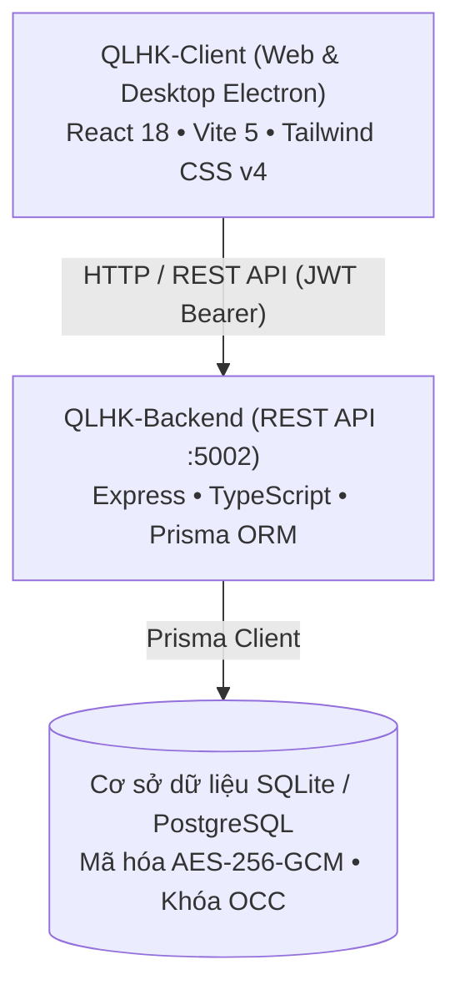

# Quản lý Hộ khẩu & Nhân khẩu Xã Đăk Hà (QLHK)

Hệ thống số hóa và quản lý dữ liệu dân cư, biến động hộ khẩu, nhân khẩu và thành phần dân tộc phục vụ công tác điều hành tại Xã Đăk Hà.


> [!IMPORTANT]
> **Bản quyền thuộc Ủy ban nhân dân Xã Đăk Hà, Huyện Đăk Hà, Tỉnh Kon Tum.**  
> Mọi quyền được bảo lưu. Dự án này không áp dụng giấy phép mã nguồn mở tự do (không sử dụng MIT License, Apache hoặc GPL). Chi tiết xem tại mục [Giấy phép và bản quyền](#giay-phep-va-ban-quyen).

---

## Mục lục

- [Tổng quan](#tong-quan)
- [Tính năng chính](#tinh-nang-chinh)
- [Kiến trúc hệ thống](#kien-truc-he-thong)
- [Bắt đầu nhanh](#bat-dau-nhanh)
- [Cấu trúc thư mục](#cau-truc-thu-muc)
- [Bảo mật](#bao-mat)
- [Trạng thái và giới hạn đã biết](#trang-thai-va-gioi-han-da-biet)
- [Người duy trì và liên hệ](#nguoi-duy-tri-va-lien-he)
- [Giấy phép và bản quyền](#giay-phep-va-ban-quyen)

---

<a id="tong-quan"></a>
## Tổng quan

**QLHK** là phần mềm phục vụ cán bộ tư pháp - hộ tịch xã và các cán bộ cơ sở trong công tác số hóa, tra cứu và theo dõi biến động nhân hộ khẩu trên địa bàn xã Đăk Hà. Ứng dụng hỗ trợ quản lý chi tiết từng hộ gia đình và nhân khẩu, đối soát tệp bảng tính Excel, bảo vệ dữ liệu định danh theo quy định và tổng hợp báo cáo thống kê dân số. Phần mềm chạy song song trên nền tảng Web và Desktop (Electron) cho máy trạm làm việc.

### Hệ sinh thái số hóa công vụ Xã Đăk Hà

| Ứng dụng | Tên đầy đủ | Vai trò chính | Kho lưu trữ |
| :--- | :--- | :--- | :--- |
| **QLCS** | Quản lý Chính sách | Chế độ người cao tuổi, hưu trí xã hội, chúc thọ | [Umnuar/QLCS](https://github.com/Umnuar/QLCS) |
| **QLHK** | Quản lý Hộ khẩu | Dữ liệu dân cư, nhân hộ khẩu, dân tộc | [Umnuar/QLHK](https://github.com/Umnuar/QLHK) |
| **QLNN** | Quản lý Nông nghiệp | Dữ liệu nông nghiệp, nông thôn mới, thống kê cây trồng và vật nuôi | [Umnuar/QLNN](https://github.com/Umnuar/QLNN) |

---

<a id="tinh-nang-chinh"></a>
## Tính năng chính

- **Quản lý hộ gia đình & nhân khẩu**: Theo dõi danh sách hộ gia đình theo từng thôn, thông tin chủ hộ, tình trạng cư trú (thường trú, tạm trú, tạm vắng) và danh sách thành viên với bảng dữ liệu có thể mở rộng.
- **Bộ lọc đa tiêu chí linh hoạt**: Tìm kiếm theo họ tên, số CCCD; lọc kết hợp năm tính toán, mốc độ tuổi nghiệp vụ, giới tính, dân tộc và tình trạng cư trú.
- **Bảo vệ số Căn cước công dân (CCCD)**: Mã hóa dữ liệu lưu trữ bằng thuật toán AES-256-GCM, sử dụng mã băm một chiều SHA-256 (`cccd_hash`) để tìm kiếm đối soát không lộ dữ liệu thô, và che mờ mặc định trên giao diện.
- **Nhập xuất Excel 11 cột chuẩn**: Tự động nhận diện mẫu biểu thực tế Đăk Hà và mẫu 11 cột phẳng tiêu chuẩn, cung cấp hộp thoại xem trước đối soát kiểm tra hợp lệ trước khi lưu và xuất báo cáo danh sách.
- **Khóa lạc quan (OCC)**: Phát hiện và cảnh báo xung đột dữ liệu đồng thời qua trường phiên bản `version`, ngăn chặn tình trạng ghi đè ngầm.
- **Phân quyền theo địa bàn thôn**: Giới hạn phạm vi thao tác của Cán bộ Cơ sở theo thôn được phân công; Cán bộ Quản trị Xã có quyền quản lý toàn xã và phân công tài khoản.
- **Thùng rác và phục hồi dữ liệu**: Cơ chế xóa mềm bản ghi kèm tính năng khôi phục hộ gia đình và nhân khẩu liên kết an toàn.
- **Báo cáo thống kê dân cư**: Tổng hợp 4 chỉ số KPI tổng quan, biểu đồ cơ cấu giới tính, tháp tuổi, thành phần dân tộc và bảng đối soát quy mô giữa các thôn.
- **Nhật ký hoạt động**: Ghi vết lịch sử khởi tạo, cập nhật, xóa mềm, khôi phục và nhập Excel phục vụ tra soát.
- **Lưu trữ ngoại tuyến**: Đệm dữ liệu tạm thời qua IndexedDB phía Client hỗ trợ tra cứu khi mất kết nối mạng.

---

<a id="kien-truc-he-thong"></a>
## Kiến trúc hệ thống



### Bảng công nghệ chính

| Thành phần | Công nghệ | Phiên bản |
| :--- | :--- | :--- |
| Giao diện người dùng | React, Tailwind CSS | React 18.2.0, Tailwind CSS 4.2.4 |
| Nền tảng Desktop | Electron, Electron Builder | Electron 42.1.0, Electron Builder 24.13.3 |
| Công cụ xây dựng Client | Vite, TypeScript | Vite 5.1.6, TypeScript 5.2.2 |
| Xử lý bảng tính | SheetJS (xlsx) | 0.18.5 |
| Máy chủ API | Express, TypeScript | Express 4.21.2, TypeScript 5.7.2 |
| Cơ sở dữ liệu và ORM | Prisma ORM, SQLite / PostgreSQL | Prisma 6.0.0 |
| Xác thực và bảo mật | JWT, Bcryptjs, Helmet, AES-256-GCM | jsonwebtoken 9.0.2, bcryptjs 2.4.3, helmet 8.0.0 |
| Kiểm thử tự động | Vitest, Supertest | Vitest 2.1.8 (Backend) / 4.1.11 (Client), Supertest 7.0.0 |

---

<a id="bat-dau-nhanh"></a>
## Bắt đầu nhanh

### Yêu cầu môi trường
- Node.js phiên bản 18 hoặc 20 trở lên
- npm phiên bản 9 hoặc 10 trở lên

### Cài đặt mã nguồn

```bash
# 1. Cài đặt Backend
cd QLHK-Backend
npm install
cp .env.example .env

# 2. Sinh Prisma Client và cập nhật cấu trúc cơ sở dữ liệu
npm run prisma:generate
npm run prisma:push

# 3. Cài đặt Client
cd ../QLHK-Client
npm install
cp .env.example .env
```

### Cấu hình biến môi trường

**Backend (`QLHK-Backend/.env`):**

| Tên biến | Ý nghĩa | Bắt buộc |
| :--- | :--- | :--- |
| `PORT` | Cổng máy chủ lắng nghe (mặc định 5002) | Không |
| `NODE_ENV` | Môi trường thực thi (`development` / `production` / `test`) | Không |
| `DATABASE_URL` | Chuỗi kết nối cơ sở dữ liệu Prisma (SQLite file hoặc PostgreSQL) | Có |
| `JWT_SECRET` | Khóa bí mật ký Access Token | Có |
| `JWT_REFRESH_SECRET` | Khóa bí mật ký Refresh Token | Có |
| `ENCRYPTION_KEY` | Khóa đối xứng 256-bit (64 ký tự hex) mã hóa AES-256-GCM cho số CCCD | Có |
| `EXCEL_SAMPLE_PATH` | Đường dẫn tệp mẫu Excel nhân hộ khẩu | Không |
| `CORS_ORIGIN` | Danh sách domain hoặc cổng được phép truy cập CORS | Không |

**Client (`QLHK-Client/.env`):**

| Tên biến | Ý nghĩa | Bắt buộc |
| :--- | :--- | :--- |
| `VITE_API_URL` | Đường dẫn API Backend (mặc định `http://localhost:5002/api`) | Có |

### Chạy ứng dụng

```bash
# Chạy Backend (cổng 5002)
cd QLHK-Backend
npm run dev

# Chạy Client (giao diện Web và Desktop Electron, cổng 5175)
cd QLHK-Client
npm run dev
```

### Kiểm thử và đóng gói

```bash
# Chạy kiểm thử Backend (88 tests)
cd QLHK-Backend
npm test

# Chạy kiểm thử Client (Vitest)
cd QLHK-Client
npm test -- --run

# Đóng gói bản phát hành Client
cd QLHK-Client
npm run build:vite  # Bản Web
npm run build:win   # Bộ cài đặt Desktop Windows (.exe)
```

---

<a id="cau-truc-thu-muc"></a>
## Cấu trúc thư mục

```
QLHK/
├── QLHK-Backend/            # Dịch vụ máy chủ REST API và cơ sở dữ liệu
│   ├── prisma/              # Lược đồ cơ sở dữ liệu và cấu hình Prisma
│   ├── src/config/          # Cấu hình môi trường và kết nối dịch vụ
│   ├── src/controllers/     # Xử lý nghiệp vụ API hộ dân, nhân khẩu, thống kê
│   ├── src/middlewares/     # Middleware xác thực JWT và kiểm soát quyền theo thôn
│   ├── src/routes/          # Định tuyến các cổng API
│   ├── src/utils/           # Tiện ích mã hóa CCCD, đối soát Excel và nhật ký
│   └── tests/               # Bộ kiểm thử tích hợp Backend
├── QLHK-Client/             # Ứng dụng giao diện Web và Desktop
│   ├── electron/            # Tiến trình chính Electron và cầu nối IPC
│   ├── src/api/             # Các hàm gọi API qua Axios
│   ├── src/components/      # Thành phần giao diện, bảng dữ liệu và modal
│   ├── src/pages/           # Các màn hình chính của ứng dụng
│   ├── src/db/              # Lưu trữ ngoại tuyến qua IndexedDB
│   ├── src/utils/           # Tiện ích che mờ CCCD, định dạng ngày và xử lý Excel
│   └── src/__tests__/       # Bộ kiểm thử giao diện và luồng nghiệp vụ
├── docs/                    # Tài liệu kiến trúc và kết quả kiểm thử
├── qlhk_document.md         # Đặc tả chi tiết nghiệp vụ quản lý hộ khẩu
├── SECURITY.md              # Chính sách an toàn thông tin và tiếp nhận sự cố
└── README.md                # Tài liệu hướng dẫn sử dụng và triển khai
```

---

<a id="bao-mat"></a>
## Bảo mật

Hệ thống áp dụng xác thực JWT, phân quyền truy cập theo địa bàn thôn ở tầng máy chủ, mã hóa đối xứng AES-256-GCM cho số Căn cước công dân và lưu vết nhật ký kiểm toán. Dữ liệu công dân được thiết kế hướng tới việc bảo vệ bí mật đời tư cá nhân và an toàn thông tin.

Chi tiết về quy trình tiếp nhận và xử lý báo cáo lỗ hổng an ninh thông tin xem tại [SECURITY.md](SECURITY.md).

---

<a id="trang-thai-va-gioi-han-da-biet"></a>
## Trạng thái và giới hạn đã biết

- **Trạng thái**: Đang vận hành thử nghiệm trên môi trường máy trạm phục vụ công tác số hóa tại địa phương.
- **Giới hạn đã biết**: Danh mục thôn và tài khoản cán bộ cần được thiết lập trước trong cơ sở dữ liệu; việc thực thi kiểm thử phía Client cần môi trường Node tương thích với cấu hình phân giải tệp kiểm thử.
- **Hướng phát triển**: Tiếp tục tối ưu hóa hiệu năng nạp danh sách nhân khẩu với tập dữ liệu lớn và hoàn thiện công cụ sao lưu dữ liệu tự động định kỳ.

---

<a id="nguoi-duy-tri-va-lien-he"></a>
## Người duy trì và liên hệ

- **Đơn vị duy trì**: Ban CĐS UBND Xã Đăk Hà
- **Địa bàn**: Xã Đăk Hà, Huyện Đăk Hà, Tỉnh Kon Tum
- **Kênh tiếp nhận kỹ thuật**: `admin@dulieudakha.vn`

---

<a id="giay-phep-va-ban-quyen"></a>
## Giấy phép và bản quyền

Toàn bộ mã nguồn, cấu trúc dữ liệu và tài liệu kỹ thuật của dự án này thuộc quyền sở hữu trí tuệ của **Ủy ban nhân dân Xã Đăk Hà, Huyện Đăk Hà, Tỉnh Kon Tum**. Mọi quyền được bảo lưu (All Rights Reserved). Dự án không áp dụng giấy phép mã nguồn mở (không áp dụng MIT License, Apache hoặc GPL). Nghiêm cấm sao chép, chỉnh sửa, phân phối lại hoặc sử dụng vào mục đích thương mại khi chưa có văn bản chấp thuận chính thức từ cơ quan chủ quản.