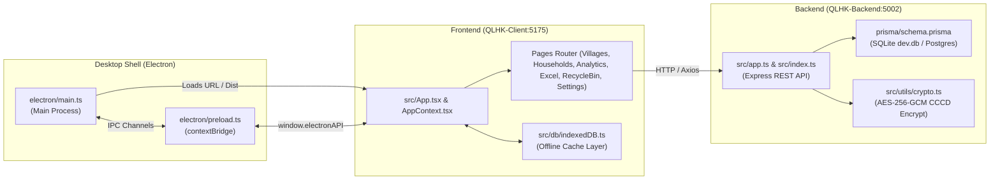

# BEHAVIOR BASELINE & REPOSITORY DISCOVERY: QLHK SYSTEM
*(Tài Liệu Khảo Sát Hệ Thống & Thiết Lập Baseline Hành Vi QLHK)*

**Dự án**: Hệ thống Quản lý Hộ khẩu & Nhân khẩu Xã Đăk Hà (QLHK)  
**Thời điểm ghi nhận**: 2026-10-01  
**Trạng thái nhánh Git**: `feat/qlhk-engineering-audit`  

---

## 1. Bản Đồ Ranh Giới Hệ Thống (System Boundaries & Entrypoints)

Hệ thống QLHK được cấu trúc thành 3 khối phân hệ chính:

### 1.1 Điểm Vào (Entrypoints)
- **Backend**: `QLHK-Backend/src/index.ts` $\rightarrow$ Khởi chạy Express server (`src/app.ts`), kết nối Prisma CSDL, kích hoạt Executive Terminal Dashboard.
- **Client**: `QLHK-Client/src/main.tsx` $\rightarrow$ Mount `App.tsx` bọc trong `AppContextProvider`.
- **Electron**: `QLHK-Client/electron/main.ts` $\rightarrow$ Khởi tạo `BrowserWindow`, cấu hình menu, phím tắt F12, nạp URL hoặc tệp `dist/index.html`.

### 1.2 Ranh Giới Bảo Mật & Dữ Liệu
- **Mã hóa CCCD**: Mã hóa đối xứng AES-256-GCM cho số Căn cước công dân. Tạo hàm băm `SHA-256(cccd + salt)` lưu tại `cccd_hash` để phục vụ tìm kiếm chính xác (Blind Indexing) mà không giải mã CSDL.
- **Kiểm soát phiên bản OCC**: Cột `version` (Int) trên bảng `Household` và `Citizen` chống ghi đè đồng thời (Optimistic Concurrency Control).
- **Phân quyền địa bàn (RBAC Village Scoping)**:
  - `admin`: Toàn quyền truy cập tất cả các thôn, quản lý tài khoản cán bộ, sao lưu phục hồi hệ thống.
  - `user`: Cán bộ cơ sở, chỉ có quyền xem/sửa dữ liệu thuộc `village_id` được phân công.
- **Cơ chế Thùng rác (Soft Delete)**: `is_deleted: true`, `deleted_at: DateTime` cho phép khôi phục khi xóa nhầm.

---

## 2. Bản Đồ Hành Vi Thực Tế (Observed Behavior Matrix)

Tách bạch rõ giữa: **Hành Vi Dự Kiến (Intended)**, **Lỗi Đã Xác Nhận (Known Bug)** và **Hành Vi Cần Làm Rõ (Unclear)**:

| Phân hệ / Màn hình | Hành Vi Đang Quan Sát Được | Phân Loại Hành Vi | Ghi Chú & Bằng Chứng |
| :--- | :--- | :---: | :--- |
| **Backend Test Suite** | 6 test thất bại tại `tests/excel-parser.test.ts` và `tests/api.test.ts` do hardcode đường dẫn file `C:\Users\umnuar\Downloads\Nhân hộ khẩu.xls`. | 🔴 **KNOWN BUG** | Test phụ thuộc file cục bộ trong thư mục Downloads thay vì dùng fixture hoặc mock buffer. |
| **Client Vitest Suite** | 5 test suite thất bại với lỗi `Cannot find module '/src/...'` trên Windows. | 🔴 **KNOWN BUG** | Vitest config xử lý alias `/src` thành root filesystem ổ đĩa trên Windows thay vì `<rootDir>/src`. |
| **Client API Test Mock** | `authApi.test.ts` gửi request thực tới `https://qlhk.dulieudakha.vn/api` và nhận lỗi Cloudflare Tunnel 530. | 🔴 **KNOWN BUG** | Unit test không được gọi API từ xa qua Internet; bắt buộc mock Axios adapter hoặc nạp local in-memory. |
| **Villages Page** | Hiển thị Banner tổng quan xã, 4 thẻ KPI động, danh sách thẻ thôn. Bấm thẻ thôn chuyển sang trang Hộ gia đình của thôn đó. | 🟢 **INTENDED** | Đã loại bỏ số 7 cứng, hiển thị động `villages.length`. |
| **HouseholdFilterBar** | Thanh tìm kiếm cố định `w-56`, bộ chọn năm `YearSelector` tối giản (không icon, stepper, áp dụng nhanh), bộ lọc độ tuổi `AgeFilterPopover`, dropdown Giới tính, Dân tộc, Cư trú không icon dồn trái. | 🟢 **INTENDED** | Đã chuẩn hóa theo layout QLNN. |
| **YearSelector Stepper** | Bấm tăng/giảm stepper hoặc nhập năm rồi bấm Áp dụng/Enter cập nhật `calculationYear` trong context và localStorage. | 🟢 **INTENDED** | Đã sửa dứt điểm lỗi race condition giữa `blur` và `click`. |
| **Household Drawer** | Mở ngăn kéo phải thêm/sửa hộ gia đình. Bấm thêm nhân khẩu mở Centered Sub-modal đè lên trên. | 🟢 **INTENDED** | Đã xử lý chống giật 24px khi mở modal con. |
| **CCCD Masking** | Hiển thị `••••••••`, click để toggle xem 12 số thực tế. | 🟢 **INTENDED** | Đã bảo mật UI, chỉ cán bộ có quyền mới bấm xem. |
| **Offline IndexedDB** | Khi mất kết nối backend, client đọc dữ liệu từ IndexedDB cache để hiển thị danh sách hộ. | 🟢 **INTENDED** | Cần kiểm tra kịch bản ghi offline rồi sync lại (Sync Conflict). |
| **23k+ Records Scale** | Hiện tại client render bảng thường với phân trang server-side (`limit=20`). Chưa có Virtualization cho trường hợp nạp toàn bộ danh sách. | 🟡 **UNCLEAR / RISK** | Cần đo lường chính xác hiệu năng khi bảng chứa hàng ngàn hàng nếu tắt phân trang hoặc xuất Excel. |

---

## 3. Ranh Giới Kỹ Thuật Cho Các Subagent

- **Agent 1 (Architecture & Code Quality)**: Tập trung vào `QLHK-Backend/src` và `QLHK-Client/src`. Quét dead code, type `any`, race conditions, memory leak.
- **Agent 2 (Security & Electron)**: Rà soát `crypto.ts`, `auth.middleware.ts`, `electron/main.ts`, `electron/preload.ts`, CSP.
- **Agent 3 (Database & Performance)**: Rà soát `prisma/schema.prisma`, indexes, SQLite query plans, benchmark quy mô dữ liệu lớn (0 -> 23k+).
- **Agent 4 (UI/UX & Accessibility)**: Rà soát `components/households`, `pages/SettingsPage.tsx`, WCAG 2.1 AA keyboard support.
- **Agent 5 (QA & Reliability)**: Tương tác trực tiếp qua dev server, bơm lỗi, bấm nhanh lặp lại, kiểm tra rò rỉ bộ nhớ.
- **Agent 6 (Test & Release)**: Rà soát `vitest.config.ts`, `vite.config.ts`, `electron-builder.json5`, khắc phục lỗi test runner.
