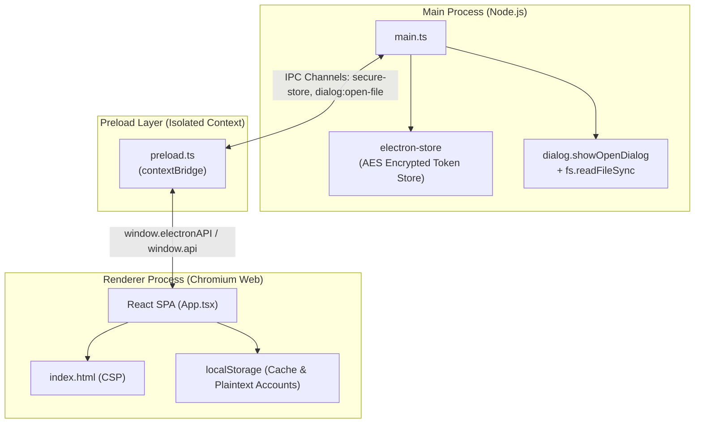
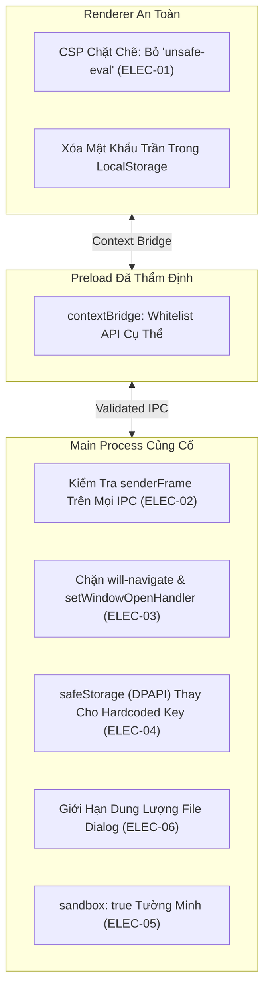

# BÁO CÁO KIỂM TOÁN AN NINH ELECTRON DESKTOP (ELECTRON SECURITY AUDIT)
## HỆ THỐNG QUẢN LÝ HỘ KHẨU & NHÂN KHẨU XÃ ĐĂK HÀ (QLHK-CLIENT)

- **Phân hệ kiểm toán**: Electron Desktop Architecture (`QLHK-Client/electron/`), IPC Channels, WebPreferences, CSP, Local Storage Security.
- **Thời điểm thực hiện**: 2026-10-01
- **Chế độ kiểm toán**: Read-Only Source Code Security Audit (Section 31 Meta-Rule)
- **Tiêu chuẩn tham chiếu**: Electron Official Security Checklist (17 Security Recommendations), OWASP Desktop App Security, Chromium Sandbox Architecture.

---

## 1. TỔNG QUAN AN NINH ELECTRON DESKTOP

Khối ứng dụng máy trạm Desktop (`QLHK-Client`) được xây dựng trên nền tảng **Electron** kết hợp với **Vite**, **React 18** và **TypeScript**. 

Mô hình kiến trúc Desktop của QLHK có sự phân tách rõ rệt giữa:
- **Main Process (Node.js runtime)**: Chịu trách nhiệm quản lý vòng đời ứng dụng, cửa sổ `BrowserWindow`, thực đơn (Menu), hộp thoại tệp native và kho lưu trữ token mã hóa `electron-store`.
- **Preload Script (`electron/preload.ts`)**: Cầu nối trung gian sử dụng `contextBridge.exposeInMainWorld` để chia sẻ các API an toàn sang Renderer.
- **Renderer Process (Chromium runtime)**: Giao diện người dùng web chạy React SPA.



### Bảng Đánh Giá Theo Bộ Tiêu Chuẩn An Ninh Chính Thức Của Electron (Electron Official Checklist)

| Tiêu chí An ninh (Official Recommendation) | Trạng thái Thực tế | Mức độ Rủi ro | Vị trí Mã Nguồn |
| :--- | :---: | :---: | :--- |
| **1. Enable Context Isolation** | ✅ **BẬT (`true`)** | An toàn | [`electron/main.ts#L35`](file:///c:/Projects/QLHK/QLHK-Client/electron/main.ts#L35) |
| **2. Disable Node.js Integration in Renderers** | ✅ **TẮT (`false`)** | An toàn | [`electron/main.ts#L36`](file:///c:/Projects/QLHK/QLHK-Client/electron/main.ts#L36) |
| **3. Enable Process Sandboxing** | ⚠️ **THIẾU KHAI BÁO** | Trung bình | [`electron/main.ts#L33-L38`](file:///c:/Projects/QLHK/QLHK-Client/electron/main.ts#L33-L38) |
| **4. Define a Content Security Policy (CSP)** | 🔴 **YẾU (`unsafe-inline`, `unsafe-eval`)** | **CAO** | [`index.html#L7`](file:///c:/Projects/QLHK/QLHK-Client/index.html#L7) |
| **5. Do not enable `allowRunningInsecureContent`** | ✅ **Mặc định tắt** | An toàn | [`electron/main.ts#L33`](file:///c:/Projects/QLHK/QLHK-Client/electron/main.ts#L33) |
| **6. Do not disable `webSecurity`** | ✅ **Mặc định bật** | An toàn | [`electron/main.ts#L33`](file:///c:/Projects/QLHK/QLHK-Client/electron/main.ts#L33) |
| **7. Validate IPC Sender Frame (`senderFrame`)** | 🔴 **KHÔNG KIỂM TRA** | **CAO** | [`electron/main.ts#L106-L184`](file:///c:/Projects/QLHK/QLHK-Client/electron/main.ts#L106-L184) |
| **8. Handle Navigation (`will-navigate`)** | 🔴 **CHƯA ĐĂNG KÝ** | **CAO** | [`electron/main.ts`](file:///c:/Projects/QLHK/QLHK-Client/electron/main.ts) |
| **9. Handle Child Windows (`setWindowOpenHandler`)** | 🔴 **CHƯA ĐĂNG KÝ** | **CAO** | [`electron/main.ts`](file:///c:/Projects/QLHK/QLHK-Client/electron/main.ts) |
| **10. Safe Protocol Handling in `shell.openExternal`** | ⚠️ **CHƯA CẤU HÌNH** | Trung bình | [`electron/main.ts`](file:///c:/Projects/QLHK/QLHK-Client/electron/main.ts) |
| **11. Do not expose raw `ipcRenderer` or `require`** | ✅ **TUÂN THỦ** | An toàn | [`electron/preload.ts`](file:///c:/Projects/QLHK/QLHK-Client/electron/preload.ts) |
| **12. Secure Storage Encryption Key** | 🔴 **HARDCODED STATIC KEY** | **CAO** | [`electron/main.ts#L9`](file:///c:/Projects/QLHK/QLHK-Client/electron/main.ts#L9) |
| **13. Dependency Vulnerability (`tar`, `builder-util`)** | 🔴 **CRITICAL CVE** | **CRITICAL** | `QLHK-Client/package.json` |

---

## 2. CHI TIẾT CÁC LỖ HỔNG AN NINH ELECTRON DESKTOP

### [ELEC-01] [HIGH] Content Security Policy (CSP) quá lỏng lẻo: Chứa `'unsafe-inline'` và `'unsafe-eval'`
- **Vị trí**: [`QLHK-Client/index.html`](file:///c:/Projects/QLHK/QLHK-Client/index.html#L7).
- **CWE**: CWE-1021: Improper Restriction of Rendered UI Layers or Frames; CWE-79: Cross-Site Scripting.
- **Bằng chứng mã nguồn**:
```html
<!-- QLHK-Client/index.html (Dòng 7) -->
<meta http-equiv="Content-Security-Policy" content="
    default-src 'self'; 
    script-src 'self' 'unsafe-inline' 'unsafe-eval'; 
    style-src 'self' 'unsafe-inline' https://fonts.googleapis.com; 
    font-src 'self' https://fonts.gstatic.com data:; 
    img-src 'self' data: https: blob:; 
    connect-src 'self' http://localhost:* http://127.0.0.1:* https://qlhk.dulieudakha.vn https://*.dulieudakha.vn ws://localhost:* ws://127.0.0.1:*;
" />
```
- **Phân tích cơ chế & Rủi ro**:
  - Việc cho phép `'unsafe-eval'` trong `script-src` vô hiệu hóa hoàn toàn cơ chế bảo vệ của Chromium chống lại việc thực thi chuỗi ký tự thành mã lệnh (thông qua `eval()`, `new Function()`, `setTimeout(string)`).
  - Kết hợp với `'unsafe-inline'`, nếu ứng dụng gặp bất kỳ điểm chèn dữ liệu DOM nào hoặc bị tiêm nhiễm mã qua thư viện bên thứ ba (Supply Chain), kẻ tấn công có thể chạy mã JavaScript tùy ý trong ngữ cảnh của Renderer Process.
  - Trong Electron, việc bị XSS trong Renderer Process là bước đệm trực tiếp để khai thác các API đã expose qua Preload (`electronAPI.secureStore`, `electronAPI.openFileDialog`).
- **Khuyến nghị khắc phục**:
  - Loại bỏ hoàn toàn `'unsafe-eval'` khỏi `script-src`.
  - Trong môi trường sản xuất (production build), loại bỏ `'unsafe-inline'` và sử dụng Vite hash hoặc nonce nếu cần inline scripts.
  - CSP tối ưu cho production:
    ```html
    <meta http-equiv="Content-Security-Policy" content="
        default-src 'self'; 
        script-src 'self'; 
        style-src 'self' 'unsafe-inline' https://fonts.googleapis.com; 
        font-src 'self' https://fonts.gstatic.com; 
        img-src 'self' data: blob:; 
        connect-src 'self' https://qlhk.dulieudakha.vn;
    " />
    ```

---

### [ELEC-02] [HIGH] Thiếu kiểm tra nguồn gửi IPC (`event.senderFrame`) trên toàn bộ các kênh xử lý
- **Vị trí**: [`QLHK-Client/electron/main.ts`](file:///c:/Projects/QLHK/QLHK-Client/electron/main.ts#L106-L184).
- **CWE**: CWE-285: Improper Authorization; CWE-345: Insufficient Verification of Data Authenticity.
- **Bằng chứng mã nguồn**:
```typescript
// QLHK-Client/electron/main.ts (Dòng 106-143)
ipcMain.handle('secure-store:get', (_e, key: string) => {
    try {
        return secureStore.get(key)
    } catch (err) { ... }
})

ipcMain.handle('secure-store:set', (_e, { key, value }: { key: string; value: any }) => {
    try {
        secureStore.set(key, value)
        return true
    } catch (err) { ... }
})

ipcMain.handle('dialog:open-file', async (_e, filters?: ...) => {
    // Không kiểm tra _e.senderFrame!
    const result = await dialog.showOpenDialog(win, ...);
    const fileBuffer = fs.readFileSync(filePath);
    return { filePath, fileName: path.basename(filePath), data: fileBuffer.toString('base64') };
})
```
- **Phân tích cơ chế & Rủi ro**:
  - Tham số sự kiện `_e` (IpcMainInvokeEvent) được truyền vào nhưng hoàn toàn bị bỏ qua (`_e`).
  - Hệ thống không kiểm tra `_e.senderFrame` có phải là main frame của cửa sổ cục bộ hợp lệ hay không (`_e.senderFrame.url.startsWith(...)`).
  - Nếu ứng dụng tải một iframe của bên thứ ba, hoặc bị điều hướng tới một trang web bên ngoài (xem `ELEC-03`), các script chạy trong frame đó hoàn toàn có thể kích hoạt các kênh `secure-store:get`, `secure-store:set`, `dialog:open-file` để đọc trộm token hoặc đọc nội dung tệp nhạy cảm trên máy trạm của cán bộ.
- **Khuyến nghị khắc phục**:
  - Xây dựng hàm thẩm định frame nguồn cho mọi handler:
    ```typescript
    function validateSender(frame: Electron.WebFrameMain | null): boolean {
        if (!frame) return false;
        const validOrigin = VITE_DEV_SERVER_URL 
            ? new URL(VITE_DEV_SERVER_URL).origin 
            : 'file://';
        return frame.url.startsWith(validOrigin);
    }

    ipcMain.handle('secure-store:get', (e, key: string) => {
        if (!validateSender(e.senderFrame)) {
            throw new Error('Forbidden: Unauthorized IPC sender frame');
        }
        return secureStore.get(key);
    });
    ```

---

### [ELEC-03] [HIGH] Cửa sổ không kiểm soát điều hướng ngoài (`will-navigate`) và mở cửa sổ con (`setWindowOpenHandler`)
- **Vị trí**: [`QLHK-Client/electron/main.ts`](file:///c:/Projects/QLHK/QLHK-Client/electron/main.ts#L24-L71).
- **CWE**: CWE-601: URL Redirection to Untrusted Site; CWE-1022: Use of Web Link to Untrusted Target with Windows Manipulation.
- **Phân tích cơ chế & Rủi ro**:
  - Trong `createWindow()` của `main.ts`, đối tượng `win` không được đăng ký:
    1. `win.webContents.setWindowOpenHandler(...)`
    2. `win.webContents.on('will-navigate', ...)`
  - Nếu mã nguồn client (hoặc một liên kết trong bảng biểu/hộ dân) thực hiện `window.open('https://malicious-site.com')` hoặc thẻ `<a href="..." target="_blank">`, Electron sẽ mặc định tạo ra một cửa sổ mới kế thừa các thuộc tính và có thể điều hướng tự do.
  - Nếu người dùng bấm vào một liên kết ngoại vi hoặc bị tấn công phishing, cửa sổ chính của ứng dụng có thể bị điều hướng thẳng tới trang web độc hại bên ngoài mà không có thanh địa chỉ để nhận biết.
- **Khuyến nghị khắc phục**:
  - Chặn mở cửa sổ mới tùy tiện và chuyển hướng các liên kết ngoài ra trình duyệt mặc định của hệ điều hành:
    ```typescript
    import { shell } from 'electron';

    // 1. Chặn mở cửa sổ mới trong ứng dụng
    win.webContents.setWindowOpenHandler(({ url }) => {
        if (url.startsWith('https://')) {
            shell.openExternal(url); // Mở bằng trình duyệt ngoài (Chrome/Edge)
        }
        return { action: 'deny' }; // Từ chối mở BrowserWindow con
    });

    // 2. Chặn điều hướng nội bộ ra trang lạ
    win.webContents.on('will-navigate', (event, url) => {
        const allowedOrigin = VITE_DEV_SERVER_URL || 'file://';
        if (!url.startsWith(allowedOrigin)) {
            event.preventDefault();
            shell.openExternal(url);
        }
    });
    ```

---

### [ELEC-04] [HIGH] Khóa mã hóa `electron-store` được hardcode chuỗi tĩnh trong mã nguồn
- **Vị trí**: [`QLHK-Client/electron/main.ts`](file:///c:/Projects/QLHK/QLHK-Client/electron/main.ts#L7-L10).
- **CWE**: CWE-321: Use of Hard-coded Cryptographic Key; CWE-311: Missing Encryption of Sensitive Data.
- **Bằng chứng mã nguồn**:
```typescript
// QLHK-Client/electron/main.ts (Dòng 7-10)
const secureStore = new Store({
    name: 'qlhk-secure-tokens',
    encryptionKey: 'QLHK_ENCRYPTED_STORE_KEY_SECURE_2026', // <-- KHÓA MÃ HÓA CỨNG
})
```
- **Phân tích cơ chế & Rủi ro**:
  - `electron-store` cho phép đặt `encryptionKey` để mã hóa tệp JSON cấu hình trên đĩa (`%APPDATA%/qlhk-secure-tokens.json`).
  - Tuy nhiên, chuỗi khóa `'QLHK_ENCRYPTED_STORE_KEY_SECURE_2026'` được lưu cứng trong file `main.ts`. Bất kỳ ai trích xuất gói cài đặt `.asar` hoặc mở file nhị phân đều lấy được khóa này.
  - Khi đó, bất kỳ phần mềm độc hại nào chạy trên máy người dùng đều có thể giải mã tệp cấu hình và trích xuất Access Token, Refresh Token cũng như thông tin phiên đăng nhập của cán bộ.
- **Khuyến nghị khắc phục**:
  - Sử dụng API bảo mật cấp Hệ điều hành của Electron: **`safeStorage`** (sử dụng DPAPI trên Windows, Keychain trên macOS, Secret Service API trên Linux):
    ```typescript
    import { safeStorage } from 'electron';

    // Khi ghi token:
    const encryptedBuffer = safeStorage.encryptString(token);
    // Khi đọc token:
    const plainToken = safeStorage.decryptString(encryptedBuffer);
    ```
  - Cách làm này đảm bảo chỉ người dùng đang đăng nhập vào Windows mới có thể giải mã được dữ liệu lưu trên đĩa, không phụ thuộc vào khóa cứng trong mã nguồn.

---

### [ELEC-05] [MEDIUM] Chưa kích hoạt chế độ hộp cát (`sandbox: true`) tường minh trong `webPreferences`
- **Vị trí**: [`QLHK-Client/electron/main.ts`](file:///c:/Projects/QLHK/QLHK-Client/electron/main.ts#L33-L38).
- **CWE**: CWE-693: Protection Mechanism Failure.
- **Bằng chứng mã nguồn**:
```typescript
// QLHK-Client/electron/main.ts (Dòng 33-38)
webPreferences: {
    preload: path.join(__dirname, 'preload.mjs'),
    contextIsolation: true,
    nodeIntegration: false,
    // THIẾU: sandbox: true
},
```
- **Phân tích cơ chế & Rủi ro**:
  - Dù Electron hiện đại đã bật sandbox mặc định cho nhiều trường hợp, việc không khai báo tường minh `sandbox: true` có thể dẫn đến việc Renderer Process không được đặt trong ranh giới hộp cát bảo vệ của hệ điều hành (OS-level sandboxing) khi cấu hình bị can thiệp bởi các plugin Vite (như `vite-plugin-electron-renderer`).
  - Nếu xảy ra lỗ hổng tràn bộ đệm trong Chromium, kẻ tấn công có thể thoát khỏi tiến trình Renderer mà không bị chặn bởi cơ chế Sandbox của Windows.
- **Khuyến nghị khắc phục**:
  - Bổ sung `sandbox: true` tường minh vào `webPreferences`.

---

### [ELEC-06] [MEDIUM] Đọc tệp đồng bộ `fs.readFileSync` trong handler `dialog:open-file` gây nguy cơ nghẽn Event Loop và cạn kiệt RAM
- **Vị trí**: [`QLHK-Client/electron/main.ts`](file:///c:/Projects/QLHK/QLHK-Client/electron/main.ts#L160-L173).
- **CWE**: CWE-400: Uncontrolled Resource Consumption; CWE-770: Allocation of Resources Without Limits or Throttling.
- **Bằng chứng mã nguồn**:
```typescript
// QLHK-Client/electron/main.ts (Dòng 160-173)
const filePath = result.filePaths[0]
try {
    const fileBuffer = fs.readFileSync(filePath) // <-- ĐỌC ĐỒNG BỘ TOÀN BỘ FILE VÀO RAM
    return {
        filePath,
        fileName: path.basename(filePath),
        data: fileBuffer.toString('base64'), // <-- CHUYỂN TOÀN BỘ SANG BASE64
    }
} catch (err: any) { ... }
```
- **Phân tích cơ chế & Rủi ro**:
  - Hàm `fs.readFileSync` đọc toàn bộ tệp được chọn vào bộ đệm và chuyển đổi sang chuỗi `base64`.
  - Nếu cán bộ vô tình chọn một tệp Excel có dung lượng lớn (hoặc một tệp bất kỳ có kích thước hàng trăm MB đến hàng GB), tiến trình Main Process sẽ bị nghẽn (freeze giao diện người dùng) và chuỗi base64 khổng lồ có thể làm tràn bộ nhớ V8, dẫn tới việc ứng dụng máy trạm tự động tắt (crash).
- **Khuyến nghị khắc phục**:
  - Kiểm tra kích thước tệp bằng `fs.statSync(filePath).size` trước khi đọc. Nếu vượt quá giới hạn cho phép (ví dụ 20MB), từ chối đọc và thông báo lỗi.
  - Sử dụng phương thức đọc bất đồng bộ `fs.promises.readFile` hoặc chỉ trả về đường dẫn tệp `filePath` để xử lý phân luồng theo stream.

---

### [ELEC-07] [LOW] Chuyển tiếp toàn bộ thông điệp Console của Renderer ra Terminal mà không qua lọc dữ liệu nhạy cảm
- **Vị trí**: [`QLHK-Client/electron/main.ts`](file:///c:/Projects/QLHK/QLHK-Client/electron/main.ts#L68-L70).
- **CWE**: CWE-532: Insertion of Sensitive Information into Log File.
- **Bằng chứng mã nguồn**:
```typescript
// QLHK-Client/electron/main.ts (Dòng 68-70)
win.webContents.on('console-message', (_e, level, msg) => {
    console.log(`[Renderer ${level}] ${msg}`)
})
```
- **Phân tích cơ chế & Rủi ro**:
  - Mọi thông báo `console.log`, `console.error` trong mã nguồn React ở Renderer đều được in thẳng ra cửa sổ dòng lệnh (terminal) khởi chạy Electron.
  - Nếu React component hoặc Axios interceptor log ra dữ liệu người dùng, access token hoặc số CCCD khi debug, các thông tin này sẽ bị lưu vết lại trên màn hình console hoặc file log của hệ điều hành.
- **Khuyến nghị khắc phục**:
  - Chỉ kích hoạt listener này khi đang ở chế độ phát triển (`!app.isPackaged`).
  - Trong production, vô hiệu hóa việc lắng nghe `console-message`.

---

### [ELEC-08] [CRITICAL] Lỗ hổng nghiêm trọng chuỗi cung ứng đóng gói Electron (`tar <=7.5.20` & `builder-util-runtime`)
- **Vị trí**: `QLHK-Client/package.json` (phụ thuộc của `electron-builder: ^24.13.3`).
- **Mã tư vấn**: 
  - `tar <=7.5.20`: **GHSA-34x7-hfp2-rc4v** (Critical), **GHSA-8qq5-rm4j-mr97** (Arbitrary File Overwrite & Symlink Poisoning via Hardlink Path Traversal).
  - `builder-util-runtime <9.7.0`: **GHSA-p2f4-r6v6-j797** (High - Rò rỉ thông tin xác thực qua cross-origin redirect).
- **Phân tích cơ chế & Rủi ro**:
  - `electron-builder` phiên bản 24.13.3 kéo theo thư viện `tar` dính hơn 10 CVE nghiêm trọng liên quan đến Path Traversal, Symlink Poisoning và ghi đè tệp tùy ý trong quá trình giải nén hoặc đóng gói bản cài đặt Windows Installer (`.exe` / `.msi`).
  - Kẻ tấn công trên mạng hoặc qua kho lưu trữ phụ thuộc có thể giả mạo gói tải về để chèn mã độc vào trình cài đặt của ứng dụng phân phối cho các cán bộ xã.
- **Khuyến nghị khắc phục**:
  - Nâng cấp `electron-builder` lên phiên bản `^26.15.3` hoặc mới nhất.
  - Chạy lệnh `npm audit fix --force` trên thư mục `QLHK-Client` để xử lý dứt điểm cây phụ thuộc của `tar`.

---

## 3. THẨM ĐỊNH BỀ MẶT PRELOAD SCRIPT (`preload.ts`)

Kiểm toán an ninh đối với tệp [`QLHK-Client/electron/preload.ts`](file:///c:/Projects/QLHK/QLHK-Client/electron/preload.ts) cho kết quả **TỐT VỀ BỀ MẶT RỦI RO CƠ BẢN**:
1. **Không để lộ `ipcRenderer`**: Ứng dụng không thực hiện `contextBridge.exposeInMainWorld('ipcRenderer', ipcRenderer)`.
2. **Không để lộ `require` hoặc `process`**: Các hàm lộ ra chỉ gồm các lời gọi cụ thể có kiểm soát (`get`, `set`, `delete`, `clear`, `openFileDialog`, `setZoom`, `getAppVersion`).
3. **Hai biến toàn cục đồng bộ**: Cung cấp đồng thời `window.electronAPI` và `window.api` để tương thích ngược với hệ sinh thái QLNN/QLCS.

Tuy nhiên, như đã phân tích tại `ELEC-02`, lỗ hổng lớn nhất của kiến trúc này nằm ở phía đầu nhận của Main Process (`ipcMain.handle`) khi **không thẩm định frame gọi** trước khi thực thi.

---

## 4. BẢNG TỔNG HỢP KIẾN TRÚC AN NINH KHUYẾN NGHỊ CHO ELECTRON



---

*Báo cáo được hoàn thành bởi AGENT 2 (Security & Electron Security Engineer) — Master Engineering System QLHK.*
