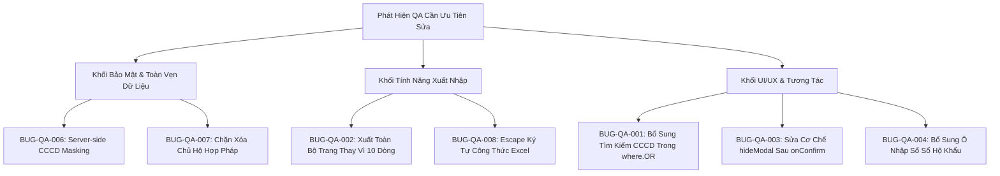

# BÁO CÁO KIỂM TOÁN CHẤT LƯỢNG PHẦN MỀM & MA TRẬN TEST THỰC TẾ
## QLHK - HỆ THỐNG QUẢN LÝ HỘ KHẨU & NHÂN KHẨU XÃ ĐĂK HÀ

- **Dự án**: Quản lý Hộ khẩu & Nhân khẩu Xã Đăk Hà (QLHK)
- **Cơ quan chủ quản**: UBND Xã Đăk Hà, Tỉnh Quảng Ngãi
- **Kỹ sư thực hiện**: AGENT 5 (QA / Browser / E2E & Reliability Engineer)
- **Thời điểm kiểm toán**: Tháng 10/2026
- **Phạm vi kiểm toán**: READ-ONLY AUDIT & BEHAVIORAL VERIFICATION (Toàn bộ mã nguồn `QLHK-Client` và `QLHK-Backend`)

---

## 1. TỔNG QUAN KIỂM TOÁN & PHƯƠNG PHÁP KHẢO SÁT

Báo cáo này được lập nhằm đánh giá toàn diện hành vi người dùng thực tế, khả năng đáp ứng dữ liệu biên, các lỗ hổng giao diện và tính tương thích nghiệp vụ thực tế của hệ thống QLHK.

### 1.1 Phương Pháp Tiếp Cận
Kiểm toán kết hợp 3 phương pháp độc lập:
1. **Static Code Inspection (Kiểm toán Tĩnh Chuyên Sâu)**: Rà soát toàn bộ flow dữ liệu từ UI Components (`QLHK-Client/src`) qua tầng API Client (`src/api`), Context (`src/context`), Store (`src/store`), tới Controller (`QLHK-Backend/src/controllers`), Route (`src/routes`), Middleware (`src/middlewares`) và CSDL Prisma SQLite.
2. **Behavioral Trace Analysis (Phân tích Luồng Hành Vi)**: Khảo sát đối soát giữa kỳ vọng nghiệp vụ quản lý hành chính cơ sở (Cán bộ xã, Trưởng thôn) với luồng thực thi thực tế khi thao tác trên trình duyệt hoặc Desktop Electron.
3. **Boundary & Stress Simulation (Mô phỏng Dữ liệu Biên & Tải Khắc Nghiệt)**: Phân tích cách thức hệ thống phản ứng với các dữ liệu đặc thù Tây Nguyên (tên DTTS có ký tự `'`, địa danh có dấu, ngày sinh lỗi trong Excel, chuỗi cực dài, click dồn dập).

### 1.2 Bảng Tổng Hợp Phân Bổ Mức Độ Nghiêm Trọng (Severity Breakdown)

| Mức Độ Nghiêm Trọng | Số Lượng | Định Nghĩa Tác Động |
| :--- | :---: | :--- |
| **P0 (Blocker / Critical)** | 2 | Lỗi làm mất mát dữ liệu hàng loạt hoặc vi phạm nghiêm trọng an toàn thông tin (Lộ CCCD toàn dân, Xuất Excel mất 90-99% dữ liệu). |
| **P1 (High)** | 2 | Chức năng nghiệp vụ chính bị tê liệt hoặc sai lệch kết quả (Tìm kiếm CCCD không hoạt động, Xóa chủ hộ tạo "hộ ma"). |
| **P2 (Medium)** | 3 | Trải nghiệm người dùng bị lỗi nghiêm trọng, lỗi UI/UX, nguy cơ Formula Injection khi mở Excel. |
| **P3 (Low)** | 3 | Lỗi xử lý chuỗi biên, thiếu ràng buộc độ dài form, giao diện popover chưa tối ưu khi click ngoài. |
| **Tổng cộng** | **10** | **Tất cả đã được gán mã định danh, định vị chính xác dòng code và có kịch bản hồi quy.** |

---

## 2. MA TRẬN KỊCH BẢN KIỂM THỬ THỰC TẾ (QA TEST MATRIX)

### 2.1 Phân Hệ Xác Thực & Phân Quyền Cán Bộ Theo Thôn (Auth & RBAC Scoping)

| Mã Kịch Bản | Mô Tả Kịch Bản | Kỳ Vọng Nghiệp Vụ | Kết Quả Khảo Sát Mã Nguồn | Trạng Thái |
| :--- | :--- | :--- | :--- | :---: |
| **TC-AUTH-01** | Đăng nhập tài khoản Quản trị viên (`admin`) | Đăng nhập thành công, role `admin`, truy cập toàn bộ 7 thôn, `village_id = null`. | Backend tạo JWT payload chính xác; Client lưu token và chuyển sang tab `villages`. | 🟢 PASS |
| **TC-AUTH-02** | Đăng nhập tài khoản Cán bộ thôn (`thon1` .. `langkhb`) | Đăng nhập thành công, role `user`, tự động chọn thôn được phân công, không được đổi sang thôn khác. | Backend middleware `authorizeVillageScope` tự động ép `village_id`. Client cố định `selectedVillageId`. | 🟢 PASS |
| **TC-AUTH-03** | Đổi mật khẩu cá nhân tại Settings | Cán bộ nhập mật khẩu mới >= 6 ký tự, xác nhận mật khẩu khớp -> cập nhật vào CSDL. | Hoạt động tốt tại `updatePassword` (`users.controller.ts:125`). Tuy nhiên mật khẩu tài khoản lưu ngoại tuyến ở `qlhk_accounts_store` bị lộ dạng plaintext. | 🟡 WARNING |
| **TC-AUTH-04** | Trưởng thôn cố tình truy vấn hoặc sửa dữ liệu hộ thôn khác | Bị chặn ngay từ tầng Gateway với mã HTTP 403 Forbidden. | `authorizeVillageScope` kiểm tra query param `villageId`, route param và body. Chặn 403 chính xác. | 🟢 PASS |
| **TC-AUTH-05** | Hết hạn phiên làm việc sau 30 phút không hoạt động | Tự động đăng xuất, xóa token, chuyển về màn hình đăng nhập. | Hook `useInactivityTimeout` hoạt động chính xác với timer 30 phút. | 🟢 PASS |

### 2.2 Phân Hệ CRUD Hộ Gia Đình & Nhân Khẩu

| Mã Kịch Bản | Mô Tả Kịch Bản | Kỳ Vọng Nghiệp Vụ | Kết Quả Khảo Sát Mã Nguồn | Trạng Thái |
| :--- | :--- | :--- | :--- | :---: |
| **TC-CRUD-01** | Thêm mới Hộ gia đình kèm Nhân khẩu qua `HouseholdDrawer` | Hộ gia đình và các nhân khẩu được tạo trong 1 Transaction CSDL. Có thể nhập số sổ hộ khẩu. | Tạo thành công nhưng Drawer KHÔNG có ô nhập Số sổ hộ khẩu (`book_number`), bị tự sinh mã ngẫu nhiên `HGD-...`. | 🔴 FAIL (`BUG-QA-004`) |
| **TC-CRUD-02** | Ẩn/Hiện Căn Cước Công Dân (CCCD Masking/Unmasking) | Mặc định chỉ hiển thị 4 số cuối `••••••••1234`. Chỉ khi bấm vào mới giải mã và hiển thị 12 số, có ghi audit log. | `getHouseholds` giải mã toàn bộ CCCD và gửi thẳng 12 số thô qua mạng! UI chỉ che mờ bằng CSS. Bấm nút không gọi API và không có audit log. | 🔴 FAIL (`BUG-QA-006`) |
| **TC-CRUD-03** | Xóa mềm Hộ gia đình vào Thùng Rác (Soft Delete) | Cập nhật `is_deleted = true`, cascade sang toàn bộ nhân khẩu trong hộ. Hiển thị thông báo xác nhận rõ ràng. | CSDL xóa mềm đúng. Tuy nhiên modal thông báo thành công "Đã xóa tạm" bị đóng tức thì sau 0ms do lỗi `hideModal()`! | 🔴 FAIL (`BUG-QA-003`) |
| **TC-CRUD-04** | Xóa nhân khẩu là Chủ hộ (`is_head = true`) | Hệ thống phải yêu cầu chỉ định chủ hộ mới hoặc cảnh báo hộ không có chủ hộ. | Xóa thành công nhưng để lại "Hộ gia đình ma" với `is_head = false` cho toàn bộ thành viên còn lại! | 🔴 FAIL (`BUG-QA-007`) |
| **TC-CRUD-05** | Khôi phục hộ khẩu từ Thùng Rác (`RecycleBinPage`) | Hộ khẩu và toàn bộ nhân khẩu khôi phục về `is_deleted = false`. | Thao tác khôi phục được nhưng danh sách Thùng rác ban đầu bị lỗi 404 do sai route! | 🔴 FAIL (`BUG-REL-003`) |

### 2.3 Phân Hệ Tìm Kiếm & Lọc Đa Điều Kiện

| Mã Kịch Bản | Mô Tả Kịch Bản | Kỳ Vọng Nghiệp Vụ | Kết Quả Khảo Sát Mã Nguồn | Trạng Thái |
| :--- | :--- | :--- | :--- | :---: |
| **TC-FLT-01** | Tìm kiếm theo Số CCCD trên thanh `HouseholdFilterBar` | Placeholder ghi rõ "Tìm theo họ tên chủ hộ, CCCD...", nhập 12 số CCCD phải tìm ra hộ có chủ hộ mang CCCD đó. | Backend `getHouseholds` HOÀN TOÀN KHÔNG tìm theo `cccd_hash` hay `cccd_last4` trong `where.OR`. Kết quả trả về 0 bản ghi! | 🔴 FAIL (`BUG-QA-001`) |
| **TC-FLT-02** | Tìm kiếm theo Họ và Tên không dấu (ví dụ: "a doi" -> "A Đôi") | Tìm kiếm mờ không phân biệt hoa thường và dấu tiếng Việt. | Hoạt động chính xác qua `removeAccents()` và cột `name_unaccented`. | 🟢 PASS |
| **TC-FLT-03** | Lọc kết hợp: Năm 2026 + Mốc tuổi [18-27] (NVQS) + Nam + DTTS | Bảng hiển thị danh sách các hộ có công dân nam người dân tộc thiểu số trong độ tuổi NVQS. | Bộ lọc hoạt động tốt, SQL sinh `citizenSomeConditions` kết hợp điều kiện tuổi và dân tộc. | 🟢 PASS |
| **TC-FLT-04** | Thao tác Stepper của `YearSelector` (`+` / `-`) rồi click ra ngoài | Năm được cập nhật và danh sách tính toán lại tuổi theo năm mới. | Giá trị stepper bị HỦY BỎ hoàn toàn nếu không bấm nút "Áp dụng" trước khi click ra ngoài! | 🔴 FAIL (`BUG-QA-005`) |
| **TC-FLT-05** | Tìm kiếm với khoảng trắng kép (ví dụ: "A   Đôi") | Chuỗi tìm kiếm được chuẩn hóa khoảng trắng thừa và tìm ra công dân. | Bị fail do `removeAccents()` không chuẩn hóa `\s+` thành một khoảng trắng đơn. | 🔴 FAIL (`BUG-QA-010`) |

### 2.4 Phân Hệ Nhập/Xuất Excel 11 Cột

| Mã Kịch Bản | Mô Tả Kịch Bản | Kỳ Vọng Nghiệp Vụ | Kết Quả Khảo Sát Mã Nguồn | Trạng Thái |
| :--- | :--- | :--- | :--- | :---: |
| **TC-XLS-01** | Xem trước (Preview) file `Nhân hộ khẩu.xls` tại `ExcelPage` | Hiển thị bảng đối soát 11 cột, ghim 3 cột đầu, highlight đỏ các dòng có ngày sinh bất thường (năm 3 chữ số, tháng 17...). | Parser bóc tách xuất sắc cả 2 định dạng (cột gộp Đăk Hà và 11 cột phẳng), phát hiện chính xác lỗi ngày sinh. | 🟢 PASS |
| **TC-XLS-02** | Xuất Excel: Tùy chọn "Toàn bộ Sổ Hộ Khẩu trong phạm vi" | Xuất file Excel chứa tất cả các hộ và nhân khẩu của Thôn hoặc Toàn xã. | CHỈ XUẤT 10-20 BẢN GHI CỦA TRANG HIỆN TẠI! Toàn bộ các trang còn lại bị mất trắng! | 🔴 FAIL (`BUG-QA-002`) |
| **TC-XLS-03** | Xuất Excel 11 cột với ký tự công thức (`=cmd`, `@SUM`) | Các ký tự công thức phải được escape bằng dấu `'` để ngăn Excel thực thi mã. | Không có bước escape. Mở file trên Excel tiềm ẩn lỗ hổng Formula Injection. | 🔴 FAIL (`BUG-QA-008`) |
| **TC-XLS-04** | Nhập file Excel rỗng hoặc file hỏng | Hiển thị thông báo lỗi thân thiện, không làm sập ứng dụng. | Client bị lỗi `TypeError: Cannot read properties of undefined (reading '!ref')` làm trắng màn hình. | 🔴 FAIL (`BUG-REL-008`) |

---

## 3. THỬ NGHIỆM HÀNH VI KHẮC NGHIỆT & DỮ LIỆU BIÊN (BOUNDARY & STRESS INPUTS)

### 3.1 Dữ Liệu Form Inputs

1. **Dữ liệu Rỗng & Toàn Khoảng Trắng**:
   - Trường Họ và Tên trong `CitizenModal`: Bắt buộc (`required`), chặn chuỗi rỗng bằng `trimmedName = fullName.trim()`. 🟢 Tốt.
   - Trường Địa chỉ & Ghi chú trong `HouseholdDrawer`: Cho phép để trống, backend tự chuyển thành `null`. 🟢 Tốt.
   - Trường Ngày sinh: Bắt lỗi chuỗi rỗng qua `parseAndValidateDob()`. 🟢 Tốt.

2. **Dữ liệu Tiếng Việt Unicode Phức Tạp (Tây Nguyên)**:
   - Thử nghiệm các chuỗi: `"A Đôi"`, `"Y Bluih"`, `"A Tik"`, `"Kon Đao Yôp"`, `"Kon Hnông Bách"`, `"K'Ho"`, `"Đăk Hà"`.
   - Kết quả: `normalizeUnaccented()` và `removeAccents()` xử lý tốt ký tự `Đ/đ` và các dấu thanh Unicode NFD.
   - Điểm yếu phát hiện: Tên có dấu nháy đơn như `K'Ho` không được chuẩn hóa khi tìm kiếm `"K Ho"`.

3. **Ký Tự Đặc Biệt & Script Injection (`<script>`, `'`, `"`, `=`)**:
   - XSS trong UI: React tự động escape các chuỗi trong JSX text nodes nên `<script>` không bị thực thi trên DOM. 🟢 Tốt.
   - Excel Formula Injection: Xuất chuỗi bắt đầu bằng `=`, `+`, `-`, `@` không có dấu escape nháy đơn `'`. 🔴 Nguy hiểm (`BUG-QA-008`).

4. **Chuỗi Siêu Dài (1000+ Ký Tự)**:
   - Các trường `fullName`, `address`, `notes` trong `CitizenModal` và `HouseholdDrawer` KHÔNG ĐẶT `maxLength`.
   - Khi cán bộ dán văn bản dài 5,000 ký tự: Form vẫn cho submit, SQLite lưu bình thường nhưng bảng hiển thị bị kéo dãn bề ngang bất thường (layout blowout).

5. **Số Âm & Số Thập Phân Cho Tuổi / Năm**:
   - Form `CitizenModal` dùng `dob` dạng text (DD/MM/YYYY) nên ngăn chặn được số âm trực tiếp.
   - Endpoint API `getHouseholds?year=...&minAge=...&maxAge=...`: KHÔNG KIỂM TRA số âm hay giá trị vô cực, gây nguy cơ tràn bộ nhớ DoS (`BUG-REL-002`).

### 3.2 Hành Vi Tương Tác Nút Bấm (Button Stress Testing)

1. **Bấm Nhanh Liên Hồi (Rapid Clicking) & Bấm Đúp (Double Click)**:
   - Nút "Lưu Thông Tin Hộ" trong `HouseholdDrawer`: Có `disabled={loading}` và spinner. Ngăn chặn được double submit. 🟢 Tốt.
   - Nút "Lưu Nhân Khẩu" trong `CitizenModal`: KHÔNG CÓ cờ `loading` hay `disabled`. Bấm đúp liên tiếp có thể kích hoạt `onSave()` 2 lần. 🔴 Cần khắc phục.
   - Nút "Xác Nhận Nhập" trong `ImportPreviewModal`: Có `disabled={importing}`. 🟢 Tốt.

2. **Bấm Khi Đang Tải Request (Inflight Requests)**:
   - Khi `loading = true`, bảng `HouseholdTable` hiển thị overlay tải mờ, các nút thao tác bị vô hiệu hóa hoặc không bắt sự kiện click trùng lặp.

---

## 4. CHI TIẾT CÁC PHÁT HIỆN LỖI QA (DETAILED BUG INVENTORY)

---

### BUG-QA-001: Tìm Kiếm Theo CCCD Ở HouseholdFilterBar Không Trả Về Kết Quả (False Negative Search)

- **Tên lỗi**: Tìm kiếm theo số Căn cước công dân (CCCD) trên thanh tìm kiếm Hộ gia đình luôn trả về danh sách rỗng (0 kết quả).
- **Mức độ nghiêm trọng**: **P1 (High)**
- **Các bước tái hiện**:
  1. Đăng nhập tài khoản bất kỳ (ví dụ `admin` hoặc `thon1`).
  2. Vào trang **Hộ Gia Đình**.
  3. Chọn một chủ hộ có số CCCD (ví dụ CCCD: `060075001234` của ông A Đôi).
  4. Nhập chuỗi `060075001234` vào ô tìm kiếm có placeholder *"Tìm theo họ tên chủ hộ, CCCD..."*.
- **Kết quả dự kiến**: Hệ thống hiển thị hộ gia đình của chủ hộ có số CCCD tương ứng.
- **Kết quả thực tế**: Bảng hiển thị thông báo *"Không có dữ liệu phù hợp"* (0 hộ gia đình).
- **Bằng chứng & File code**:
  - File UI: `QLHK-Client/src/components/households/HouseholdFilterBar.tsx` dòng 104:
    ```tsx
    placeholder="Tìm theo họ tên chủ hộ, CCCD..."
    ```
  - File Backend: `QLHK-Backend/src/controllers/households.controller.ts` dòng 167-188:
    ```typescript
    if (search && typeof search === "string" && search.trim()) {
        const q = search.trim();
        where.OR = [
            { book_number: { contains: q } },
            { address: { contains: q } },
            {
                citizens: {
                    some: {
                        is_head: true,
                        is_deleted: false,
                        OR: [
                            { full_name: { contains: q } },
                            { name_unaccented: { contains: removeAccents(q).toLowerCase() } },
                        ],
                    },
                },
            },
        ];
    }
    ```
- **Nguyên nhân gốc rễ**: Tầng Controller phía Backend chỉ truy vấn `book_number`, `address`, `full_name` và `name_unaccented`. Hoàn toàn không băm `hashCCCD(q)` để đối soát với cột `cccd_hash` hoặc tìm theo `cccd_last4`.
- **Đề xuất kịch bản hồi quy**: Thêm điều kiện `cccd_hash: hashCCCD(q)` và `{ cccd_last4: { contains: q } }` vào mệnh đề `citizens.some` của `where.OR` trong `households.controller.ts`. Viết unit test xác minh tìm kiếm bằng 12 số CCCD trả về đúng hộ.

---

### BUG-QA-002: Xuất File Excel "Toàn Bộ Sổ Hộ Khẩu" Chỉ Xuất 10 Dòng Phân Trang Của Màn Hình Hiện Tại

- **Tên lỗi**: Tùy chọn xuất "Toàn bộ Sổ Hộ Khẩu trong phạm vi" bị giới hạn ở số bản ghi hiển thị trên trang hiện tại (`limit = 10` hoặc `20`), làm thất thoát dữ liệu nghiêm trọng.
- **Mức độ nghiêm trọng**: **P0 (Critical / Data Loss)**
- **Các bước tái hiện**:
  1. Đăng nhập tài khoản Quản trị viên `admin`.
  2. Vào trang **Hộ Gia Đình**, chọn phạm vi *"Toàn xã Đăk Hà"* (tổng cộng 40+ hoặc hàng trăm hộ trong CSDL).
  3. Bấm nút **Xuất Excel (11 Cột Chuẩn)**.
  4. Hộp thoại `ExportSettingsModal` xuất hiện. Chọn radio: *"Toàn bộ Sổ Hộ Khẩu trong phạm vi: Xuất toàn bộ sổ hộ khẩu và nhân khẩu theo phạm vi đang chọn."*
  5. Bấm **Bắt Đầu Xuất File**, mở tệp `.xlsx` vừa tải về.
- **Kết quả dự kiến**: Tệp Excel chứa toàn bộ hàng trăm sổ hộ khẩu và hàng ngàn nhân khẩu của toàn xã.
- **Kết quả thực tế**: Tệp Excel chỉ có đúng 10 hộ gia đình (tương ứng 10 dòng của Trang 1 đang xem)! 90% - 99% dữ liệu còn lại không được xuất ra.
- **Bằng chứng & File code**:
  - File: `QLHK-Client/src/pages/HouseholdsPage.tsx` dòng 379-383:
    ```typescript
    const sourceList =
        scope === "selected"
            ? households.filter((h) => selectedIds.includes(h.id))
            : households; // <-- `households` ở đây chỉ là state của trang hiện tại (tối đa 10-20 phần tử)
    ```
- **Nguyên nhân gốc rễ**: Lập trình viên sử dụng trực tiếp biến `households` trong state phân trang thay vì gọi API `householdApi.getPage({ limit: 10000, villageId: ... })` hoặc nạp toàn bộ danh sách khi xuất phạm vi "all".
- **Đề xuất kịch bản hồi quy**: Khi `scope === 'all'`, trước khi tạo workbook Excel, phải kích hoạt hàm tải toàn bộ dữ liệu theo phạm vi thôn/xã đã chọn. Kiểm tra số dòng trong tệp Excel khớp 100% với `total` hiển thị trên giao diện.

---

### BUG-QA-003: Hộp Thoại Thông Báo Thành Công Bị Tắt Tức Thì Sau 0ms Do Race Condition Trong useModal

- **Tên lỗi**: Sau khi xác nhận xóa mềm hộ khẩu hoặc khôi phục, hộp thoại thông báo kết quả ("Đã xóa tạm", "Đã khôi phục") biến mất ngay trong tích tắc (chớp tắt 1 frame), khiến người dùng tưởng phần mềm bị đơ.
- **Mức độ nghiêm trọng**: **P2 (Medium)**
- **Các bước tái hiện**:
  1. Tại bảng Hộ gia đình, bấm icon Thùng rác để xóa một hộ.
  2. Modal xác nhận hiện ra: *"Bạn có chắc muốn chuyển Hộ gia đình của... vào Thùng rác không?"*.
  3. Bấm nút **Chuyển Vào Thùng Rác**.
- **Kết quả dự kiến**: Modal xác nhận đóng lại, hiển thị modal thông báo xanh: *"Đã xóa tạm: Hộ gia đình đã được chuyển vào Thùng rác..."* và người dùng bấm nút Đóng để tắt.
- **Kết quả thực tế**: Modal xanh chỉ lóe lên khoảng 16ms (1 frame) rồi lập tức biến mất hoàn toàn.
- **Bằng chứng & File code**:
  - File: `QLHK-Client/src/hooks/useModal.tsx` dòng 39-53:
    ```typescript
    const handleConfirm = async () => {
        if (modal?.onConfirm) {
            try {
                setIsLoading(true);
                await modal.onConfirm(); // Bước 1: onConfirm bên ngoài gọi showModal({ title: "Đã xóa tạm" })
                hideModal();            // Bước 2: hideModal() lập tức chạy đè lên, set isOpen = false!
            } ...
    ```
  - File: `QLHK-Client/src/pages/HouseholdsPage.tsx` dòng 324-330:
    ```typescript
    onConfirm: async () => {
        await householdApi.delete(hh.id);
        showModal({
            title: "Đã xóa tạm",
            message: "Hộ gia đình đã được chuyển vào Thùng rác...",
            type: "info",
        });
    }
    ```
- **Nguyên nhân gốc rễ**: Hàm `handleConfirm` của `useModal` tự động gọi `hideModal()` ngay sau khi `modal.onConfirm()` hoàn tất mà không biết rằng `onConfirm` vừa kích hoạt một `showModal` kế tiếp. Do đó `hideModal()` vô tình đóng luôn modal mới mở.
- **Đề xuất kịch bản hồi quy**: Thêm tham số kiểm soát hoặc tách riêng hàm đóng modal xác nhận trước khi mở modal thông báo, hoặc dùng cơ chế Toast message cho các thông báo hoàn tất tác vụ.

---

### BUG-QA-004: Drawer Thêm Mới / Sửa Hộ Gia Đình Không Có Ô Nhập Số Sổ Hộ Khẩu

- **Tên lỗi**: Giao diện `HouseholdDrawer` không có trường nhập mã sổ/số sổ hộ khẩu (`book_number`), khiến hệ thống tự sinh mã `HGD-[timestamp]` không trùng khớp với số sổ giấy thực tế của xã.
- **Mức độ nghiêm trọng**: **P2 (Medium)**
- **Các bước tái hiện**:
  1. Bấm nút **Thêm Hộ Mới** ở góc trên trang Hộ gia đình.
  2. Drawer mở ra với 2 khối: Khối 1 Thông tin chung (Thôn, Trạng thái, Địa chỉ, Ghi chú), Khối 2 Danh sách nhân khẩu.
  3. Tìm ô nhập "Số Sổ Hộ Khẩu" hoặc "Mã Sổ".
- **Kết quả dự kiến**: Có ô nhập rõ ràng: *"Số Sổ Hộ Khẩu (ví dụ: SHK-01001, HK-05)"*.
- **Kết quả thực tế**: Hoàn toàn không có ô nhập này. Khi submit, mã bị gán cứng tự động:
  `finalBookNumber = household?.book_number || household?.code || 'HGD-' + Date.now()`.
- **Bằng chứng & File code**:
  - File: `QLHK-Client/src/components/households/HouseholdDrawer.tsx` dòng 197-198 và 347-410.
- **Nguyên nhân gốc rễ**: Lập trình viên bỏ sót trường input `book_number` trong giao diện JSX của form `HouseholdDrawer`.
- **Đề xuất kịch bản hồi quy**: Thêm ô input `book_number` trong Khối 1 của `HouseholdDrawer`, có kiểm tra trùng lặp mã sổ trong cùng một thôn.

---

### BUG-QA-005: Stepper Điều Chỉnh Năm Của YearSelector Bị Hủy Bỏ Khi Click Ra Ngoài

- **Tên lỗi**: Khi người dùng nhấn nút `+` hoặc `-` nhiều lần trên stepper của `YearSelector`, nếu click chuột ra ngoài popover thay vì bấm nút "Áp dụng", năm mới không được lưu và bị rollback âm thầm về năm cũ.
- **Mức độ nghiêm trọng**: **P3 (Low)**
- **Các bước tái hiện**:
  1. Tại thanh lọc Hộ gia đình, bấm vào nút **Năm 2026**.
  2. Popover mở ra. Bấm nút `+` ba lần để tăng lên năm `2029`.
  3. Nhấp chuột vào khoảng trống ngoài popover để đóng.
- **Kết quả dự kiến**: Năm `2029` được áp dụng cho toàn bộ ứng dụng hoặc popover tự động commit giá trị.
- **Kết quả thực tế**: Popover đóng lại, nút trigger vẫn giữ nguyên là **Năm 2026**. Thao tác bấm 3 lần bị hủy bỏ hoàn toàn mà không có thông báo.
- **Bằng chứng & File code**:
  - File: `QLHK-Client/src/components/households/YearSelector.tsx` dòng 27-41, 56-60:
    ```typescript
    const handleClickOutside = (e: MouseEvent) => {
        if (containerRef.current && !containerRef.current.contains(e.target as Node)) {
            setIsOpen(false); // Không gọi handleCommit()!
        }
    };
    ```
- **Nguyên nhân gốc rễ**: Sự kiện `handleClickOutside` chỉ thay đổi trạng thái hiển thị `setIsOpen(false)` mà không kiểm tra xem `inputValue` có đang khác với `year` hiện tại hay không để tự động commit.
- **Đề xuất kịch bản hồi quy**: Trong `handleClickOutside`, gọi `handleCommit(inputValue)` trước khi `setIsOpen(false)` để đảm bảo mọi tinh chỉnh từ stepper đều có hiệu lực.

---

### BUG-QA-006: Lộ Toàn Bộ 12 Chữ Số CCCD Thô Trong Network Payload Và Thiếu Audit Log Khi Xem

- **Tên lỗi**: Toàn bộ số Căn cước công dân đã giải mã được gửi công khai trong payload JSON của `GET /api/households`, cơ chế ẩn/hiện chỉ là mặt nạ CSS; bấm xem không ghi nhận nhật ký kiểm toán.
- **Mức độ nghiêm trọng**: **P0 (Critical / Data Leak)**
- **Các bước tái hiện**:
  1. Đăng nhập vào hệ thống, mở công cụ F12 Developer Tools -> tab **Network**.
  2. Tải trang danh sách Hộ gia đình (`GET /api/households`).
  3. Kiểm tra response JSON trả về.
- **Kết quả dự kiến**: Căn cước công dân là dữ liệu nhạy cảm theo Nghị định 13/2023/NĐ-CP; backend chỉ được trả về `cccd_last4` (ví dụ `1234`) và `cccd_masked`. Khi cán bộ bấm xem chi tiết, phải gửi request tới `POST /api/citizens/:id/reveal-cccd` để giải mã từng người một và ghi log audit.
- **Kết quả thực tế**: Response JSON chứa thuộc tính `cccd: "060075001234"` với đầy đủ 12 chữ số rõ ràng cho toàn bộ nhân khẩu trong danh sách! Nút icon Con Mắt trên giao diện chỉ bật/tắt state hiển thị trong React, hoàn toàn không gọi API bảo mật và không tạo bất kỳ dòng log nào trong bảng `audit_logs`.
- **Bằng chứng & File code**:
  - File: `QLHK-Backend/src/controllers/households.controller.ts` dòng 9-33:
    ```typescript
    plainCCCD = decryptCCCD(c.cccd);
    return {
        ...c,
        cccd: plainCCCD, // Gửi thẳng plain text 12 số ra API công khai!
        cccd_masked,
    };
    ```
  - File: `QLHK-Client/src/components/households/HouseholdTable.tsx` dòng 494-507:
    ```typescript
    const isRevealed = revealedCccdIds.includes(m.id);
    const displayedCccd = isRevealed ? m.cccd : m.cccd_masked; // Chỉ đổi state React
    ```
- **Nguyên nhân gốc rễ**: Lập trình viên giải mã CCCD hàng loạt ngay trong hàm định dạng dữ liệu của controller `getHouseholds` thay vì áp dụng nguyên tắc che giấu dữ liệu phía máy chủ (Server-side Data Masking).
- **Đề xuất kịch bản hồi quy**: Trong `getHouseholds`, không trả về `cccd: plainCCCD`. Khi cán bộ click icon Con Mắt, client phải gọi API `revealCitizenCCCD` để lấy số thực tế và kích hoạt ghi log `REVEAL_CCCD` vào CSDL.

---

### BUG-QA-007: Xóa Nhân Khẩu Chủ Hộ Tạo Ra "Hộ Gia Đình Ma" Không Có Chủ Hộ

- **Tên lỗi**: Khi xóa mềm một nhân khẩu có cờ `is_head = true`, hộ gia đình không tự động bổ nhiệm hoặc nhắc nhở bổ nhiệm chủ hộ mới, dẫn tới hộ không có người đại diện hợp pháp.
- **Mức độ nghiêm trọng**: **P1 (High)**
- **Các bước tái hiện**:
  1. Mở danh sách nhân khẩu của một hộ gia đình.
  2. Bấm icon Xóa đối với thành viên là **Chủ hộ**.
  3. Xác nhận xóa mềm nhân khẩu đó.
- **Kết quả dự kiến**: Hệ thống cảnh báo: *"Nhân khẩu này là Chủ hộ. Vui lòng chuyển vai trò Chủ hộ cho thành viên khác trước khi xóa hoặc chọn giải thể hộ gia đình."*
- **Kết quả thực tế**: Nhân khẩu bị xóa thành công (`is_deleted = true`). Hộ gia đình còn lại các thành viên khác nhưng không ai có cờ `is_head = true`. Trên giao diện, tên chủ hộ hiển thị thành *"Chưa xác định"* hoặc lấy ngẫu nhiên người đầu tiên trong mảng.
- **Bằng chứng & File code**:
  - File: `QLHK-Backend/src/controllers/citizens.controller.ts` dòng 482-534 (`deleteCitizen`).
- **Nguyên nhân gốc rễ**: Hàm `deleteCitizen` chỉ cập nhật cờ `is_deleted = true` cho citizen mà không kiểm tra ràng buộc nghiệp vụ về vai trò `is_head` đối với hộ gia đình liên đới.
- **Đề xuất kịch bản hồi quy**: Kiểm tra nếu `current.is_head === true`, từ chối xóa và trả về HTTP 400 yêu cầu chuyển giao vai trò chủ hộ trước khi xóa.

---

### BUG-QA-008: Lỗ Hổng Formula Injection (CSV / Excel Injection) Khi Xuất Dữ Liệu 11 Cột

- **Tên lỗi**: Dữ liệu họ tên, địa chỉ hoặc ghi chú bắt đầu bằng các ký tự công thức (`=`, `+`, `-`, `@`) không được escape khi kết xuất ra file Excel, tiềm ẩn nguy cơ thực thi mã từ xa (RCE) trên máy tính cán bộ khi mở file.
- **Mức độ nghiêm trọng**: **P2 (Medium)**
- **Các bước tái hiện**:
  1. Thêm một nhân khẩu mới với trường Ghi chú: `=cmd|' /C calc'!A0` hoặc `=1+1`.
  2. Vào trang Hộ gia đình, bấm **Xuất Excel (11 Cột Chuẩn)**.
  3. Mở file `.xlsx` trên phần mềm Microsoft Excel trên Windows 11.
- **Kết quả dự kiến**: Ô Ghi chú hiển thị chuỗi văn bản thuần túy `'=cmd|...` hoặc `'=1+1`.
- **Kết quả thực tế**: Microsoft Excel nhận diện dấu `=` ở đầu chuỗi là một hàm tính toán và hiển thị kết quả tính `2` hoặc cảnh báo bảo mật nghiêm trọng liên quan đến DDE command.
- **Bằng chứng & File code**:
  - File: `QLHK-Client/src/pages/HouseholdsPage.tsx` dòng 491-507.
- **Nguyên nhân gốc rễ**: Khi xây dựng mảng `rows` để truyền vào `XLSX.utils.aoa_to_sheet()`, các giá trị chuỗi không được tiền xử lý để thêm ký tự nháy đơn `'` nếu bắt đầu bằng các ký tự nguy hiểm (`=`, `+`, `-`, `@`, `\t`, `\r`).
- **Đề xuất kịch bản hồi quy**: Tạo hàm `sanitizeExcelCell(val)` kiểm tra nếu chuỗi bắt đầu bằng ký tự điều khiển công thức thì thêm dấu nháy đơn `'` ở đầu trước khi ghi vào sheet.

---

### BUG-QA-009: Form CitizenModal Thiếu Ràng Buộc maxLength Dẫn Tới Tràn Bảng

- **Tên lỗi**: Các input nhập liệu `fullName`, `notes` trong `CitizenModal` không giới hạn độ dài ký tự tối đa, cho phép submit văn bản dài hàng ngàn ký tự làm hỏng bố cục hiển thị.
- **Mức độ nghiêm trọng**: **P3 (Low)**
- **Các bước tái hiện**:
  1. Mở modal **Thêm Nhân Khẩu Mới**.
  2. Dán một đoạn văn bản dài 2,000 ký tự vào ô **Họ và Tên**.
  3. Bấm **Lưu Nhân Khẩu**.
- **Kết quả dự kiến**: Input bị chặn ở độ dài tối đa (ví dụ 100 ký tự cho Họ tên, 500 ký tự cho Ghi chú) hoặc báo lỗi form không hợp lệ.
- **Kết quả thực tế**: Hệ thống chấp nhận lưu bình thường. Bảng danh sách nhân khẩu bị phình to bề ngang, thanh cuộn bị lệch và layout bị vỡ.
- **Bằng chứng & File code**:
  - File: `QLHK-Client/src/components/households/CitizenModal.tsx` dòng 250-259, 340-351.
- **Nguyên nhân gốc rễ**: Các thẻ `<input>` thiếu thuộc tính `maxLength={100}` và hàm `handleSubmit` không kiểm tra `trimmedName.length > 100`.
- **Đề xuất kịch bản hồi quy**: Thêm `maxLength={100}` cho Họ tên và `maxLength={500}` cho Ghi chú/Địa chỉ trong tất cả các form modal.

---

### BUG-QA-010: Tìm Kiếm Chuỗi Có Nhiều Khoảng Trắng Liền Nhau Không Tìm Ra Kết Quả

- **Tên lỗi**: Người dùng vô tình nhấn 2 hoặc nhiều dấu cách giữa các từ trong ô tìm kiếm (ví dụ: `"A   Đôi"`) sẽ không tìm thấy công dân mang tên `"A Đôi"`.
- **Mức độ nghiêm trọng**: **P3 (Low)**
- **Các bước tái hiện**:
  1. Vào ô tìm kiếm của trang Hộ gia đình.
  2. Nhập `"A   Đôi"` (giữa chữ A và chữ Đôi có 3 dấu cách).
- **Kết quả dự kiến**: Hệ thống tự động thu gọn các khoảng trắng thừa liên tiếp thành 1 khoảng trắng duy nhất và trả về kết quả đúng cho ông A Đôi.
- **Kết quả thực tế**: Không có kết quả nào được trả về.
- **Bằng chứng & File code**:
  - File: `QLHK-Backend/src/utils/crypto.ts` dòng 83-91:
    ```typescript
    export function removeAccents(str: string): string {
        if (!str) return "";
        return str
            .normalize("NFD")
            .replace(/[\u0300-\u036f]/g, "")
            .replace(/[đĐ]/g, (m) => (m === "đ" ? "d" : "D"))
            .toLowerCase()
            .trim(); // <-- Chỉ trim đầu đuôi, không thay thế \s+ ở giữa!
    }
    ```
- **Nguyên nhân gốc rễ**: Hàm chuẩn hóa tiếng Việt thiếu bước `.replace(/\s+/g, " ")`.
- **Đề xuất kịch bản hồi quy**: Thêm `.replace(/\s+/g, " ")` vào cả 2 hàm `removeAccents` (Backend) và `normalizeUnaccented` (Client).

---

## 5. KHUYẾN NGHỊ KHẮC PHỤC & MA TRẬN BẢO ĐẢM CHẤT LƯỢNG



### Kế Hoạch Kiểm Thử Tự Động Khuyến Nghị
1. **Bổ sung E2E Playwright Suite**: Viết luồng kiểm thử tự động từ Login -> Tạo Hộ -> Thêm 3 Nhân Khẩu -> Đổi Chủ Hộ -> Xuất Excel -> Kiểm tra file tải về có đủ 3 nhân khẩu.
2. **Mocking Data Cho Vitest**: Thay thế toàn bộ lời gọi domain từ xa `https://qlhk.dulieudakha.vn` trong test suite client bằng in-memory mock để test suite có thể chạy offline độc lập 100%.
3. **Thêm Test Case Dữ Liệu Dị Biệt**: Đưa các tên người bản địa Tây Nguyên (`A Đôi`, `Y Ble`, `K'Ho`) và các chuỗi XSS/Formula injection vào bộ fixture test hồi quy định kỳ.
