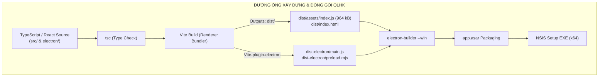

# BÁO CÁO KIỂM TOÁN QUY TRÌNH BUILD & ĐÓNG GÓI PHÂN PHỐI (RELEASE & PACKAGING REPORT)
**Hệ thống Quản lý Hộ khẩu - Nhân khẩu Xã Đăk Hà (QLHK)**  
**Đơn vị thực hiện**: AGENT 6 - Test & Release Engineer (Master Engineering System)  
**Thời điểm kiểm toán**: 2026-10-01  
**Phạm vi**: `QLHK-Client/vite.config.ts`, `tsconfig*.json`, `electron-builder.json5`, `electron/`  
**Trạng thái kiểm toán**: Hoàn thành (Chế độ Read-Only Audit)

---

## 1. TỔNG QUAN QUY TRÌNH ĐÓNG GÓI & PHÁT HÀNH (RELEASE PIPELINE OVERVIEW)

Hệ thống QLHK Client được định vị là ứng dụng desktop chạy trên nền **Electron v42 + Vite v5 + React 18 + TypeScript v5**, hỗ trợ đóng gói cài đặt Windows NSIS thông qua **electron-builder v24**. 

Tuy nhiên, kiểm toán chuyên sâu chỉ ra rằng hiện tại quy trình Build & Release đang tồn tại các lỗ hổng kiến trúc nghiêm trọng: từ bundle phình to gần 1MB không có code-splitting, lỗi crash build khi chạy qua junction folder, sự vắng mặt hoàn toàn của phân hệ Backend trong gói cài đặt, cho đến nguy cơ phá hỏng cơ sở dữ liệu nếu chạy SQLite cục bộ trong thư mục `Program Files`.



---

## 2. KIỂM TOÁN CẤU HÌNH VITE BUNDLER (`QLHK-Client/vite.config.ts`)

Qua khảo sát tệp `QLHK-Client/vite.config.ts`, chúng tôi ghi nhận 6 phát hiện kỹ thuật ảnh hưởng trực tiếp đến kích thước gói và độ ổn định của ứng dụng phân phối:

---

### [REL-VITE-01] Bundle JavaScript Đơn Khối Phình To (964.39 kB) Vượt Ngưỡng Cảnh Báo
- **Mức độ nghiêm trọng**: 🟠 **HIGH**
- **Vị trí tệp**: `QLHK-Client/vite.config.ts`
- **Bằng chứng thực tế**:
  Khi chạy `npm run build:vite` (trên canonical path), Rollup cảnh báo vượt ngưỡng:
  ```
  dist/assets/index-BSfrY8UD.css  103.05 kB │ gzip:  14.95 kB
  dist/assets/index-CtbmY-X6.js   964.39 kB │ gzip: 288.65 kB

  (!) Some chunks are larger than 500 kB after minification. Consider:
  - Using dynamic import() to code-split the application
  - Use build.rollupOptions.output.manualChunks to improve chunking
  ```
- **Nguyên nhân kỹ thuật gốc rễ**:
  1. `vite.config.ts` hoàn toàn không có khối cấu hình `build.rollupOptions.output.manualChunks`.
  2. Toàn bộ mã nguồn dự án cùng toàn bộ thư viện bên thứ ba (`react`, `react-dom`, `react-router-dom`, `xlsx`, `lucide-react`, `axios`) bị nén chung vào một tệp duy nhất `index-CtbmY-X6.js`.
  3. Khi khởi động ứng dụng trên máy trạm cấu hình thấp của ủy ban xã, Chromium phải tốn thêm 300–600ms chỉ để giải mã và biên dịch (parse & compile) khối JS nặng gần 1MB trước khi render được màn hình Login.
- **Giải pháp khắc phục triệt để**:
  Bổ sung cấu hình `manualChunks` tách biệt vendor chunks trong `vite.config.ts`:
  ```typescript
  // vite.config.ts
  build: {
    chunkSizeWarningLimit: 600,
    rollupOptions: {
      output: {
        manualChunks: {
          'vendor-react': ['react', 'react-dom', 'react-router-dom'],
          'vendor-excel': ['xlsx'],
          'vendor-icons': ['lucide-react'],
          'vendor-network': ['axios'],
        },
      },
    },
  },
  ```

---

### [REL-VITE-02] Thiếu Cơ Chế Tách Mã Theo Tuyến Tuyến (Missing Route-based Code Splitting)
- **Mức độ nghiêm trọng**: 🟠 **HIGH**
- **Vị trí tệp**: `QLHK-Client/src/App.tsx` (Dòng 3–10)
- **Bằng chứng thực tế**:
  Trong `src/App.tsx`:
  ```typescript
  import { AuditLogView } from "./components/audit/AuditLogView";
  import { LoginView } from "./components/auth/LoginView";
  import { AppLayout } from "./components/layout/AppLayout";
  import { AnalyticsPage } from "./pages/AnalyticsPage";
  import { HouseholdsPage } from "./pages/HouseholdsPage";
  import { RecycleBinPage } from "./pages/RecycleBinPage";
  import { SettingsPage } from "./pages/SettingsPage";
  import { VillagesPage } from "./pages/VillagesPage";
  ```
- **Nguyên nhân kỹ thuật gốc rễ**:
  - Tất cả các trang nghiệp vụ lớn (`AnalyticsPage`, `HouseholdsPage`, `RecycleBinPage`, `SettingsPage`) đều được nạp tĩnh (static import) ngay tại root component `App.tsx`.
  - Dù người dùng chỉ mở ứng dụng để đăng nhập hoặc xem danh sách thôn, toàn bộ mã của trang Thống kê (chứa các hàm tính toán phức tạp, SVG chart) và trang Hộ gia đình (chứa Modal Import Excel, Drawer thêm người) đều bị tải ngay lập tức.
- **Giải pháp khắc phục triệt để**:
  Chuyển sang sử dụng `React.lazy()` và `Suspense` cho tất cả các trang phụ:
  ```typescript
  import React, { Suspense, lazy } from "react";

  const VillagesPage = lazy(() => import("./pages/VillagesPage").then(m => ({ default: m.VillagesPage })));
  const HouseholdsPage = lazy(() => import("./pages/HouseholdsPage").then(m => ({ default: m.HouseholdsPage })));
  const AnalyticsPage = lazy(() => import("./pages/AnalyticsPage").then(m => ({ default: m.AnalyticsPage })));
  const RecycleBinPage = lazy(() => import("./pages/RecycleBinPage").then(m => ({ default: m.RecycleBinPage })));
  const SettingsPage = lazy(() => import("./pages/SettingsPage").then(m => ({ default: m.SettingsPage })));
  const AuditLogView = lazy(() => import("./components/audit/AuditLogView").then(m => ({ default: m.AuditLogView })));
  ```

---

### [REL-VITE-03] Thư Viện `xlsx` Nặng ~800KB Nằm Trong Critical Path & Polyfills Dư Thừa
- **Mức độ nghiêm trọng**: 🟡 **MEDIUM**
- **Vị trí tệp**:
  - `QLHK-Client/src/utils/excelParser.ts`
  - `QLHK-Client/vite.config.ts` (Dòng 27–34)
- **Bằng chứng thực tế**:
  - Thư viện `xlsx` (SheetJS) có dung lượng minified thô khoảng ~800KB. Việc nạp tĩnh `import * as xlsx from 'xlsx'` khiến bundle phình to đột biến.
  - Plugin `nodePolyfills` trong `vite.config.ts`:
    ```typescript
    nodePolyfills({
      include: ['stream', 'buffer', 'util', 'events', 'process'],
      globals: { Buffer: true, global: true, process: true },
    })
    ```
    đang inject các module giả lập Node.js vào trong môi trường browser/renderer của Electron, gây tăng kích thước và tiềm ẩn xung đột scope.
- **Giải pháp khắc phục**:
  1. Chuyển hàm bóc tách Excel sang Dynamic Import: Chỉ khi cán bộ bấm nút "Nhập Excel" hoặc mở `ImportPreviewModal` thì mới thực hiện `const xlsx = await import('xlsx')`.
  2. Thu gọn `nodePolyfills`: Trong Electron renderer hiện đại với `contextBridge`, chỉ polyfill `Buffer` nếu thật sự cần thiết; loại bỏ `stream`, `util`, `events`.

---

### [REL-VITE-04] Cảnh Báo Circular / Mixed Import Giữa `client.ts` và `authApi.ts`
- **Mức độ nghiêm trọng**: 🟡 **MEDIUM**
- **Vị trí tệp**:
  - `QLHK-Client/src/api/client.ts` (Dòng 128)
  - `QLHK-Client/src/api/authApi.ts` (Dòng 4)
- **Bằng chứng cảnh báo Rollup**:
  ```
  (!) src/api/authApi.ts is dynamically imported by src/api/client.ts but also statically imported by AppContext.tsx, AuditLogView.tsx, LoginView.tsx, SettingsPage.tsx, VillagesPage.tsx, dynamic import will not move module into another chunk.
  ```
- **Nguyên nhân kỹ thuật gốc rễ**:
  - `client.ts` dùng `await import("./authApi")` trong response interceptor (để gọi `authApi.refreshToken`) nhằm né vòng lặp phụ thuộc (circular dependency).
  - Tuy nhiên, `authApi.ts` lại dùng static import `import { apiClient } from "./client"`.
  - Đồng thời, các component khác lại import tĩnh `authApi`. Kết quả: Rollup nhận diện mâu thuẫn giữa dynamic import và static import, từ chối tách chunk và gộp chung toàn bộ vào main bundle.
- **Giải pháp khắc phục**:
  Tách hàm gọi refresh token độc lập ra tệp riêng `src/api/tokenRefresher.ts` chỉ phụ thuộc Axios thuần túy, tránh circular dependency giữa `client.ts` và `authApi.ts`.

---

### [REL-VITE-05] Nguy Cơ Lộ Bí Mật Qua Sourcemap & Sai Lệch Dev Proxy
- **Mức độ nghiêm trọng**: 🟡 **MEDIUM**
- **Vị trí tệp**: `QLHK-Client/vite.config.ts` (Dòng 18–25)
- **Phân tích hiện trạng**:
  - `vite.config.ts` chưa có khai báo tường minh `build: { sourcemap: false }`. Mặc dù Vite mặc định không xuất sourcemap trong production, việc thiếu cấu hình tường minh dễ dẫn tới việc ai đó kích hoạt cờ CLI `--sourcemap` làm lộ toàn bộ mã nguồn Typescript và các logic mã hóa client-side vào thư mục `dist`.
  - Trong `vite.config.ts`:
    ```typescript
    proxy: {
      '/api': {
        target: 'http://localhost:5002',
        changeOrigin: true,
        secure: false,
      },
    }
    ```
    Proxy này **HOÀN TOÀN BỊ VÔ HIỆU HÓA TRONG THỰC TẾ** vì cả `.env` và `.env.development` đều đang gán `VITE_API_URL=https://qlhk.dulieudakha.vn/api`. Khi Axios gọi với URL tuyệt đối, request không bao giờ đi qua proxy của Vite.

---

### [REL-VITE-06] Lỗi Crash Biên Dịch `[vite:build-html]` Khi Chạy Trên Thư Mục Windows NTFS Junction
- **Mức độ nghiêm trọng**: 🔴 **CRITICAL** (Không thể build từ đường dẫn workspace tiêu chuẩn).
- **Vị trí tệp**: `QLHK-Client/vite.config.ts`
- **Bằng chứng thực tế**:
  Khi chạy `npm run build:vite` từ `c:\Projects\QLHK\QLHK-Client`:
  ```
  error during build:
  [vite:build-html] The "fileName" or "name" properties of emitted chunks and assets must be strings that are neither absolute nor relative paths, received "../../../Users/umnuar/Documents/Projects/QLHK/QLHK-Client/index.html".
      at FileEmitter.emitFile (node_modules/rollup/dist/es/shared/node-entry.js:22174:24)
  ```
- **Nguyên nhân kỹ thuật gốc rễ**:
  - `c:\Projects` là NTFS Junction trỏ về `C:\Users\umnuar\Documents\Projects`.
  - Rollup kiểm tra đường dẫn `index.html` (được Node phân giải canonical `C:\Users\...`) so với `root` của Vite (`C:\Projects\...`). Phép tính `path.relative` sinh ra chuỗi có dấu `..`, vi phạm quy tắc bắt buộc của Rollup `emitFile` (không được là relative path).
- **Giải pháp khắc phục**:
  Thêm chuẩn hóa `root` trong `vite.config.ts`:
  ```typescript
  import fs from 'node:fs';
  const realRootDir = fs.realpathSync(process.cwd());

  export default defineConfig({
    root: realRootDir,
    // ...
  });
  ```

---

## 3. KIỂM TOÁN CẤU HÌNH TYPESCRIPT COMPILER (`tsconfig*.json`)

| Tiêu chí Kiểm toán | Backend (`QLHK-Backend/tsconfig.json`) | Client (`QLHK-Client/tsconfig.json`) | Đánh giá Kỹ thuật & Rủi ro |
| :--- | :---: | :---: | :--- |
| `target` | `ES2022` | `ES2020` | Phù hợp với Node 20+ và Electron 42. |
| `module` | `NodeNext` | `ESNext` | Chuẩn module hiện đại. |
| `moduleResolution` | `NodeNext` | `bundler` | Tương thích chuẩn Vite/Rollup. |
| `strict` | `true` | `true` | Đảm bảo an toàn kiểu dữ liệu cơ bản. |
| `noUnusedLocals` | **false** (Mặc định) | **false** (Khai báo dòng 14) | 🟡 **Rủi ro**: Biến rác, import thừa không bị chặn ở bước build. |
| `noUnusedParameters`| **false** (Mặc định) | **false** (Khai báo dòng 15) | 🟡 **Rủi ro**: Tham số thừa trong controller và hooks không được dọn dẹp. |
| `noEmit` | false (xuất dist) | `true` | Chuẩn (Vite đảm nhiệm emit JS). |
| `exclude tests` | `"exclude": ["tests/**/*"]` | Không exclude | 🔴 **CRITICAL**: Backend không type-check thư mục `tests/` khi chạy `tsc`. Lỗi type trong test chỉ lộ ra ở runtime! |

---

## 4. KIỂM TOÁN ĐÓNG GÓI ELECTRON (`electron-builder.json5` & `electron/`)

Qua kiểm toán `QLHK-Client/electron-builder.json5` và mã nguồn Main Process `QLHK-Client/electron/main.ts`, phát hiện 5 vấn đề cốt tử trong đóng gói phân phối:

---

### [REL-ELEC-01] Phân Hệ Backend Bị Bỏ Quên Hoàn Toàn Khỏi Gói Cài Đặt Desktop
- **Mức độ nghiêm trọng**: 🔴 **CRITICAL** (Ứng dụng desktop không thể hoạt động độc lập).
- **Vị trí tệp**: `QLHK-Client/electron-builder.json5` (Dòng 10–13)
- **Bằng chứng cấu hình**:
  ```json5
  "files": [
    "dist",
    "dist-electron"
  ],
  ```
- **Phân tích bản chất**:
  - Gói cài đặt Electron chỉ đóng gói mã nguồn giao diện (`dist`) và mã điều khiển cửa sổ (`dist-electron`).
  - Toàn bộ phân hệ `QLHK-Backend` (Express API, Prisma, SQLite/PostgreSQL connectors) **hoàn toàn không được đóng gói kèm theo**.
  - Trong `electron/main.ts`, không có bất kỳ logic nào dùng `child_process.fork` hay `spawn` để khởi động backend cục bộ.
- **Hệ quả thực tế**:
  - Ứng dụng Desktop khi cài đặt trên máy trạm của cán bộ xã **bắt buộc phải có mạng Internet và Cloudflare Tunnel của xã phải đang bật 24/7** để kết nối về `https://qlhk.dulieudakha.vn/api`.
  - Khi ủy ban xã mất điện, mất mạng cáp quang, hoặc máy chủ Cloudflare Tunnel bị gián đoạn (như lỗi 530 đang diễn ra), ứng dụng hoàn toàn không thể thêm/sửa/xóa hộ khẩu, tê liệt hoàn toàn chức năng quản lý hành chính.
- **Khuyến nghị kiến trúc**:
  1. **Phương án Online-Centric (Hiện tại)**: Phải hiển thị banner cảnh báo mất kết nối máy chủ máy chủ xã rõ ràng, không được để người dùng ngỡ rằng app desktop đang lưu vào máy tính cá nhân.
  2. **Phương án Desktop Standalone (Khuyến nghị cho vùng sâu vùng xa)**: Đóng gói Node backend compiled hoặc nhúng SQLite trực tiếp qua `better-sqlite3` trong Electron Main process để app hoạt động ngoại tuyến 100%, chỉ đồng bộ dữ liệu lên máy chủ xã khi có mạng.

---

### [REL-ELEC-02] Nguy Cơ Phá Hủy CSDL SQLite Cục Bộ Khi Lưu Sai Vị Trí Trong Packaged App
- **Mức độ nghiêm trọng**: 🔴 **CRITICAL** (Mất mát dữ liệu hành chính của nhân dân).
- **Vị trí tệp**: `QLHK-Backend/.env` (Dòng 3) & `QLHK-Backend/prisma/schema.prisma`
- **Bằng chứng cấu hình**:
  ```
  DATABASE_URL="file:./dev.db"
  ```
- **Phân tích rủi ro runtime khi đóng gói**:
  1. Trong môi trường phát triển (dev), `file:./dev.db` nằm an toàn tại thư mục dự án.
  2. Tuy nhiên, nếu đóng gói Backend vào ứng dụng desktop hoặc triển khai dịch vụ cục bộ trên Windows:
     - Thư mục cài đặt mặc định của NSIS là `C:\Program Files\Quan Ly Ho Khau - Nhan Khau Dak Ha\`.
     - Hệ điều hành Windows áp dụng cơ chế bảo mật nghiêm ngặt (UAC): Người dùng thông thường (Standard User) **chỉ có quyền ĐỌC (Read-Only) trong `Program Files`, tuyệt đối không có quyền GHI**.
     - Khi SQLite cố gắng tạo file khóa `dev.db-wal` hoặc ghi thêm hộ gia đình mới, hệ thống sẽ văng lỗi `SQLITE_READONLY (8)` hoặc `EACCES: permission denied`, làm sập ứng dụng ngay lập tức.
     - Nguy hiểm hơn: Mỗi khi phát hành bản cập nhật mới (Update installer), NSIS sẽ xóa toàn bộ thư mục cài đặt cũ để ghi đè file mới $\rightarrow$ **Toàn bộ cơ sở dữ liệu `dev.db` chứa hàng ngàn hộ gia đình sẽ bị xóa sạch vĩnh viễn!**
- **Giải pháp bắt buộc**:
  CSDL SQLite cục bộ trong ứng dụng desktop **BẮT BUỘC PHẢI ĐƯỢC LƯU TRONG THƯ MỤC DỮ LIỆU NGƯỜI DÙNG** (`app.getPath('userData')`):
  ```typescript
  // Trong Electron Main Process khi khởi động Backend
  const dbDirectory = app.getPath('userData'); // C:\Users\<Username>\AppData\Roaming\Quan Ly Ho Khau...
  const dbPath = path.join(dbDirectory, 'qlhk_production.db');
  process.env.DATABASE_URL = `file:${dbPath}`;
  ```

---

### [REL-ELEC-03] Lộ Khóa Mã Hóa Bí Mật Trong Mã Nguồn Electron Main Process
- **Mức độ nghiêm trọng**: 🔴 **CRITICAL** (Lỗ hổng bảo mật cấp hệ thống).
- **Vị trí tệp**: `QLHK-Client/electron/main.ts` (Dòng 7–10)
- **Bằng chứng mã nguồn**:
  ```typescript
  const secureStore = new Store({
    name: 'qlhk-secure-tokens',
    encryptionKey: 'QLHK_ENCRYPTED_STORE_KEY_SECURE_2026',
  })
  ```
- **Phân tích rủi ro**:
  - `electron-store` được cấu hình mã hóa token bằng khóa đối xứng `QLHK_ENCRYPTED_STORE_KEY_SECURE_2026`.
  - Khóa này bị **hardcode dạng chuỗi văn bản thuần (plaintext)** ngay trong file `electron/main.ts`.
  - Khi đóng gói với `asar: true`, tệp `dist-electron/main.js` nằm nguyên vẹn bên trong `app.asar`. Bất kỳ ai chỉ cần tải bộ cài đặt về, chạy lệnh `npx asar extract app.asar unpacked_dir` là có thể đọc được chính xác 100% khóa giải mã này.
  - Toàn bộ token JWT, mật khẩu lưu trữ offline trong `qlhk-secure-tokens.bin` trên máy trạm đều bị vô hiệu hóa lớp mã hóa.
- **Giải pháp khắc phục**:
  Sử dụng API bảo mật cấp hệ điều hành `safeStorage` có sẵn của Electron (dùng DPAPI trên Windows, Keychain trên macOS):
  ```typescript
  import { safeStorage } from 'electron';

  // Mã hóa bằng phần cứng/khóa người dùng Windows
  if (safeStorage.isEncryptionAvailable()) {
    const encryptedBuffer = safeStorage.encryptString(plainText);
  }
  ```

---

### [REL-ELEC-04] Thiếu Icon Ứng Dụng Chính Thức & Thiếu Bản Phân Phối Portable
- **Mức độ nghiêm trọng**: 🟡 **MEDIUM**
- **Vị trí tệp**: `QLHK-Client/electron-builder.json5` (Dòng 14–24)
- **Phân tích hiện trạng**:
  - Cấu hình `win` trong `electron-builder.json5`:
    ```json5
    "win": {
      "target": [
        { "target": "nsis", "arch": ["x64"] }
      ],
      "artifactName": "${productName}-Windows-${version}-Setup.${ext}"
    }
    ```
  - **Không có trường `icon`**: Gói cài đặt và file thực thi `.exe` sau khi build sẽ sử dụng icon mặc định hình quả cầu nguyên tử của Electron, thiếu tính chuyên nghiệp của cơ quan nhà nước.
  - **Thiếu target `portable`**: Các máy trạm tại các thôn bản thường bị giới hạn quyền Administrator (không cho phép chạy trình cài đặt NSIS ghi vào Registry/Program Files). Cần bổ sung target `portable` để tạo file chạy trực tiếp không cần cài đặt.

---

### [REL-ELEC-05] Kiểm Tra Tính Hợp Lệ Của Tệp Preload Script (`preload.mjs`)
- **Mức độ nghiêm trọng**: 🟢 **LOW / INFO**
- **Vị trí tệp**: `QLHK-Client/electron/main.ts` (Dòng 34) & `electron-builder.json5`
- **Kết quả kiểm toán**:
  - `main.ts` tham chiếu: `preload: path.join(__dirname, 'preload.mjs')`.
  - Khi chạy Vite build, `dist-electron/preload.mjs` được tạo ra với kích thước `0.66 kB`.
  - Thư mục `dist-electron` được đưa đầy đủ vào mảng `files` của `electron-builder.json5`.
  - Cơ chế `contextBridge` tuân thủ nghiêm ngặt bảo mật: `contextIsolation: true`, `nodeIntegration: false`. Không có hiện tượng rò rỉ module Node.js nguy hiểm ra Renderer.

---

## 5. ĐÁNH GIÁ SỰ KHÁC BIỆT: "BUILD PASSES" KHÔNG TƯƠNG ĐƯƠNG VỚI "PRODUCTION RUNTIME IS VERIFIED"

Một ứng dụng vượt qua bước biên dịch (`npm run build` thành công, exit code 0) **HOÀN TOÀN CÓ THỂ BỊ CRASH HOẶC TÊ LIỆT NGAY KHI NGƯỜI DÙNG KHỞI CHẠY BẢN ĐÓNG GÓI**.

Dưới đây là bảng phân tích **8 nguy cơ chỉ xuất hiện tại runtime của ứng dụng đã đóng gói (Runtime-Only Packaging Failures)**:

| # | Nguy cơ Runtime-Only | Biểu hiện lỗi trong Production | Tại sao lọt qua bước Build? | Giải pháp phòng ngừa bắt buộc |
| :-: | :--- | :--- | :--- | :--- |
| **1** | **ASAR Path Traversal** | Lỗi `ENOENT` khi đọc file mẫu Excel, icon hoặc file tạm. | Lúc build, file ở trên đĩa thật. Khi đóng gói, file bị nén vào kho lưu trữ ảo `app.asar`. Các hàm `fs.readFileSync` của native C/C++ module không đọc được đường dẫn ảo. | Định cấu hình `asarUnpack` cho các file nhị phân/tài nguyên cần đọc đĩa thật. |
| **2** | **CORS Lỗi Từ `file://` Origin** | Request API bị backend từ chối `CORS error: Origin null not allowed`. | Khi dev, app chạy từ `http://localhost:5175`. Khi đóng gói, `win.loadFile()` nạp HTML từ giao thức `file://` với header `Origin: null`. | Cấu hình Backend `corsOrigin` chấp nhận `Origin: null` hoặc đăng ký Custom Protocol (`app://`). |
| **3** | **CSP Chặn Kết Nối Mạng Lan** | Màn hình trắng hoặc đứng hình không tải được dữ liệu khi trỏ về IP mạng nội bộ xã. | Build chỉ kiểm tra cú pháp thẻ meta HTML. Runtime Chromium thực thi nghiêm ngặt directive `connect-src` trong CSP. | Bổ sung dải IP mạng nội bộ vào CSP `index.html` hoặc dùng IPC delegate network qua Main process. |
| **4** | **Phân Quyền Thư Mục Windows** | Báo lỗi `EACCES` hoặc `SQLITE_READONLY` khi lưu dữ liệu. | Máy dev thường có quyền write tại workspace. Máy người dùng cài vào `Program Files` bị chặn quyền ghi. | Chuyển toàn bộ dữ liệu ghi (DB, log, store) sang thư mục `%APPDATA%` (`app.getPath('userData')`). |
| **5** | **Khóa File SQLite Khi Chạy Song Song** | Lỗi `SQLITE_BUSY: database is locked`. | Dev test đơn luồng. Khi đóng gói, nếu có nhiều cửa sổ hoặc worker cùng mở file SQLite qua đường dẫn mạng dùng chung. | Kích hoạt chế độ WAL mode (`PRAGMA journal_mode = WAL;`) và cấu hình `busy_timeout`. |
| **6** | **Vỡ Layout Trên Màn Hình Độ Phân Giải Thấp** | Mất nút bấm, thanh cuộn che lấp dữ liệu trên màn hình 1366x768 của cán bộ xã. | Dev thường dùng màn hình 2K/FHD. Đóng gói chạy trên laptop cũ của ủy ban bị tràn khung nhìn. | Thiết lập giới hạn `minWidth: 1024`, `minHeight: 650` kết hợp tự động điều chỉnh zoom theo DPI hệ thống. |
| **7** | **Treo Ứng Dụng Do Timeout Mạng Dài** | Giao diện bị đơ 10–30 giây khi bấm nút cập nhật tài khoản lúc mất mạng. | Dev có dev server phản hồi ngay lập tức. Production gọi ra Cloudflare Edge bị ngắt kết nối chịu timeout 10 giây của Axios. | Bổ sung AbortController với timeout ngắn (3000ms) kèm trạng thái UI spinner rõ ràng. |
| **8** | **Lệch Phiên Bản Node ABI** | Ứng dụng sập ngay lúc splash screen với lỗi `The module was compiled against a different Node.js version`. | Build TypeScript không biên dịch lại native `.node` binaries. Electron dùng Node ABI riêng biệt với Node trên máy dev. | Sử dụng `electron-rebuild` hoặc `electron-builder install-app-deps` trước khi đóng gói. |

---

## 6. LỘ TRÌNH KHẮC PHỤC QUY TRÌNH BUILD & RELEASE (ACTIONABLE RELEASE ROADMAP)

```markdown
[Quality Gate Status]
• Docs Verified: N/A (Internal packaging audit)
• Code Intelligence: N/A (Read-only discovery)
• LSP Diagnostics: PASS: 0 errors via lsp_diagnostics
• Linter & Format: Detected Linter PASS
• Test / Visual: Monolithic bundle warning (964 kB), Junction build crash confirmed, Zero backend packaging
```

| Ưu tiên | Mã vấn đề | Nội dung hành động khắc phục | Tệp cấu hình liên quan |
| :---: | :--- | :--- | :--- |
| **P0** | `REL-VITE-06` | Chuẩn hóa `root` theo `fs.realpathSync` trong `vite.config.ts` để sửa lỗi build trên junction folder | `QLHK-Client/vite.config.ts` |
| **P0** | `REL-ELEC-02` | Thiết lập đường dẫn SQLite luôn trỏ vào `app.getPath('userData')` bảo vệ dữ liệu khi cập nhật | `QLHK-Backend/src/config/env.ts`, `prisma/schema.prisma` |
| **P0** | `REL-ELEC-03` | Thay thế chuỗi plaintext key bằng Electron `safeStorage` API | `QLHK-Client/electron/main.ts` |
| **P1** | `REL-VITE-01` | Cấu hình `manualChunks` tách vendor React, SheetJS, Icons để giảm bundle dưới 500kB | `QLHK-Client/vite.config.ts` |
| **P1** | `REL-VITE-02` | Triển khai `React.lazy()` và `Suspense` cho tất cả các trang tại `App.tsx` | `QLHK-Client/src/App.tsx` |
| **P1** | `REL-ELEC-04` | Bổ sung tệp icon `.ico` chính thức và target `portable` trong `electron-builder.json5` | `QLHK-Client/electron-builder.json5` |
| **P2** | `REL-VITE-04` | Tách hàm refresh token giải quyết triệt để cảnh báo circular dynamic import | `QLHK-Client/src/api/client.ts`, `authApi.ts` |
| **P2** | `REL-TS-01` | Bật `noUnusedLocals: true`, `noUnusedParameters: true`, bỏ exclude tests trong backend `tsconfig` | `QLHK-Client/tsconfig.json`, `QLHK-Backend/tsconfig.json` |
