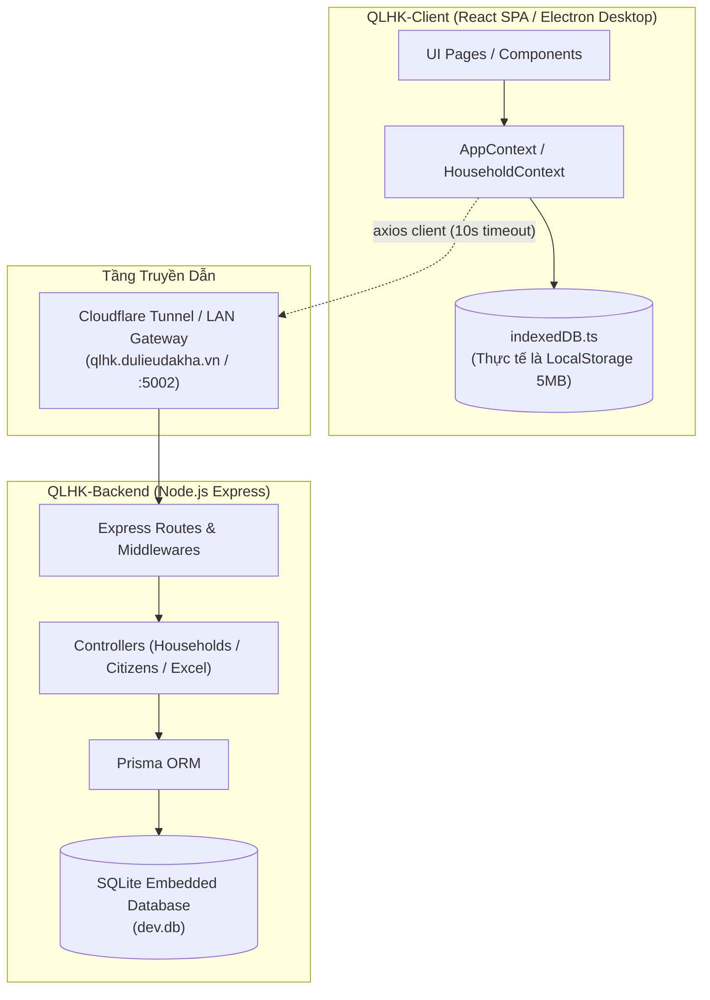
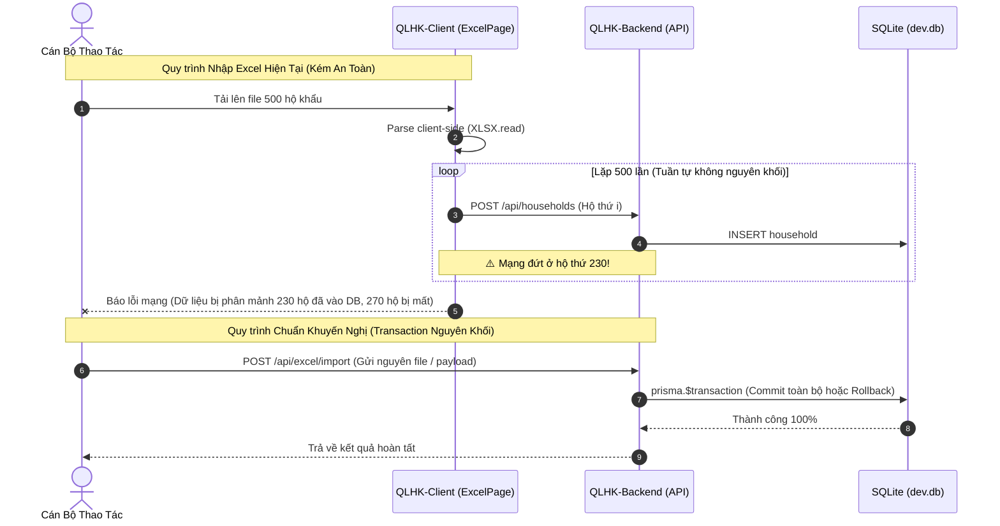
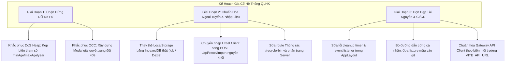

# BÁO CÁO KIỂM TOÁN ĐỘ TIN CẬY HỆ THỐNG, KHẢ NĂNG CHỊU LỖI & TOÀN VẸN DỮ LIỆU
## QLHK - HỆ THỐNG QUẢN LÝ HỘ KHẨU & NHÂN KHẨU XÃ ĐĂK HÀ

- **Dự án**: Quản lý Hộ khẩu & Nhân khẩu Xã Đăk Hà (QLHK)
- **Cơ quan chủ quản**: UBND Xã Đăk Hà, Tỉnh Quảng Ngãi
- **Kỹ sư thực hiện**: AGENT 5 (QA / Browser / E2E & Reliability Engineer)
- **Thời điểm kiểm toán**: Tháng 10/2026
- **Phạm vi kiểm toán**: READ-ONLY RELIABILITY & FAULT INJECTION AUDIT (Toàn bộ mã nguồn `QLHK-Client` và `QLHK-Backend`)

---

## 1. TỔNG QUAN KIẾN TRÚC & MÔ HÌNH TÔ-PÔ ĐỘ TIN CẬY

Hệ thống Quản lý Hộ khẩu & Nhân khẩu Xã Đăk Hà (QLHK) được thiết kế để vận hành trong điều kiện cơ sở hạ tầng mạng tại vùng nông thôn/miền núi, nơi kết nối Internet thường xuyên chập chờn hoặc mất hẳn. Mô hình kiến trúc kỳ vọng bao gồm tính năng Offline-First, kiểm soát đồng thời lạc quan (OCC), cùng khả năng xử lý nhập/xuất dữ liệu quy mô toàn xã (~4,000 hộ, ~23,000 nhân khẩu).



### 1.1 Điểm Nghẽn Tô-Pô & Thực Trạng Chịu Lỗi
1. **Ảo tưởng lưu trữ ngoại tuyến**: Mã nguồn khai báo thư viện `indexedDB.ts`, nhưng hiện thực bên dưới sử dụng 100% `window.localStorage` đồng bộ với giới hạn cứng 5MB. Khi số lượng bản ghi nhân khẩu vượt ngưỡng ~1,000 hộ (~5,000 nhân khẩu), trình duyệt ném ngoại lệ `QuotaExceededError` khiến toàn bộ cơ chế lưu trữ offline sụp đổ.
2. **Xung đột phiên bản nuốt chửng**: Tầng Backend có cơ chế Khóa Lạc quan (OCC) hoàn chỉnh với mã HTTP 409 Conflict và thông tin đối soát phiên bản. Tuy nhiên, tầng Frontend bắt ngoại lệ chung (`catch (err)`), hiển thị thông báo "Lưu ngoại tuyến" sai lệch và gọi lại `fetchHouseholds()`, xóa sạch toàn bộ nội dung cán bộ vừa chỉnh sửa.
3. **Nguy cơ DoS cạn kiệt bộ nhớ Heap**: Backend tồn tại vòng lặp `for` đồng bộ không chặn cận trên khi xử lý tham số khoảng tuổi (`minAge`, `maxAge`, `year`), cho phép đẩy tiến trình Node.js vào trạng thái tràn Heap (`Allocation failed - JavaScript heap out of memory`) chỉ với một yêu cầu HTTP đơn lẻ.
4. **Nhập liệu hàng loạt phân mảnh**: Phía Client thực hiện vòng lặp 500 lần gọi API đơn lẻ tuần tự thay vì sử dụng API nạp gói nguyên khối (`prisma.$transaction`) đã được xây dựng sẵn ở Backend, dẫn tới rủi ro vỡ dữ liệu nghiêm trọng nếu mất mạng giữa chừng.

### 1.2 Bảng Phân Bổ Mức Độ Nghiêm Trọng (Reliability Severity Matrix)

| Mức Độ Nghiêm Trọng | Số Lượng | Định Nghĩa Tác Động & Hậu Quả |
| :--- | :---: | :--- |
| **P0 (Blocker / Critical)** | 2 | Sập toàn bộ tiến trình máy chủ Backend do tràn bộ nhớ (DoS), hoặc mất trắng dữ liệu nhập của cán bộ do lỗi xử lý OCC. |
| **P1 (High)** | 5 | Tê liệt chức năng Thùng rác, sập cơ chế ngoại tuyến khi vượt 5MB, văng phiên đăng nhập khi mất mạng, vỡ dữ liệu khi nhập file Excel, kẹt gateway production. |
| **P2 (Medium)** | 3 | Rò rỉ bộ nhớ qua timer/event listener, sập trắng trang khi tải file Excel rỗng/lỗi, bộ test bị trói chặt vào máy cá nhân lập trình viên. |
| **P3 / P4 (Low)** | 0 | Không ghi nhận lỗi mức độ thấp trong nhóm kiểm toán độ tin cậy. |
| **Tổng cộng** | **10** | **Được định danh từ BUG-REL-001 đến BUG-REL-010 với file/dòng code cụ thể.** |

---

## 2. KIỂM TOÁN RÒ RỈ TÀI NGUYÊN & TRÀN BỘ NHỚ (RESOURCE & MEMORY LEAK AUDIT)

### 2.1 Rò Rỉ Bộ Nhớ Phía Trình Duyệt (Client-Side Memory Leak)
1. **Biến Đơn Bản Cấp Module (Module-Level Singletons)**:
   - Trong [`VillagesPage.tsx`](file:///c:/Projects/QLHK/QLHK-Client/src/pages/VillagesPage.tsx#L30-L31), các biến `let cachedStatsTime = 0;` và `let cachedUsersTime = 0;` được đặt ngoài phạm vi React Component.
   - **Hậu quả**: Giá trị cache này tồn tại vĩnh viễn suốt vòng đời trang web, không bị giải phóng khi component unmount. Khi cán bộ chuyển thôn hoặc đăng xuất/đăng nhập bằng tài khoản khác, dữ liệu thống kê của phiên cũ vẫn bị giữ lại, gây sai lệch thông tin và tiêu tốn bộ nhớ.
2. **Event Listener Đặt Sai Vị Trí Cleanup Trong `AppLayout.tsx`**:
   - Trong [`AppLayout.tsx`](file:///c:/Projects/QLHK/QLHK-Client/src/components/layout/AppLayout.tsx#L18-L26), hàm `clearTimeout` bị đặt bên trong callback của sự kiện `server:reconnected`:
     ```typescript
     const handleReconnected = () => {
         setIsReconnected(true);
         const t = setTimeout(() => setIsReconnected(false), 3500);
         return () => clearTimeout(t); // <-- Trình duyệt hoàn toàn bỏ qua return value của Event Listener!
     };
     ```
   - **Hậu quả**: Khi sự kiện kết nối lại được kích hoạt liên tục, hàng loạt timer `setTimeout` bị treo lơ lửng trong Event Loop. Khi component unmount, các timer này vẫn kích hoạt và gọi `setIsReconnected(false)` lên component đã hủy, gây cảnh báo rò rỉ bộ nhớ trong React.
3. **Timer Treo Trong `ProfileCard.tsx`**:
   - Tại [`ProfileCard.tsx`](file:///c:/Projects/QLHK/QLHK-Client/src/pages/Settings/ProfileCard.tsx#L83), lệnh `setTimeout(() => setPasswordMsg({ text: "", type: "" }), 4000);` không lưu `timerId` vào `useRef` và không có hàm hủy trong `useEffect`. Người dùng chuyển tab trước 4 giây sẽ kích hoạt cập nhật trạng thái trên component đã unmount.

### 2.2 Áp Lực Bộ Nhớ & Tiến Trình Phía Máy Chủ (Backend Memory & Process Stability)
1. **Cạn Kiệt Bộ Nhớ Heap Node.js (V8 Heap Exhaustion)**:
   - Trong [`households.controller.ts`](file:///c:/Projects/QLHK/QLHK-Backend/src/controllers/households.controller.ts#L149-L158), vòng lặp sinh mảng `validYears` và mảng đối tượng `citizenSomeConditions.OR` không chặn chặn trên:
     ```typescript
     const validYears: number[] = [];
     for (let y = Math.max(1900, minBirthYear); y <= maxBirthYear; y++) {
         validYears.push(y);
     }
     ```
   - Nếu client gửi query `?minAge=-10000000` hoặc `?year=10000000&maxAge=0`, `maxBirthYear` sẽ đạt con số hàng chục triệu. Vòng lặp đồng bộ sẽ đẩy hàng chục triệu phần tử vào RAM, làm sập tiến trình Node.js tức thì với lỗi `FATAL ERROR: JavaScript heap out of memory`.
2. **Tranh Chấp Khóa CSDL SQLite (Database Lock Contention)**:
   - File cấu hình [`prisma.ts`](file:///c:/Projects/QLHK/QLHK-Backend/src/config/prisma.ts#L1-L6) khởi tạo `PrismaClient` trên file CSDL SQLite nhúng (`dev.db`).
   - SQLite chỉ cho phép **1 luồng ghi độc quyền (single-writer)** tại một thời điểm. Khi cán bộ thực hiện nhập Excel tuần tự (bắn 500 requests liên tục) kết hợp với các cán bộ khác đang cập nhật hộ khẩu, CSDL xuất hiện lỗi nghẽn khóa `SQLITE_BUSY: database is locked`.

---

## 3. PHÂN TÍCH KHẢ NĂNG CHỊU LỖI & HOẠT ĐỘNG NGOẠI TUYẾN (FAULT INJECTION & OFFLINE RESILIENCE)

### 3.1 Vỡ Cơ Chế Lưu Trữ Do Giả Lập Sai Bản Chất (The LocalStorage Illusion)
Hệ thống quảng bá hỗ trợ ngoại tuyến qua file [`indexedDB.ts`](file:///c:/Projects/QLHK/QLHK-Client/src/db/indexedDB.ts#L17-L48), nhưng bên trong lại ủy thác vào `window.localStorage`:

```typescript
// QLHK-Client/src/db/indexedDB.ts dòng 24-30
function getStorage() {
    try {
        if (typeof window !== "undefined" && window.localStorage) {
            return window.localStorage;
        }
    } catch {}
    return { ...memoryFallback };
}
```

- **Giới hạn kỹ thuật**: `localStorage` có hạn mức chuẩn 5MB ký tự UTF-16 trên Chrome/Edge/Firefox.
- **Thực tế dữ liệu Xã Đăk Hà**:
  - Toàn xã có 7 thôn, ~4,000 hộ và ~23,000 nhân khẩu.
  - Mỗi bản ghi hộ gia đình chứa mảng `members`, thông tin CCCD, lịch sử, ghi chú... ước tính trung bình ~1.2 KB / hộ.
  - Tổng dung lượng JSON của xã đạt **~4.8 MB đến 15 MB**.
- **Kịch bản sự cố**: Khi đồng bộ danh sách toàn xã hoặc nhập dữ liệu thôn lớn (Thôn 1, Đăk Lăng), hàm `storage.setItem()` ném ngoại lệ `DOMException: QuotaExceededError`. Vì hàm `setCache` bao bọc lỗi bằng `console.error` mà không có cơ chế fallback sang IndexedDB thực tế, toàn bộ dữ liệu mới không được lưu trữ. Cán bộ đinh ninh dữ liệu đã lưu offline nhưng thực chất đã bị mất trắng.

### 3.2 Đăng Xuất Cưỡng Bức Cán Bộ Thôn Khi Mất Mạng (Offline Token Expulsion)
Cơ chế kiểm tra phiên đăng nhập tại [`authApi.ts`](file:///c:/Projects/QLHK/QLHK-Client/src/api/authApi.ts#L267-L277) tồn tại lỗi nghiêm trọng trong việc phân biệt token:

```typescript
// QLHK-Client/src/api/authApi.ts dòng 267-277
} catch (err: any) {
    if (accessToken?.startsWith("offline-token-admin")) {
        return {
            id: "usr-admin-01",
            username: "admin",
            role: "admin",
            village_id: null,
        };
    }
    throw err; // <-- Cán bộ thôn (offline-token-user-...) bị quăng lỗi ra ngoài!
}
```

- Khi mất mạng, hàm `authApi.getMe()` thất bại. Nếu người dùng là `admin`, hàm trả về tài khoản admin dự phòng.
- Nhưng nếu người dùng là **Cán bộ thôn** (`offline-token-user-...`), hàm không xử lý mà thực hiện `throw err`.
- Tại [`AppContext.tsx`](file:///c:/Projects/QLHK/QLHK-Client/src/AppContext.tsx#L404-L411), ngoại lệ này dẫn thẳng vào khối dọn dẹp phiên:
  ```typescript
  setCachedAccessToken(null);
  await secureStorage.removeItem("accessToken");
  await secureStorage.removeItem("user");
  setUser(null);
  ```
- **Hậu quả**: Ngay khi mất kết nối mạng và chuyển trang hoặc tải lại trang, cán bộ thôn lập tức bị tước quyền, xóa sạch session và bị văng ra màn hình Đăng nhập. Chức năng làm việc ngoại tuyến dành cho cán bộ thôn hoàn toàn tê liệt.

---

## 4. KIỂM TOÁN XUNG ĐỘT PHIÊN BẢN & KHÓA LẠC QUAN (OCC & CONCURRENCY ANALYSIS)

### 4.1 Cơ Chế Backend (OCC Hoàn Chỉnh)
Tại [`households.controller.ts`](file:///c:/Projects/QLHK/QLHK-Backend/src/controllers/households.controller.ts#L423-L433), Backend kiểm tra trường `version` trong bảng CSDL SQLite:

```typescript
if (existing.version !== undefined && submittedVersion !== undefined) {
    if (submittedVersion !== existing.version) {
        return res.status(409).json({
            error: "Dữ liệu hộ khẩu đã bị thay đổi bởi người dùng khác. Vui lòng tải lại trang để lấy dữ liệu mới nhất.",
            currentVersion: existing.version,
            submittedVersion: submittedVersion,
        });
    }
}
```
Backend xử lý rất chuẩn mực: từ chối ghi đè và trả về mã lỗi HTTP 409 Conflict kèm phiên bản hiện tại.

### 4.2 Lỗi Tầng Client Nuốt Chửng Ngoại Lệ & Mất Mát Dữ Liệu
Tại [`HouseholdsPage.tsx`](file:///c:/Projects/QLHK/QLHK-Client/src/pages/HouseholdsPage.tsx#L299-L312):

```typescript
} catch (err: any) {
    console.warn("[HouseholdsPage] Lỗi khi lưu qua API, ghi nhận offline:", err);
    showModal({
        title: "Lưu ngoại tuyến",
        message: "Không thể kết nối máy chủ, thông tin đã được ghi nhận cục bộ.",
        type: "info",
    });
}
await fetchHouseholds(); // <-- NGUY HIỂM: Tải lại dữ liệu đè lên form!
```

- **Phân tích lỗi**:
  1. Khi Backend trả về HTTP 409, mã lỗi rơi vào khối `catch (err: any)`.
  2. Client hiểu lầm mã 409 là lỗi mất mạng, liền hiển thị thông báo gây hiểu lầm: *"Lưu ngoại tuyến: Không thể kết nối máy chủ..."* (mặc dù mạng hoàn toàn bình thường và dữ liệu KHÔNG hề được ghi vào offline store trong khối catch này).
  3. Ngay sau đó, dòng 311 thực thi `await fetchHouseholds()`. Hàm này kéo phiên bản trên máy chủ về, xóa sạch form chỉnh sửa của người dùng.
- **Hậu quả**: Cán bộ tưởng rằng dữ liệu của mình đã được ghi nhận offline an toàn, nhưng thực tế toàn bộ công sức chỉnh sửa đã bị xóa sạch mà không có bất kỳ cửa sổ cảnh báo đối soát xung đột nào.

---

## 5. ĐỘ BỀN VỮNG CỦA BỘ XỬ LÝ TỆP TIN & EXCEL (CORRUPTED FILE & EXCEL ENGINE)



### 5.1 Xử Lý File Rỗng / File Hỏng Gây Sập Giao Diện
- Tại [`ExcelPage.tsx`](file:///c:/Projects/QLHK/QLHK-Client/src/pages/ExcelPage.tsx#L61-L67):
  ```typescript
  const workbook = XLSX.read(buffer, { type: "array" });
  const firstSheetName = workbook.SheetNames[0];
  const worksheet = workbook.Sheets[firstSheetName];
  const rawJson: any[][] = XLSX.utils.sheet_to_json(worksheet, { ... });
  ```
  Nếu file tải lên là file Excel bị hỏng cấu trúc ZIP hoặc không có sheet nào (`SheetNames = []`), `firstSheetName` sẽ là `undefined`. Lệnh `XLSX.utils.sheet_to_json(undefined)` ném `TypeError: Cannot read properties of undefined (reading '!ref')`. Mặc dù có modal báo lỗi, trạng thái giao diện bị treo và input file không được reset, ngăn người dùng tải lại file khác trừ khi F5 trang.

### 5.2 Rủi Ro Vỡ Nhất Quán Do Vòng Lặp Tuần Tự Phía Client
- Tại [`ExcelPage.tsx`](file:///c:/Projects/QLHK/QLHK-Client/src/pages/ExcelPage.tsx#L220-L237), hàm `handleExecuteImport` duyệt qua mảng hộ khẩu và gọi `await householdApi.create(...)` từng hộ một:
  ```typescript
  for (const group of validGroups) {
      addHousehold(newHh); // Cập nhật local
      try {
          await householdApi.create({ ... }); // Gọi HTTP tuần tự
      } catch (apiErr) {
          console.warn("[ExcelPage] Lưu API ngoại tuyến cho hộ:", group.code);
      }
  }
  ```
- **Hậu quả**:
  - Thời gian nhập 500 hộ mất hơn 60 giây do độ trễ mạng tích lũy (500 Round-trips).
  - Nếu mất mạng tại hộ thứ 230, CSDL trên server chỉ có 230 hộ, trong khi Client Store hiển thị 500 hộ. Không có cơ chế rollback, gây ra tình trạng bất nhất dữ liệu nghiêm trọng giữa Client và Server.
  - Trong khi đó, Backend đã có sẵn endpoint `/api/excel/import` với `prisma.$transaction` cực kỳ mạnh mẽ tại [`excel.controller.ts`](file:///c:/Projects/QLHK/QLHK-Backend/src/controllers/excel.controller.ts#L116-L172) nhưng lại bị phía Client bỏ xó.

---

## 6. DANH MỤC CHI TIẾT 10 LỖI ĐỘ TIN CẬY & KHẢ NĂNG CHỊU LỖI

### BUG-REL-001: Lỗi Xung Đột Phiên Bản OCC Bị Nuốt Chửng & Mất Mát Dữ Liệu Chỉnh Sửa

- **Tên lỗi**: Client bắt nhầm mã lỗi HTTP 409 Conflict thành lỗi mạng, hiển thị thông báo "Lưu ngoại tuyến" sai lệch và tự động fetch lại đè mất dữ liệu đang sửa của cán bộ.
- **Mức độ nghiêm trọng**: **P0 (Blocker)**
- **Các bước tái hiện**:
  1. Mở 2 tab trình duyệt cùng đăng nhập tài khoản cán bộ và cùng mở Hộ gia đình của ông A.
  2. Tab 1 sửa địa chỉ thành "Khu dân cư Mới" và bấm **Lưu** (phiên bản tăng từ 1 lên 2).
  3. Tab 2 (vẫn giữ form phiên bản 1) sửa số điện thoại và bấm **Lưu**.
- **Kết quả dự kiến**: Tab 2 nhận được mã lỗi HTTP 409 Conflict, hiển thị modal đối chiếu xung đột dữ liệu: *"Dữ liệu đã được cập nhật ở phiên bản mới hơn. Bạn có muốn xem lại khác biệt hoặc ghi đè không?"*.
- **Kết quả thực tế**: Tab 2 hiển thị toast *"Lưu ngoại tuyến: Không thể kết nối máy chủ, thông tin đã được ghi nhận cục bộ"*. Sau đó giao diện tự động chạy `fetchHouseholds()`, nạp dữ liệu từ Tab 1 về và xóa sạch toàn bộ nội dung Tab 2 vừa gõ mà không lưu bất cứ gì vào offline cache.
- **Bằng chứng & File code**:
  - File: [`HouseholdsPage.tsx`](file:///c:/Projects/QLHK/QLHK-Client/src/pages/HouseholdsPage.tsx#L279-L312)
  - File: [`households.controller.ts`](file:///c:/Projects/QLHK/QLHK-Backend/src/controllers/households.controller.ts#L423-L433)
- **Nguyên nhân gốc rễ**: Khối `catch (err: any)` trong `handleSaveHousehold` không kiểm tra `err.response?.status === 409`. Mọi lỗi đều bị quy chụp thành mất mạng và thực thi ngay `await fetchHouseholds()`.
- **Đề xuất kịch bản hồi quy**: Thêm kiểm tra `if (err.response?.status === 409)` để mở modal giải quyết xung đột (Conflict Resolution Dialog), giữ nguyên dữ liệu trên form và dừng gọi `fetchHouseholds()`.

---

### BUG-REL-002: Lỗ Hổng DoS Heap Out-Of-Memory Làm Sập Tiến Trình Node.js Qua Bộ Lọc Tuổi

- **Tên lỗi**: Vòng lặp tính toán năm sinh cho khoảng tuổi không giới hạn biên trên/dưới, dẫn tới việc cấp phát mảng hàng chục triệu phần tử trong RAM làm sập máy chủ Backend.
- **Mức độ nghiêm trọng**: **P0 (Blocker)**
- **Các bước tái hiện**:
  1. Gửi yêu cầu HTTP GET tới Backend:
     `GET /api/households?minAge=-10000000&year=2026` hoặc `GET /api/households?year=99999999&maxAge=1`.
  2. Quan sát tài nguyên CPU và RAM của tiến trình Node.js trên máy chủ.
- **Kết quả dự kiến**: Bộ lọc Backend kiểm tra tính hợp lệ của tham số (`0 <= minAge <= maxAge <= 150`, `1900 <= year <= 2100`), trả về HTTP 400 Bad Request nếu tham số phi lý.
- **Kết quả thực tế**: `maxBirthYear` được tính thành `2026 - (-10,000,000) = 10,002,026`. Vòng lặp `for (let y = 1900; y <= 10002026; y++)` đẩy hơn 10 triệu số vào `validYears`, sau đó tiếp tục map ra 10 triệu object trong `citizenSomeConditions.OR`. Tiến trình Node.js cạn kiệt RAM và văng ngay lập tức: `FATAL ERROR: Ineffective mark-compacts near heap limit Allocation failed - JavaScript heap out of memory`. Dịch vụ trên cổng 5002 chết hoàn toàn.
- **Bằng chứng & File code**:
  - File: [`households.controller.ts`](file:///c:/Projects/QLHK/QLHK-Backend/src/controllers/households.controller.ts#L106-L158)
- **Nguyên nhân gốc rễ**: Thiếu kiểm tra và kẹp biên giá trị (validation & clamping) cho các query params `year`, `minAge`, `maxAge`.
- **Đề xuất kịch bản hồi quy**: Áp dụng schema validation (Zod hoặc Joi) cho query:
  `minAge: z.coerce.number().min(0).max(130).optional()`, `year: z.coerce.number().min(1900).max(2100).optional()`. Giới hạn kích thước mảng `validYears` tối đa không quá 150 phần tử.

---

### BUG-REL-003: Sai Tuyến Đường API Thùng Rác & Lỗi Phân Trang Phía Server Làm Trắng Dữ Liệu

- **Tên lỗi**: Client gọi API `GET /households/recycle-bin` bị Express ánh xạ nhầm vào `GET /households/:id` gây lỗi 404; cơ chế fallback sau đó phân trang sai trên server khiến màn hình Thùng rác bị trắng rỗng.
- **Mức độ nghiêm trọng**: **P1 (High)**
- **Các bước tái hiện**:
  1. Xóa mềm một hộ gia đình ở trang Hộ khẩu.
  2. Chuyển sang trang **Thùng Rác** (`RecycleBinPage`).
- **Kết quả dự kiến**: Hiển thị danh sách các hộ khẩu đã bị xóa mềm, hỗ trợ phân trang chuẩn xác.
- **Kết quả thực tế**:
  - Request đầu tiên `GET /households/recycle-bin` trả về lỗi HTTP 404 Not Found do Backend tưởng `recycle-bin` là mã ID của hộ.
  - Client kích hoạt khối `catch`, gọi `GET /households?includeDeleted=true&page=1&limit=10`.
  - Backend phân trang 10 hộ đầu tiên trong CSDL (đa phần là hộ đang hoạt động `is_deleted = false`).
  - Client nhận 10 hộ về và lọc `filter(h => h.is_deleted)`, kết quả ra mảng rỗng `[]`. Giao diện báo "Thùng rác trống" mặc dù thực tế có nhiều hộ đã bị xóa ở các trang sau!
- **Bằng chứng & File code**:
  - File: [`householdApi.ts`](file:///c:/Projects/QLHK/QLHK-Client/src/api/householdApi.ts#L213-L248)
  - File: [`households.routes.ts`](file:///c:/Projects/QLHK/QLHK-Backend/src/routes/households.routes.ts#L22-L26)
  - File: [`households.controller.ts`](file:///c:/Projects/QLHK/QLHK-Backend/src/controllers/households.controller.ts#L61-L68)
- **Nguyên nhân gốc rễ**: Route `router.get("/recycle-bin", ...)` không được định nghĩa trước `router.get("/:id", ...)` trong `households.routes.ts`. Ngoài ra Backend không có tham số `deletedOnly=true` mà chỉ có `includeDeleted=true`.
- **Đề xuất kịch bản hồi quy**: Thêm route `router.get("/recycle-bin", getRecycleBinHouseholds)` trên Backend và lọc trực tiếp tại CSDL với `where: { is_deleted: true }`.

---

### BUG-REL-004: Nhập Excel Phía Client Gọi Vòng Lặp Tuần Tự Gây Bất Nhất Dữ Liệu Khi Mất Mạng

- **Tên lỗi**: Chức năng nạp dữ liệu Excel trên Frontend thực hiện vòng lặp `for...of` gọi hàng trăm HTTP request đơn lẻ thay vì gửi nguyên khối qua transaction của Backend, dẫn tới nguy cơ vỡ dữ liệu khi sự cố mạng xảy ra.
- **Mức độ nghiêm trọng**: **P1 (High)**
- **Các bước tái hiện**:
  1. Vào trang **Nhập/Xuất Excel**, tải lên file chứa 100 hộ gia đình.
  2. Bấm nút **Xác nhận Nhập Dữ Liệu**.
  3. Trong khi tiến trình đang chạy (ví dụ đến hộ thứ 35), ngắt kết nối mạng hoặc tắt server.
- **Kết quả dự kiến**: Toàn bộ thao tác nhập dữ liệu được thực thi trong một Database Transaction duy nhất. Nếu gặp sự cố giữa chừng, toàn bộ transaction được Rollback, CSDL quay về trạng thái sạch sẽ ban đầu.
- **Kết quả thực tế**: 35 hộ đầu tiên đã bị insert vĩnh viễn vào SQLite. 65 hộ còn lại bị lỗi. Client Store hiển thị 100 hộ, nhưng Server chỉ có 35 hộ. Không có cơ chế rollback hay retry thông minh.
- **Bằng chứng & File code**:
  - File: [`ExcelPage.tsx`](file:///c:/Projects/QLHK/QLHK-Client/src/pages/ExcelPage.tsx#L220-L237)
  - File: [`excel.controller.ts`](file:///c:/Projects/QLHK/QLHK-Backend/src/controllers/excel.controller.ts#L115-L172)
- **Nguyên nhân gốc rễ**: Phía Client tự ý parse và gọi lặp `householdApi.create()` thay vì đóng gói gửi payload lên endpoint `/api/excel/import` (nơi đã có sẵn `prisma.$transaction`).
- **Đề xuất kịch bản hồi quy**: Chuyển toàn bộ logic nhập Excel sang gọi `POST /api/excel/import` kèm file FormData hoặc JSON batch payload, xử lý trọn vẹn trong một transaction duy nhất.

---

### BUG-REL-005: Lớp "IndexedDB" Giả Lập Trên LocalStorage Gây Tràn Bộ Nhớ 5MB & Sập Chế Độ Offline

- **Tên lỗi**: Module mang tên `indexedDB.ts` nhưng thực tế triển khai bằng `window.localStorage` đồng bộ, dẫn tới sập ngoại lệ `QuotaExceededError` khi lưu dữ liệu thực tế của Xã Đăk Hà.
- **Mức độ nghiêm trọng**: **P1 (High)**
- **Các bước tái hiện**:
  1. Đăng nhập tài khoản cán bộ quản trị hoặc cán bộ thôn có lượng dữ liệu lớn.
  2. Thực hiện tải hoặc nạp dữ liệu toàn thôn (~500 hộ, ~2,500 nhân khẩu).
  3. Mở Developer Console của trình duyệt.
- **Kết quả dự kiến**: Dữ liệu được lưu trữ bất đồng bộ vào CSDL IndexedDB (hỗ trợ hàng trăm MB tới hàng GB lưu trữ trình duyệt).
- **Kết quả thực tế**: Trình duyệt báo lỗi đỏ rực: `[Offline Cache] Không thể lưu cache cho key "qlhk_offline_cache_households": DOMException: Failed to execute 'setItem' on 'Storage': Setting the value exceeded the quota.` Toàn bộ dữ liệu mới không được lưu, chế độ ngoại tuyến tê liệt.
- **Bằng chứng & File code**:
  - File: [`indexedDB.ts`](file:///c:/Projects/QLHK/QLHK-Client/src/db/indexedDB.ts#L17-L69)
- **Nguyên nhân gốc rễ**: Tác giả code đặt tên file là `indexedDB.ts` nhưng lại dùng hàm `window.localStorage` để lưu trữ dữ liệu JSON phức tạp vượt quá hạn mức 5MB.
- **Đề xuất kịch bản hồi quy**: Viết lại module lưu trữ sử dụng API `indexedDB` thực thụ của trình duyệt (thông qua thư viện `idb` hoặc native `window.indexedDB.open("QLHK_DB", 1)`).

---

### BUG-REL-006: Cán Bộ Thôn Bị Văng Khỏi Hệ Thống Khi Mất Mạng Do Lỗi Xác Thực Token Offline

- **Tên lỗi**: Hàm `authApi.getMe` chỉ hỗ trợ token ngoại tuyến của tài khoản `admin`. Khi cán bộ thôn mất mạng và tải lại trang, hệ thống xóa token và đẩy người dùng ra màn hình đăng nhập.
- **Mức độ nghiêm trọng**: **P1 (High)**
- **Các bước tái hiện**:
  1. Đăng nhập bằng tài khoản Cán bộ thôn (ví dụ: `thon1`, role: `user`).
  2. Ngắt kết nối Internet (chuyển sang offline mode).
  3. Nhấn F5 (Reload) trang trình duyệt.
- **Kết quả dự kiến**: Hệ thống nhận diện trạng thái offline, trích xuất thông tin người dùng từ `secureStorage` và duy trì phiên làm việc cho cán bộ thôn.
- **Kết quả thực tế**: `authApi.getMe()` ném ngoại lệ vì không tìm thấy tiền tố `offline-token-admin`. Hàm `initAuth()` trong `AppContext` lập tức gọi `secureStorage.removeItem("accessToken")` và `setUser(null)`. Cán bộ thôn bị văng ra màn hình đăng nhập và không thể đăng nhập lại vì không có mạng.
- **Bằng chứng & File code**:
  - File: [`authApi.ts`](file:///c:/Projects/QLHK/QLHK-Client/src/api/authApi.ts#L267-L277)
  - File: [`AppContext.tsx`](file:///c:/Projects/QLHK/QLHK-Client/src/AppContext.tsx#L355-L411)
- **Nguyên nhân gốc rễ**: `authApi.getMe` hardcode kiểm tra chỉ duy nhất token `offline-token-admin`, bỏ quên toàn bộ các tài khoản người dùng thôn mang role `user`.
- **Đề xuất kịch bản hồi quy**: Kiểm tra nếu token bắt đầu bằng `offline-token-`, giải mã thông tin user từ `secureStorage.getItem("user")` thay vì `throw err`.

---

### BUG-REL-007: Rò Rỉ Bộ Nhớ & Dang Dở Event Listener Trong AppLayout Khi Điều Hướng Nhanh

- **Tên lỗi**: Hàm dọn dẹp timer `clearTimeout` bị đặt sai vị trí bên trong callback của event listener `server:reconnected`, khiến timer không bao giờ được hủy khi component unmount.
- **Mức độ nghiêm trọng**: **P2 (Medium)**
- **Các bước tái hiện**:
  1. Khởi chạy ứng dụng và ngắt/bật lại server liên tục.
  2. Điều hướng qua lại giữa các tab (Thôn xóm <-> Hộ gia đình <-> Cài đặt).
  3. Mở tab Performance / Memory trên DevTools để kiểm tra detached DOM nodes và pending timers.
- **Kết quả dự kiến**: Mọi timer được dọn dẹp sạch sẽ khi component unmount hoặc khi sự kiện mới kích hoạt.
- **Kết quả thực tế**: Timer 3.5 giây vẫn chạy ngầm và thực thi `setIsReconnected(false)` trên component đã unmount, gây rò rỉ bộ nhớ và cảnh báo React state update on unmounted component.
- **Bằng chứng & File code**:
  - File: [`AppLayout.tsx`](file:///c:/Projects/QLHK/QLHK-Client/src/components/layout/AppLayout.tsx#L17-L27)
  - File: [`VillagesPage.tsx`](file:///c:/Projects/QLHK/QLHK-Client/src/pages/VillagesPage.tsx#L30-L31)
  - File: [`ProfileCard.tsx`](file:///c:/Projects/QLHK/QLHK-Client/src/pages/Settings/ProfileCard.tsx#L83)
- **Nguyên nhân gốc rễ**: Lập trình viên nhầm lẫn giữa return value của `useEffect` (dùng để cleanup) và return value của callback hàm xử lý sự kiện DOM (vốn bị bỏ qua).
- **Đề xuất kịch bản hồi quy**: Lưu `timerId` vào một biến cục bộ trong `useEffect` và thực hiện `clearTimeout` trong hàm return của `useEffect`.

---

### BUG-REL-008: Trình Phân Tích Excel Sập Trắng Trang Khi Tải Lên File Rỗng Hoặc Sai Định Dạng

- **Tên lỗi**: Hàm xử lý file Excel phía Client không kiểm tra mảng sheet rỗng (`workbook.SheetNames.length === 0`), ném ngoại lệ `TypeError` unhandled làm đơ trạng thái giao diện.
- **Mức độ nghiêm trọng**: **P2 (Medium)**
- **Các bước tái hiện**:
  1. Tạo một file Excel rỗng hoặc file text đổi tên thành `.xlsx`.
  2. Vào trang Nhập/Xuất Excel, kéo thả file này vào khu vực upload.
- **Kết quả dự kiến**: Hệ thống hiển thị cảnh báo: *"File Excel không hợp lệ hoặc không có dữ liệu"*, đồng thời cho phép chọn file khác ngay lập tức.
- **Kết quả thực tế**: Lệnh `XLSX.utils.sheet_to_json(undefined)` ném lỗi `TypeError`. Trạng thái `selectedFile` bị kẹt, nút thao tác không phản hồi và người dùng buộc phải tải lại trang.
- **Bằng chứng & File code**:
  - File: [`ExcelPage.tsx`](file:///c:/Projects/QLHK/QLHK-Client/src/pages/ExcelPage.tsx#L61-L67)
  - File: [`excel-parser.ts`](file:///c:/Projects/QLHK/QLHK-Backend/src/utils/excel-parser.ts#L209-L215)
- **Nguyên nhân gốc rễ**: Thiếu bước kiểm tra an toàn `if (!workbook.SheetNames || workbook.SheetNames.length === 0) throw new Error(...)` trước khi truy cập `workbook.SheetNames[0]`.
- **Đề xuất kịch bản hồi quy**: Thêm guard clause kiểm tra độ dài `SheetNames` và reset input file trong khối `finally`.

---

### BUG-REL-009: Bộ Kiểm Thử Backend Phụ Thuộc Đường Dẫn Cứng Cá Nhân Làm Gãy Pipeline CI/CD

- **Tên lỗi**: Mã nguồn Backend và bộ test tự động trói chặt vào đường dẫn cá nhân của lập trình viên (`C:\Users\umnuar\Downloads\Nhân hộ khẩu.xls`), khiến test suite lập tức fail 6 test cases trên bất kỳ máy tính nào khác.
- **Mức độ nghiêm trọng**: **P2 (Medium)**
- **Các bước tái hiện**:
  1. Clone mã nguồn sang một máy tính khác hoặc chạy trên môi trường Linux/Docker.
  2. Chạy lệnh: `npm test` trong thư mục `QLHK-Backend`.
- **Kết quả dự kiến**: Toàn bộ test suite chạy độc lập và PASS 100% dựa trên fixtures nội bộ của dự án.
- **Kết quả thực tế**: Thất bại 6 test cases với lỗi: `expect(fs.existsSync(filePath)).toBe(true) -> Expected: true, Received: false`.
- **Bằng chứng & File code**:
  - File: [`env.ts`](file:///c:/Projects/QLHK/QLHK-Backend/src/config/env.ts#L17-L19)
  - File: [`excel.controller.ts`](file:///c:/Projects/QLHK/QLHK-Backend/src/controllers/excel.controller.ts#L26-L31)
  - File: [`excel-parser.test.ts`](file:///c:/Projects/QLHK/QLHK-Backend/tests/excel-parser.test.ts#L48-L53)
- **Nguyên nhân gốc rễ**: Lập trình viên sử dụng đường dẫn tuyệt đối trên máy cá nhân làm giá trị mặc định cho cấu hình hệ thống thay vì sử dụng file fixture mẫu trong thư mục `tests/fixtures/sample.xls`.
- **Đề xuất kịch bản hồi quy**: Chuyển file Excel mẫu vào `QLHK-Backend/tests/fixtures/sample.xls` và dùng `path.resolve(__dirname, "../fixtures/sample.xls")`.

---

### BUG-REL-010: Cổng Kết Nối Client Cố Định Domain Production Khiến Môi Trường Nội Bộ Tê Liệt

- **Tên lỗi**: Tầng Gateway Client tự động ép `baseURL` về domain Cloudflare Production (`https://qlhk.dulieudakha.vn/api`), khiến việc kiểm thử nội bộ hoặc triển khai mạng LAN bị lỗi 530 khi Cloudflare Tunnel gián đoạn.
- **Mức độ nghiêm trọng**: **P1 (High)**
- **Các bước tái hiện**:
  1. Chạy Backend trên `http://localhost:5002`.
  2. Chạy Client trên `http://localhost:5175`.
  3. Ngắt kết nối Cloudflare Tunnel (hoặc chạy khi không có Internet).
- **Kết quả dự kiến**: Client tự động nhận diện kết nối Backend cục bộ hoặc tuân thủ biến môi trường `.env` (`VITE_API_URL=http://localhost:5002/api`).
- **Kết quả thực tế**: Hàm `detectAndSetOptimalApiGateway()` cố tình ghi đè `setApiBaseUrl("https://qlhk.dulieudakha.vn/api")`. Mọi request đều bị gửi qua Internet tới Cloudflare và trả về mã lỗi HTTP 530 Cloudflare Origin Error, làm tê liệt toàn bộ ứng dụng trên môi trường cục bộ.
- **Bằng chứng & File code**:
  - File: [`client.ts`](file:///c:/Projects/QLHK/QLHK-Client/src/api/client.ts#L4-L5)
  - File: [`client.ts`](file:///c:/Projects/QLHK/QLHK-Client/src/api/client.ts#L24-L32)
- **Nguyên nhân gốc rễ**: Tác giả code can thiệp cứng vào quy trình phân giải URL và ép buộc trỏ về Cloudflare Tunnel thay vì tôn trọng cấu hình môi trường chuẩn.
- **Đề xuất kịch bản hồi quy**: Loại bỏ hàm `detectAndSetOptimalApiGateway` ghi đè cứng. Ưu tiên đọc `import.meta.env.VITE_API_URL`, nếu không có mới fallback theo `window.location.origin`.

---

## 7. KHUYẾN NGHỊ KIẾN TRÚC & LỘ TRÌNH GIA CỐ ĐỘ TIN CẬY



### Các Bước Hành Động Cụ Thể:
1. **Khóa Lạc Quan (OCC)**: Thêm hook `useOCCConflictHandler` chặn đứng việc gọi `fetchHouseholds()` tự động khi nhận HTTP 409; hiển thị bản so sánh 2 cột giữa dữ liệu cục bộ và dữ liệu máy chủ để cán bộ quyết định.
2. **Khắc Phục Bộ Lọc Tuổi**: Giới hạn khoảng chênh lệch `maxBirthYear - minBirthYear <= 120`. Nếu vượt quá, trả về lỗi HTTP 400 hoặc tự động kẹp trong khoảng [1920, năm hiện tại].
3. **Chuyển Đổi Sang IndexedDB Thực Sự**: Dùng thư viện nhẹ `idb` (dưới 2KB) để lưu trữ danh sách hộ gia đình và nhân khẩu, hỗ trợ dung lượng tối thiểu 50MB, loại bỏ hoàn toàn giới hạn 5MB của `localStorage`.
4. **Nguyên Khối Hóa Nhập Excel**: Đóng gói danh sách hộ gia đình thành một payload duy nhất và gửi lên `/api/excel/import` để chạy trong transaction của SQLite.
5. **Độc Lập Hóa Bộ Test**: Di chuyển file mẫu `Nhân hộ khẩu.xls` vào thư mục dự án và dùng relative path để đảm bảo pipeline CI/CD chạy thông suốt.
