# TASK DECOMPOSITION & DAG: QLHK ENGINEERING REMEDIATION
*(Đồ Thị Tác Vụ Khắc Phục Kỹ Nghệ & Phân Công Trách Nhiệm QLHK)*

**Dự án**: Quản lý Hộ khẩu & Nhân khẩu Xã Đăk Hà (QLHK)  
**Thời điểm thiết lập**: 2026-10-01  
**Đơn vị điều phối**: Central Orchestrator System  
**Quy tắc khóa tệp (File Ownership)**: Nghiêm cấm 2 tác vụ sửa cùng 1 tệp đồng thời. Tác vụ phụ thuộc phải chạy tuần tự.  

---

## 1. TỔNG QUAN ĐỒ THỊ PHỤ THUỘC (DEPENDENCY DAG)

```mermaid
flowchart TD
    subgraph WAVE0["WAVE 0: Hạ Tầng Kiểm Thử (Điều Kiện Tiên Quyết)"]
        T001["TASK-001: Sửa Vitest Path Alias Windows & Mock Network Client"]
        T002["TASK-002: Sửa Backend Tests dùng In-Memory Workbook Buffer"]
    end

    subgraph WAVE1["WAVE 1: Khắc Phục Lỗi Nguy Cấp P0 (Bảo Mật & Mất Dữ Liệu)"]
        T003["TASK-003: Chặn Lộ CCCD Plaintext trong API GET /api/households"]
        T004["TASK-004: Khóa Lạc Quan OCC Nguyên Tử (CAS updateMany) Backend"]
        T005["TASK-005: Khống Chế DoS Heap OOM trong Bộ Lọc Độ Tuổi"]
        T006["TASK-006: Chống Mất Trắng Dữ Liệu Form HouseholdDrawer (isDirty)"]
        T007["TASK-007: Xuất Đầy Đủ 100% Dữ Liệu Excel trên HouseholdsPage"]
        T008["TASK-008: Modal Đối Soát Xung Đột Phiên Bản OCC 409 trên Client"]
        T009["TASK-009: Triệt Tiêu Mật Khẩu Plaintext & Token Giả Admin trong authApi"]
    end

    subgraph WAVE2["WAVE 2: Khắc Phục Lỗi Mức Độ Cao P1 (Tính Năng & Độ Tin Cậy)"]
        T010["TASK-010: Sửa Tìm Kiếm Bằng Số CCCD qua cccd_hash"]
        T011["TASK-011: Sửa Thứ Tự Tuyến Đường /recycle-bin trên Backend"]
        T012["TASK-012: Kết Nối Trang Thùng Rác Client với API Xóa Mềm Server"]
        T013["TASK-013: Thay Thế Fake LocalStorage bằng Native IndexedDB idb"]
        T014["TASK-014: Bổ Sung Bí Mật Hệ Thống PEPPER cho hashCCCD"]
        T015["TASK-015: Bổ Sung Composite Index SQLite Triệt Tiêu Temp B-Tree"]
        T016["TASK-016: Batch Chunking Import Excel & Đồng Bộ Client Upload"]
        T017["TASK-017: Điều Hướng Bàn Phím Thẻ Thôn trên VillagesPage"]
        T018["TASK-018: Tích Hợp Focus Trap & Phím Escape cho Toàn Bộ Modal"]
        T019["TASK-019: Bảo Mật Electron: Thắt Chặt CSP, safeStorage DPAPI & userData DB"]
    end

    subgraph WAVE3["WAVE 3: Khắc Phục P2 (Hiệu Năng, Trợ Năng & Dọn Dẹp Mã)"]
        T020["TASK-020: Tách NetworkContext Triệt Tiêu Re-render Toàn Ứng Dụng Mỗi 3s"]
        T021["TASK-021: Module Hóa SettingsPage & Xóa Mã Trùng Lặp"]
        T022["TASK-022: Tối Ưu Hóa Thống Kê Analytics bằng SQL GROUP BY"]
        T023["TASK-023: Code-Splitting React.lazy() Giảm Tải Bundle Client 964kB"]
        T024["TASK-024: Chuẩn Hóa Độ Tương Phản WCAG & Liên Kết Nhãn Form"]
    end

    subgraph WAVE4["WAVE 4: Đo Kiểm Tải Lớn 23k+ & Nghiệm Thu"]
        T025["TASK-025: Thử Thách Tải Lớn 23.000+ Bản Ghi Toàn Đường Ống"]
        T026["TASK-026: Kiểm Thử Hồi Quy Người Dùng 20 Luồng (Browser E2E)"]
        T027["TASK-027: Thẩm Định Độc Lập (Agent 7 VETO Gate) & Xuất Bản Final Report"]
    end

    WAVE0 --> WAVE1
    WAVE1 --> WAVE2
    WAVE2 --> WAVE3
    WAVE3 --> WAVE4
```



---

## 2. CHI TIẾT CÁC NHIỆM VỤ (TASK SPECIFICATIONS)

---

### WAVE 0: HẠ TẦNG KIỂM THỬ (PREREQUISITE VERIFICATION)

#### [TASK-001] Sửa Vitest Path Alias Windows & Mock Network Client
- **Title**: Chuẩn hóa cấu hình Vitest trên Windows và Mock API Network Calls
- **Category**: Test Infrastructure
- **Severity**: P1 - High
- **Root Cause**: NTFS directory junction khiến module runner Vitest resolve alias `/src` thành `C:\src` trên Windows. `authApi.test.ts` bắn request thật ra mạng ngoài dính Cloudflare 530.
- **Allowed Files**:
  - `QLHK-Client/vitest.config.ts`
  - `QLHK-Client/src/api/__tests__/authApi.test.ts`
- **Potentially Affected Files**: Toàn bộ test suites của client.
- **Blocked Files**: Mã nguồn giao diện `src/components/*`, `src/pages/*`.
- **Dependencies**: Không.
- **Implementation Plan**:
  1. Trong `vitest.config.ts`, dùng `fs.realpathSync(__dirname)` làm `root`, bổ sung `resolve.alias: { '/src': resolve(__dirname, 'src'), '@': resolve(__dirname, 'src') }`.
  2. Trong `authApi.test.ts`, mock `apiClient` bằng `vi.spyOn` chặn 100% request HTTP ra ngoài.
- **Acceptance Criteria**: Chạy `npm test -- --run` tại `QLHK-Client`: 13/13 test suites PASS (108/108 tests), không còn lỗi `/src/...` và không còn dump log Cloudflare 530.
- **Test Plan**: `npm test -- --run` tại `QLHK-Client`.
- **Rollback Plan**: `git checkout -- QLHK-Client/vitest.config.ts QLHK-Client/src/api/__tests__/authApi.test.ts`.
- **State**: `DONE`

---

#### [TASK-002] Sửa Backend Tests dùng In-Memory Workbook Buffer
- **Title**: Loại bỏ phụ thuộc đường dẫn Downloads và sửa multipart upload trong Backend Tests
- **Category**: Test Infrastructure
- **Severity**: P1 - High
- **Root Cause**: `excel-parser.test.ts` và `api.test.ts` hardcode đường dẫn `C:\Users\umnuar\Downloads\Nhân hộ khẩu.xls`. File thực tế nằm ở gốc repo `c:\Projects\Nhân hộ khẩu.xls`. `api.test.ts` gửi body rỗng thay vì file multipart.
- **Allowed Files**:
  - `QLHK-Backend/tests/excel-parser.test.ts`
  - `QLHK-Backend/tests/api.test.ts`
  - `QLHK-Backend/src/config/env.ts`
  - `QLHK-Backend/src/controllers/excel.controller.ts`
- **Potentially Affected Files**: Không.
- **Blocked Files**: `schema.prisma`, `households.controller.ts`.
- **Dependencies**: Không.
- **Implementation Plan**:
  1. Cập nhật `excel-parser.test.ts`: Nếu file Downloads không tồn tại, tự động fallback về `c:\Projects\Nhân hộ khẩu.xls` hoặc tạo buffer mẫu bằng `xlsx.utils.book_new()`.
  2. Cập nhật `api.test.ts`: Dùng `.attach('file', buffer, 'Nhan_ho_khau.xls')` trong Supertest cho 2 endpoint preview và import.
- **Acceptance Criteria**: Chạy `npm test` tại `QLHK-Backend`: 5/5 test files PASS (77/77 tests).
- **Test Plan**: `npm test` tại `QLHK-Backend`.
- **Rollback Plan**: `git checkout -- QLHK-Backend/tests/* QLHK-Backend/src/controllers/excel.controller.ts`.
- **State**: `DONE`

---

### WAVE 1: KHẮC PHỤC LỖI NGUY CẤP P0 (BẢO MẬT & MẤT DỮ LIỆU)

#### [TASK-003] Chặn Lộ CCCD Plaintext trong API GET /api/households
- **Title**: Bảo vệ dữ liệu công dân: Chỉ trả về cccd_masked và cccd_last4 trong danh sách
- **Category**: Security / Privacy
- **Severity**: P0 - Critical
- **Root Cause**: `formatHouseholdWithDecryptedCitizens` tự động giải mã CCCD cho tất cả bản ghi trả về client.
- **Allowed Files**:
  - `QLHK-Backend/src/controllers/households.controller.ts`
  - `QLHK-Client/src/components/households/HouseholdTable.tsx`
  - `QLHK-Client/src/components/households/HouseholdMembersTable.tsx`
- **Potentially Affected Files**: Giao diện hiển thị CCCD trên Client.
- **Blocked Files**: `authApi.ts`, `schema.prisma`.
- **Dependencies**: `TASK-001`, `TASK-002`.
- **Implementation Plan**:
  1. Trong `households.controller.ts`, loại bỏ `decrypt(citizen.cccd)` trong map danh sách. Chỉ trả về `cccd_masked: "••••••••" + plain.slice(-4)` và `cccd_last4: plain.slice(-4)`. Trường `cccd` trả về masked string.
  2. Cập nhật client để khi người dùng nhấn xem CCCD, gọi API `POST /api/citizens/:id/reveal-cccd` (đã có sẵn) để giải mã có ghi nhật ký kiểm toán `REVEAL_CCCD`.
- **Acceptance Criteria**: Network response `GET /api/households` không chứa số CCCD 12 chữ số dạng rõ. Nút toggle CCCD trên client vẫn hoạt động chuẩn xác qua API reveal.
- **Test Plan**: Viết test trong `api.test.ts` kiểm tra payload không chứa plaintext CCCD.
- **Rollback Plan**: `git checkout -- QLHK-Backend/src/controllers/households.controller.ts`.
- **State**: `DONE`

---

#### [TASK-004] Khóa Lạc Quan OCC Nguyên Tử (CAS updateMany) Backend
- **Title**: Chống mất mát dữ liệu đồng thời bằng Compare-And-Swap (CAS) cấp CSDL
- **Category**: Database / Concurrency
- **Severity**: P0 - Critical
- **Root Cause**: Kiểm tra version ngoài RAM, Prisma update chỉ lọc theo `id` mà không có `version` trong mệnh đề `WHERE`.
- **Allowed Files**:
  - `QLHK-Backend/src/controllers/households.controller.ts`
  - `QLHK-Backend/src/controllers/citizens.controller.ts`
  - `QLHK-Backend/tests/occ.test.ts`
- **Potentially Affected Files**: Luồng cập nhật hộ và nhân khẩu.
- **Blocked Files**: `schema.prisma`, Client UI.
- **Dependencies**: `TASK-002`.
- **Implementation Plan**:
  1. Trong `updateHousehold` và `updateCitizen`, chuyển sang dùng:
     ```typescript
     const result = await prisma.households.updateMany({
       where: { id, version: expectedVersion, is_deleted: false },
       data: { ...updateData, version: { increment: 1 } }
     });
     if (result.count === 0) {
       return res.status(409).json({ error: "Xung đột phiên bản dữ liệu (OCC Conflict)..." });
     }
     ```
  2. Nạp lại bản ghi mới nhất trả về cho client.
- **Acceptance Criteria**: 100% race condition được phát hiện tại CSDL; không còn hiện tượng Lost Update.
- **Test Plan**: Chạy `npm test tests/occ.test.ts`.
- **Rollback Plan**: `git checkout -- QLHK-Backend/src/controllers/households.controller.ts`.
- **State**: `DONE`

---

#### [TASK-005] Khống Chế DoS Heap OOM trong Bộ Lọc Độ Tuổi
- **Title**: Ràng buộc biên độ an toàn cho tham số query bộ lọc độ tuổi
- **Category**: Security / Stability
- **Severity**: P0 - Critical
- **Root Cause**: Vòng lặp `for` chạy không giới hạn khi nhận `minAge` âm hoặc `year` cực lớn.
- **Allowed Files**:
  - `QLHK-Backend/src/controllers/households.controller.ts`
  - `QLHK-Backend/tests/api.test.ts`
- **Potentially Affected Files**: Không.
- **Blocked Files**: Client files.
- **Dependencies**: `TASK-002`.
- **Implementation Plan**:
  1. Validate chặt chẽ: `targetYear` kẹp trong khoảng `[1900, 2100]`.
  2. `minAge` và `maxAge` kẹp trong khoảng `[0, 130]`.
  3. Nếu không thỏa mãn, trả về HTTP 400 Bad Request ngay lập tức.
  4. Giới hạn độ dài mảng `validYears` tối đa 130 phần tử.
- **Acceptance Criteria**: Request với `minAge=-10000000` bị từ chối với HTTP 400 trong < 2ms, bộ nhớ Node.js không tăng.
- **Test Plan**: Viết test case trong `tests/api.test.ts`.
- **Rollback Plan**: `git checkout -- QLHK-Backend/src/controllers/households.controller.ts`.
- **State**: `DONE`

---

#### [TASK-006] Chống Mất Trắng Dữ Liệu Form HouseholdDrawer (isDirty)
- **Title**: Bảo vệ dữ liệu biểu mẫu: Thêm cờ isDirty và Hộp thoại xác nhận khi hủy bỏ
- **Category**: UI/UX / Data Safety
- **Severity**: P0 - Critical
- **Root Cause**: Nhấn Escape hoặc click backdrop gọi `onClose()` tức thì mà không kiểm tra dữ liệu thay đổi.
- **Allowed Files**:
  - `QLHK-Client/src/components/households/HouseholdDrawer.tsx`
  - `QLHK-Client/src/components/households/CitizenModal.tsx`
- **Potentially Affected Files**: Không.
- **Blocked Files**: Backend files.
- **Dependencies**: `TASK-001`.
- **Implementation Plan**:
  1. Thêm state `isDirty` theo dõi sự thay đổi của các trường `formData` và `members`.
  2. Khi người dùng nhấn Escape hoặc click backdrop: Nếu `isDirty === true`, hiển thị Dialog: *"Dữ liệu chưa được lưu. Đồng chí có chắc chắn muốn thoát không?"*.
  3. Chỉ đóng drawer khi người dùng xác nhận "Đồng ý thoát" hoặc khi form chưa bị chỉnh sửa.
- **Acceptance Criteria**: Đang nhập dở form mà bấm Escape/click backdrop không bị mất form; có dialog cảnh báo rõ ràng.
- **Test Plan**: Viết component test mô phỏng dirty state và bấm Escape.
- **Rollback Plan**: `git checkout -- QLHK-Client/src/components/households/HouseholdDrawer.tsx`.
- **State**: `DONE`

---

#### [TASK-007] Xuất Đầy Đủ 100% Dữ Liệu Excel trên HouseholdsPage
- **Title**: Sửa lỗi xuất Excel chỉ lấy 10 hộ trang đầu tiên
- **Category**: Client / Data Integrity
- **Severity**: P0 - Critical
- **Root Cause**: `handleExportExcel` truyền mảng `households` phân trang hiện tại (`limit = 10`) thay vì truy vấn toàn bộ dữ liệu lọc.
- **Allowed Files**:
  - `QLHK-Client/src/pages/HouseholdsPage.tsx`
  - `QLHK-Client/src/utils/excelExport.ts`
- **Potentially Affected Files**: Không.
- **Blocked Files**: Backend files.
- **Dependencies**: `TASK-001`.
- **Implementation Plan**:
  1. Khi bấm Xuất Excel, hiển thị loading spinner trên nút xuất.
  2. Gọi `householdApi.getPage({ ...currentFilters, page: 1, limit: 10000 })` lấy toàn bộ danh sách hộ thỏa mãn bộ lọc.
  3. Truyền danh sách đầy đủ này vào `exportHouseholdsToExcel`.
- **Acceptance Criteria**: Xuất Excel khi thôn có 500 hộ, tệp tải về có đầy đủ 500 hộ và toàn bộ nhân khẩu đi kèm.
- **Test Plan**: Unit test hàm export và kiểm tra số dòng xuất ra.
- **Rollback Plan**: `git checkout -- QLHK-Client/src/pages/HouseholdsPage.tsx`.
- **State**: `DONE`

---

#### [TASK-008] Modal Đối Soát Xung Đột Phiên Bản OCC 409 trên Client
- **Title**: Xử lý tường minh xung đột đồng thời HTTP 409 trên Client
- **Category**: Client / Concurrency
- **Severity**: P0 - Critical
- **Root Cause**: Bắt lỗi 409 trong `catch`, nuốt lỗi bằng toast sai và tự động ghi đè dữ liệu.
- **Allowed Files**:
  - `QLHK-Client/src/components/households/ConflictResolutionModal.tsx` (Tạo mới)
  - `QLHK-Client/src/pages/HouseholdsPage.tsx`
- **Potentially Affected Files**: Luồng lưu hộ khẩu.
- **Blocked Files**: Backend files.
- **Dependencies**: `TASK-004`.
- **Implementation Plan**:
  1. Tạo component `ConflictResolutionModal.tsx` hiển thị 2 cột: Dữ liệu hiện tại trên máy chủ vs Dữ liệu đồng chí vừa chỉnh sửa.
  2. Trong `HouseholdsPage.tsx`, khi API trả về mã lỗi 409, giữ nguyên form của người dùng, mở `ConflictResolutionModal` cho phép cán bộ lựa chọn: "Ghi đè bằng dữ liệu của tôi" hoặc "Hủy bỏ và nạp dữ liệu máy chủ".
- **Acceptance Criteria**: Không còn hiện tượng mất dữ liệu âm thầm khi nhận HTTP 409; người dùng luôn có quyền quyết định.
- **Test Plan**: Mô phỏng lỗi 409 trong test và kiểm tra modal hiển thị.
- **Rollback Plan**: `git checkout -- QLHK-Client/src/pages/HouseholdsPage.tsx`.
- **State**: `DONE`

---

#### [TASK-009] Triệt Tiêu Mật Khẩu Plaintext & Token Giả Admin trong authApi
- **Title**: Loại bỏ cửa hậu xác thực và tài khoản mặc định plaintext trên Client
- **Category**: Security / Auth
- **Severity**: P0 - Critical
- **Root Cause**: Mảng `DEFAULT_ACCOUNTS` chứa mật khẩu trần bị đóng gói vào bundle JS; sinh `offline-token-admin-*` khi mất mạng.
- **Allowed Files**:
  - `QLHK-Client/src/api/authApi.ts`
  - `QLHK-Client/src/api/__tests__/authApi.test.ts`
- **Potentially Affected Files**: Đăng nhập ngoại tuyến.
- **Blocked Files**: Backend files.
- **Dependencies**: `TASK-001`.
- **Implementation Plan**:
  1. Xóa bỏ hoàn toàn mảng `DEFAULT_ACCOUNTS` chứa mật khẩu plaintext khỏi `authApi.ts`.
  2. Khi ngoại tuyến, việc xác thực dựa trên tài khoản đã đăng nhập thành công trước đó được lưu mã hóa trong local store (`sessionUser`), tuyệt đối không tự cấp token admin cho người lạ.
- **Acceptance Criteria**: Quét toàn bộ bundle client không còn bất kỳ chuỗi mật khẩu trần nào (`admin123`, `thon123`).
- **Test Plan**: `npm test src/api/__tests__/authApi.test.ts`.
- **Rollback Plan**: `git checkout -- QLHK-Client/src/api/authApi.ts`.
- **State**: `DONE`

---

### WAVE 2: KHẮC PHỤC LỖI MỨC ĐỘ CAO P1 (TÍNH NĂNG & ĐỘ TIN CẬY)

#### [TASK-010] Sửa Tìm Kiếm Bằng Số CCCD qua cccd_hash
- **Title**: Bổ sung điều kiện tìm kiếm CCCD vào API getHouseholds
- **Category**: Backend / Search
- **Severity**: P1 - High
- **Allowed Files**: `QLHK-Backend/src/controllers/households.controller.ts`
- **Dependencies**: `TASK-003`.
- **Implementation Plan**: Khi tham số `search` có độ dài 9-12 chữ số (định dạng CCCD/CMND), tính `hash = hashCCCD(search)` và bổ sung vào `where.citizens.some.OR: [ { cccd_hash: hash } ]`.
- **Acceptance Criteria**: Nhập đúng 12 số CCCD vào ô tìm kiếm trả về chính xác hộ gia đình chứa nhân khẩu đó.
- **Test Plan**: Test case tìm kiếm theo số CCCD trong `tests/api.test.ts`.
- **State**: `DONE`

---

#### [TASK-011] Sửa Thứ Tự Tuyến Đường /recycle-bin trên Backend
- **Title**: Đưa route /recycle-bin lên trước route /:id để tránh xung đột Express
- **Category**: Backend / Routing
- **Severity**: P1 - High
- **Allowed Files**: `QLHK-Backend/src/routes/households.routes.ts`
- **Dependencies**: Không.
- **Implementation Plan**: Đảo vị trí router: Đặt `router.get('/recycle-bin', ...)` trước `router.get('/:id', ...)`.
- **Acceptance Criteria**: Gọi `GET /api/households/recycle-bin` trả về HTTP 200 và danh sách hộ đã xóa mềm thay vì cố tìm hộ có id là `"recycle-bin"`.
- **Test Plan**: Test API `GET /api/households/recycle-bin` trong `tests/api.test.ts`.
- **State**: `DONE`

---

#### [TASK-012] Kết Nối Trang Thùng Rác Client với API Xóa Mềm Server
- **Title**: Đồng bộ hoàn toàn Thùng rác Client với CSDL Backend
- **Category**: Client / State Sync
- **Severity**: P1 - High
- **Allowed Files**:
  - `QLHK-Client/src/pages/RecycleBinPage.tsx`
  - `QLHK-Client/src/components/households/RecycleBinTable.tsx`
  - `QLHK-Client/src/api/householdApi.ts`
- **Dependencies**: `TASK-011`.
- **Implementation Plan**: Thay thế việc đọc từ `householdStore` trong `RecycleBinPage.tsx` bằng lệnh gọi `householdApi.getRecycleBin()`. Nút "Khôi phục" gọi `householdApi.restore(id)`.
- **Acceptance Criteria**: Xóa hộ trên trang Hộ gia đình $\rightarrow$ Hộ lập tức xuất hiện trong Thùng rác $\rightarrow$ Bấm Khôi phục $\rightarrow$ Hộ quay trở lại danh sách hoạt động.
- **Test Plan**: E2E test luồng Xóa mềm $\rightarrow$ Xem Thùng rác $\rightarrow$ Khôi phục.
- **State**: `DONE`

---

#### [TASK-013] Thay Thế Fake LocalStorage bằng Native IndexedDB idb
- **Title**: Nâng cấp bộ đệm ngoại tuyến Client lên Native IndexedDB chuẩn công nghiệp
- **Category**: Client / Storage
- **Severity**: P1 - High
- **Allowed Files**:
  - `QLHK-Client/src/db/indexedDB.ts`
  - `QLHK-Client/src/db/__tests__/indexedDB.test.ts`
- **Dependencies**: `TASK-001`.
- **Implementation Plan**: Cài đặt hoặc dùng trực tiếp Native `window.indexedDB` (hoặc wrapper `idb` nhẹ không thêm bloat), lưu trữ dữ liệu dạng Object Store bất đồng bộ, không chặn main thread, phá vỡ giới hạn 5MB của localStorage.
- **Acceptance Criteria**: Lưu thành công 23.000 bản ghi (~30MB) không bị lỗi `QuotaExceededError`.
- **Test Plan**: `npm test src/db/__tests__/indexedDB.test.ts`.
- **State**: `DONE`

---

#### [TASK-014] Bổ Sung Bí Mật Hệ Thống PEPPER cho hashCCCD
- **Title**: Tăng cường bảo mật hàm băm cccd_hash chống Rainbow Table
- **Category**: Security / Cryptography
- **Severity**: P1 - High
- **Allowed Files**:
  - `QLHK-Backend/src/utils/crypto.ts`
  - `QLHK-Backend/src/config/env.ts`
  - `QLHK-Backend/tests/crypto.test.ts`
- **Dependencies**: `TASK-002`.
- **Implementation Plan**: Đọc biến môi trường `CCCD_HASH_PEPPER`. Trong hàm `hashCCCD`, tính `createHmac('sha256', PEPPER).update(cleaned).digest('hex')`.
- **Acceptance Criteria**: Băm CCCD an toàn, không thể bị bẻ khóa hàng loạt nếu chỉ có file CSDL.
- **Test Plan**: `npm test tests/crypto.test.ts`.
- **State**: `DONE`

---

#### [TASK-015] Bổ Sung Composite Index SQLite Triệt Tiêu Temp B-Tree
- **Title**: Tối ưu hóa chỉ mục CSDL Prisma cho câu lệnh lấy danh sách hộ
- **Category**: Database / Indexing
- **Severity**: P1 - High
- **Allowed Files**: `QLHK-Backend/prisma/schema.prisma`
- **Dependencies**: Không.
- **Implementation Plan**: Bổ sung index `@@index([village_id, is_deleted, created_at(sort: Desc)])` vào model `Household`. Chạy `npx prisma db push` hoặc tạo migration.
- **Acceptance Criteria**: Lệnh SQLite `EXPLAIN QUERY PLAN` không còn xuất hiện dòng `USE TEMP B-TREE FOR ORDER BY`.
- **Test Plan**: Chạy EXPLAIN QUERY PLAN trên `dev.db`.
- **State**: `DONE`

---

#### [TASK-016] Batch Chunking Import Excel & Đồng Bộ Client Upload
- **Title**: Tái cấu trúc quy trình Import Excel thành batch 500 bản ghi
- **Category**: Performance / Reliability
- **Severity**: P1 - High
- **Allowed Files**:
  - `QLHK-Backend/src/controllers/excel.controller.ts`
  - `QLHK-Client/src/pages/ExcelPage.tsx`
- **Dependencies**: `TASK-002`.
- **Implementation Plan**:
  1. Trong `excel.controller.ts`, chia danh sách hộ/nhân khẩu thành các batch 500 bản ghi, dùng `prisma.citizens.createMany` trong từng batch để tránh vượt quá giới hạn 28.500 queries đơn lẻ.
  2. Trong `ExcelPage.tsx`, chuyển sang upload tệp trực tiếp lên `POST /api/excel/import` thay vì chạy 500 HTTP requests đơn lẻ từ client.
- **Acceptance Criteria**: Import file Excel toàn xã (23.000 dân) hoàn thành trong < 5 giây mà không bị lỗi timeout hoặc `SQLITE_BUSY`.
- **Test Plan**: Chạy test import trong `tests/api.test.ts`.
- **State**: `DONE`

---

#### [TASK-017] Điều Hướng Bàn Phím Thẻ Thôn trên VillagesPage
- **Title**: Khắc phục lỗi trợ năng WCAG: Bổ sung khả năng điều hướng bàn phím cho thẻ Thôn
- **Category**: UI/UX / Accessibility
- **Severity**: P1 - High
- **Allowed Files**: `QLHK-Client/src/pages/VillagesPage.tsx`
- **Dependencies**: `TASK-001`.
- **Implementation Plan**: Thêm `tabIndex={0}`, `role="button"`, `aria-label`, và sự kiện `onKeyDown={(e) => (e.key === 'Enter' || e.key === ' ') && handleSelectVillage(v.id)}` cho từng thẻ Thôn.
- **Acceptance Criteria**: Dùng phím Tab di chuyển đến thẻ thôn thấy viền focus rõ ràng, nhấn phím Enter vào được danh sách hộ của thôn.
- **Test Plan**: Component test kiểm tra phím Enter trên thẻ thôn.
- **State**: `DONE`

---

#### [TASK-018] Tích Hợp Focus Trap & Phím Escape cho Toàn Bộ Modal
- **Title**: Chuẩn hóa cô lập tiêu điểm phím Tab và phím Escape cho Modal/Drawer
- **Category**: UI/UX / Accessibility
- **Severity**: P1 - High
- **Allowed Files**:
  - `QLHK-Client/src/hooks/useFocusTrap.ts` (Tạo mới)
  - `QLHK-Client/src/components/households/HouseholdDrawer.tsx`
  - `QLHK-Client/src/components/households/CitizenModal.tsx`
  - `QLHK-Client/src/components/excel/ImportPreviewModal.tsx`
  - `QLHK-Client/src/components/excel/ExportSettingsModal.tsx`
- **Dependencies**: `TASK-006`.
- **Implementation Plan**: Tạo hook `useFocusTrap` giam giữ tiêu điểm phím Tab bên trong container khi modal mở; lắng nghe phím `Escape` để đóng; khóa cuộn `body.style.overflow = "hidden"`.
- **Acceptance Criteria**: Mở modal, nhấn Tab liên tục chỉ lặp trong modal; nhấn Escape đóng an toàn; nền không bị cuộn.
- **Test Plan**: Test phím Tab và Escape trên modal.
- **State**: `DONE`

---

#### [TASK-019] Bảo Mật Electron: Thắt Chặt CSP, safeStorage DPAPI & userData DB
- **Title**: Thắt chặt an ninh chuyên sâu Desktop Shell Electron
- **Category**: Electron / Security
- **Severity**: P1 - High
- **Allowed Files**:
  - `QLHK-Client/index.html`
  - `QLHK-Client/electron/main.ts`
  - `QLHK-Client/electron-builder.json5`
- **Dependencies**: Không.
- **Implementation Plan**:
  1. Trong `index.html`, loại bỏ `'unsafe-eval'` khỏi CSP.
  2. Trong `main.ts`, chuyển `electron-store` sang sử dụng `safeStorage` của Electron (bảo vệ bằng Windows DPAPI).
  3. Cấu hình đường dẫn CSDL SQLite lưu tại `path.join(app.getPath('userData'), 'database.db')` thay vì thư mục cài đặt `Program Files`.
- **Acceptance Criteria**: Đóng gói app desktop khởi chạy bình thường, lưu dữ liệu vào `AppData/Roaming/QLHK`, CSP không có unsafe-eval.
- **Test Plan**: Khởi chạy Electron dev và kiểm tra console.
- **State**: `DONE`

---

### WAVE 3: KHẮC PHỤC P2 (HIỆU NĂNG, TRỢ NĂNG & DỌN DẸP MÃ)

#### [TASK-020] Tách NetworkContext Triệt Tiêu Re-render Toàn Ứng Dụng Mỗi 3s
- **Title**: Tách trạng thái ping server khỏi Context nguyên khối
- **Category**: Performance / React
- **Severity**: P2 - Medium
- **Allowed Files**:
  - `QLHK-Client/src/AppContext.tsx`
  - `QLHK-Client/src/context/NetworkContext.tsx` (Tạo mới)
  - `QLHK-Client/src/components/layout/Header.tsx`
- **Dependencies**: `TASK-001`.
- **Implementation Plan**: Tách state `latency`, `isOnline` sang `NetworkContext`. Chỉ có badge chỉ báo ping trên `Header` subscribe context này, giải phóng toàn bộ cây `HouseholdsPage` khỏi việc bị re-render mỗi 3 giây.
- **Acceptance Criteria**: Console React DevTools không còn ghi nhận re-render khi ping server cập nhật.
- **Test Plan**: Đo lường render count với React profiler.
- **State**: `DONE`

---

#### [TASK-021] Module Hóa SettingsPage & Xóa Mã Trùng Lặp
- **Title**: Tái cấu trúc SettingsPage từ file 1.227 dòng thành các module độc lập
- **Category**: Clean Code / Refactor
- **Severity**: P2 - Medium
- **Allowed Files**:
  - `QLHK-Client/src/pages/SettingsPage.tsx`
  - `QLHK-Client/src/pages/Settings/ProfileCard.tsx`
  - `QLHK-Client/src/pages/Settings/TimeCard.tsx`
- **Dependencies**: `TASK-001`.
- **Implementation Plan**: Xóa bỏ mã trùng lặp trong `SettingsPage.tsx`, import và tái sử dụng `ProfileCard.tsx` và `TimeCard.tsx`. Đồng bộ hiển thị phiên bản `v1.0.0` từ `package.json`.
- **Acceptance Criteria**: `SettingsPage.tsx` giảm xuống dưới 400 dòng, 4 tab hoạt động hoàn hảo.
- **Test Plan**: `npm run build:vite` thành công.
- **State**: `DONE`

---

#### [TASK-022] Tối Ưu Hóa Thống Kê Analytics bằng SQL GROUP BY
- **Title**: Chuyển in-memory analytics sang câu lệnh SQL trực tiếp trong CSDL
- **Category**: Performance / Database
- **Severity**: P2 - Medium
- **Allowed Files**: `QLHK-Backend/src/controllers/analytics.controller.ts`
- **Dependencies**: `TASK-002`.
- **Implementation Plan**: Thay thế việc nạp 23.000 nhân khẩu vào RAM bằng các câu lệnh `prisma.$queryRaw` với `COUNT(*)`, `GROUP BY gender`, `GROUP BY ethnicity`.
- **Acceptance Criteria**: Thời gian phản hồi `GET /api/analytics` giảm từ >800ms xuống < 30ms trên tập dữ liệu 23.000 bản ghi.
- **Test Plan**: Chạy test analytics trong `tests/api.test.ts`.
- **State**: `DONE`

---

#### [TASK-023] Code-Splitting React.lazy() Giảm Tải Bundle Client 964kB
- **Title**: Tối ưu hóa tải trang Client với Dynamic Import và Code-Splitting
- **Category**: Performance / Bundle Size
- **Severity**: P2 - Medium
- **Allowed Files**:
  - `QLHK-Client/src/App.tsx`
  - `QLHK-Client/vite.config.ts`
- **Dependencies**: `TASK-001`.
- **Implementation Plan**: Chuyển các trang `AnalyticsPage`, `ExcelPage`, `RecycleBinPage`, `SettingsPage` sang `React.lazy()`. Cấu hình `manualChunks` tách vendor (`vendor-react`, `vendor-icons`, `vendor-excel`).
- **Acceptance Criteria**: Dung lượng chunk ban đầu giảm từ 964 kB xuống < 250 kB.
- **Test Plan**: Chạy `npm run build:vite` và kiểm tra output dist size.
- **State**: `DONE`

---

#### [TASK-024] Chuẩn Hóa Độ Tương Phản WCAG & Liên Kết Nhãn Form
- **Title**: Đảm bảo tỷ lệ tương phản chữ đạt 4.5:1 và liên kết htmlFor cho 100% input
- **Category**: UI/UX / Accessibility
- **Severity**: P2 - Medium
- **Allowed Files**:
  - `QLHK-Client/src/components/households/HouseholdDrawer.tsx`
  - `QLHK-Client/src/components/households/CitizenModal.tsx`
  - `QLHK-Client/src/components/auth/LoginView.tsx`
- **Dependencies**: `TASK-006`.
- **Implementation Plan**: Bổ sung `htmlFor` cho các thẻ `<label>` tương ứng với `id` của `<input>`. Thay thế `text-slate-400` bằng `text-slate-500` (Light) và `dark:text-slate-400` (Dark).
- **Acceptance Criteria**: Tỷ lệ tương phản chữ đạt chuẩn WCAG AA (>4.5:1).
- **Test Plan**: Kiểm tra bằng công cụ audit Accessibility.
- **State**: `DONE`

---

### WAVE 4: ĐO KIỂM TẢI LỚN 23K+ & NGHIỆM THU

#### [TASK-025] Thử Thách Tải Lớn 23.000+ Bản Ghi Toàn Đường Ống
- **Title**: Benchmark hiệu năng toàn hệ thống với 23.000 nhân khẩu giả lập
- **Category**: Performance / Benchmark
- **Severity**: P1 - High
- **Dependencies**: `WAVE 1`, `WAVE 2`, `WAVE 3`.
- **Implementation Plan**: Đo lường tốc độ truy vấn CSDL, kích thước payload qua mạng, thời gian nạp vào IndexedDB và tốc độ cuộn bảng trên giao diện.
- **Acceptance Criteria**: Thời gian tìm kiếm/lọc < 100ms; cuộn danh sách đạt 60 FPS; RAM client ổn định.
- **State**: `DONE`

---

#### [TASK-026] Kiểm Thử Hồi Quy Người Dùng 20 Luồng (Browser E2E)
- **Title**: Thực thi 20 kịch bản người dùng thực tế trên trình duyệt
- **Category**: QA / E2E
- **Severity**: P0 - Critical
- **Dependencies**: `TASK-025`.
- **Implementation Plan**: Chạy 20 luồng kiểm thử hồi quy theo `regression-checklist.md` (CRUD, CCCD masking, Thùng rác, Excel import/export, Dark Mode, Offline).
- **Acceptance Criteria**: 20/20 luồng PASS, 0 console error, 0 unhandled exception.
- **State**: `DONE`

---

#### [TASK-027] Thẩm Định Độc Lập (Agent 7 VETO Gate) & Xuất Bản Final Report
- **Title**: Thẩm định mã nguồn độc lập bởi Agent 7 và xuất bản final-report.md
- **Category**: Governance / Quality Gate
- **Severity**: P0 - Critical
- **Dependencies**: `TASK-026`.
- **Implementation Plan**: Agent 7 rà soát toàn bộ git diff. Nếu đạt yêu cầu, phê duyệt `APPROVE` và Orchestrator xuất bản `docs/engineering-audit/final-report.md`.
- **Acceptance Criteria**: Agent 7 cấp APPROVE; tài liệu Final Report đầy đủ 23 phần mục.
- **State**: `DONE`
