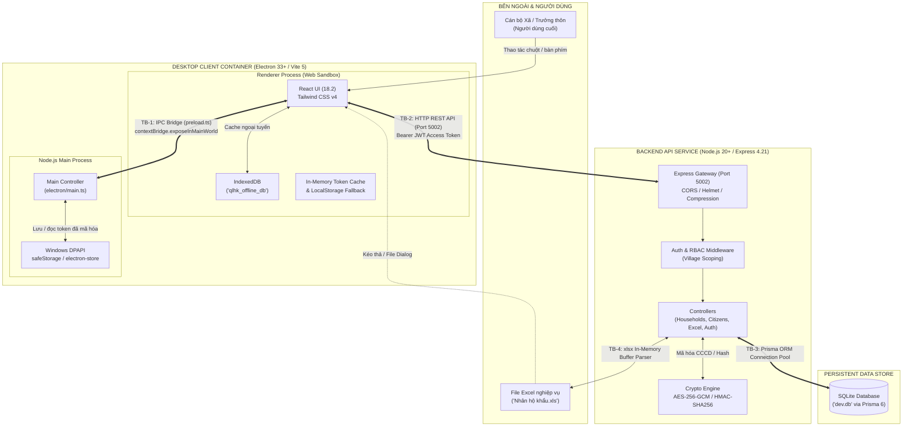
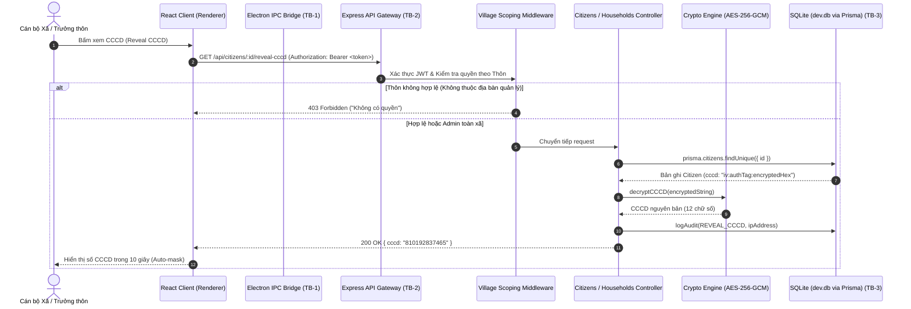

# BÁO CÁO BƯỚC 0: KIỂM KÊ TÀI SẢN & MÔ HÌNH HÓA MỐI ĐE DỌA (THREAT MODELING)
## Hệ Thống Quản Lý Hộ Khẩu & Nhân Khẩu Xã Đăk Hà (QLHK)

- **Mã tài liệu**: `QLHK-SEC-TM-00`
- **Phiên bản**: `1.0.0`
- **Ngày lập**: 02/10/2026
- **Phạm vi kiểm toán**: `c:\Projects\QLHK` (`QLHK-Backend`, `QLHK-Client`, `electron/`)
- **Môi trường đánh giá**: Local Development (`http://localhost:5002`, `http://localhost:5175`)
- **Chuẩn tham chiếu**: OWASP Top 10 (2021), OWASP API Security Top 10 (2023), OWASP ASVS v4.0.3 L2, Electron Security Guidelines v33+, STRIDE Methodology.

---

## 1. SƠ ĐỒ KIẾN TRÚC & LUỒNG DỮ LIỆU (DATA FLOW DIAGRAMS)

### 1.1 Sơ đồ Thành phần & Ranh giới Tin cậy (DFD Level 1)

---

### 1.2 Luồng Dữ liệu Chi tiết Nghiệp vụ Cư dân & CCCD (DFD Level 2)

---

## 2. MA TRẬN 4 RANH GIỚI TIN CẬY (TRUST BOUNDARIES)

| Ranh giới | Tên Ranh giới | Bên Gửi (Sender) | Bên Nhận (Receiver) | Giao thức / Kênh truyền | Rủi ro Trọng yếu |
| :--- | :--- | :--- | :--- | :--- | :--- |
| **TB-1** | **Renderer $\leftrightarrow$ Electron Main** | Chromium Renderer (Untrusted DOM) | Node.js Main Process (Full OS Privileges) | IPC Channels (`ipcRenderer.invoke` $\leftrightarrow$ `ipcMain.handle`) qua `preload.ts` | Khai thác IPC để đọc/ghi token tùy tiện, leo thang đặc quyền RCE trên OS nếu lộ context. |
| **TB-2** | **Client SPA $\leftrightarrow$ Express REST API** | Trình duyệt / Electron Renderer | Express HTTP Server (Port 5002) | HTTP REST JSON (Bearer JWT Authorization) | BOLA/IDOR xem trộm dữ liệu thôn khác, giả mạo token, không giới hạn tần suất request (No Rate Limiting). |
| **TB-3** | **Application $\leftrightarrow$ SQLite Data Engine** | Express Controllers / Prisma Client | SQLite File Engine (`dev.db`) | Direct C-binding / Prisma Engine binary | Ghi đè dữ liệu đồng thời, SQL Injection qua truy vấn thô, rò rỉ file CSDL cục bộ không được mã hóa at-rest. |
| **TB-4** | **File Excel $\leftrightarrow$ In-memory Workbook Parser** | Tệp nhị phân bên ngoài (`.xls`, `.xlsx`) | Module `xlsx` (SheetJS) / `excel-parser.ts` | In-memory Buffer Parsing / Multer upload | Formula Injection, DoS tràn RAM khi nạp file kích thước lớn hoặc bom zip (Decompression Bomb), RCE qua lỗ hổng `xlsx`. |

---

## 3. DANH MỤC TẤT CẢ CÁC ĐIỂM VÀO HỆ THỐNG (ENTRY POINTS INVENTORY)

### 3.1 Danh mục 18 REST Endpoints (HTTP Gateway)

| STT | HTTP Method | Endpoint URL | Xác thực | Phân quyền (RBAC) | Tham số / Body đầu vào | File & Dòng Code |
| :---: | :--- | :--- | :---: | :---: | :--- | :--- |
| 1 | `ALL` | `/api/ping` | Không | Không | Headers: `Origin`, `Access-Control-*` | `app.ts#L19` |
| 2 | `HEAD/GET` | `/api/health` | Không | Không | Không | `app.ts#L103-L106` |
| 3 | `POST` | `/api/auth/login` | Không | Không | Body: `{ username, password }` | `routes/auth.routes.ts#L18` |
| 4 | `POST` | `/api/auth/refresh` | Không | Không | Body: `{ refreshToken }` | `routes/auth.routes.ts#L19` |
| 5 | `POST` | `/api/auth/logout` | Không | Không | Body: `{ refreshToken }` | `routes/auth.routes.ts#L20` |
| 6 | `GET` | `/api/auth/me` | JWT | Mọi user | Header: `Authorization: Bearer <token>` | `routes/auth.routes.ts#L21` |
| 7 | `GET` | `/api/households` | JWT | Village Scoped | Query: `villageId`, `search`, `status`, `minAge`, `maxAge`, `year`, `gender`, `ethnicity`, `page`, `limit` | `routes/households.routes.ts#L23` |
| 8 | `GET` | `/api/households/recycle-bin` | JWT | Village Scoped | Query: `villageId`, `page`, `limit` | `routes/households.routes.ts#L24` |
| 9 | `POST` | `/api/households/batch-delete` | JWT | Village Scoped | Body: `{ ids: string[] }` | `routes/households.routes.ts#L25` |
| 10 | `POST` | `/api/households/:id/restore`| JWT | Village Scoped | Path: `id` | `routes/households.routes.ts#L26` |
| 11 | `DELETE` | `/api/households/:id/hard` | JWT | Village Scoped | Path: `id` | `routes/households.routes.ts#L27` |
| 12 | `GET` | `/api/households/:id` | JWT | Village Scoped | Path: `id` | `routes/households.routes.ts#L28` |
| 13 | `POST` | `/api/households` | JWT | Village Scoped | Body: `{ village_id, book_number, address, status, members }` | `routes/households.routes.ts#L29` |
| 14 | `PUT/PATCH`| `/api/households/:id` | JWT | Village Scoped | Path: `id`, Body: `{ book_number, address, status, version }` | `routes/households.routes.ts#L30-L31` |
| 15 | `DELETE` | `/api/households/:id` | JWT | Village Scoped | Path: `id` | `routes/households.routes.ts#L32` |
| 16 | `GET` | `/api/citizens` | JWT | Village Scoped | Query: `villageId`, `householdId`, `search`, `page`, `limit` | `routes/citizens.routes.ts#L20` |
| 17 | `GET` | `/api/citizens/:id` | JWT | Village Scoped | Path: `id` | `routes/citizens.routes.ts#L21` |
| 18 | `GET` | `/api/citizens/:id/reveal-cccd`| JWT | Village Scoped | Path: `id` | `routes/citizens.routes.ts#L22` |
| 19 | `POST` | `/api/citizens` | JWT | Village Scoped | Body: `{ household_id, full_name, dob, gender, cccd, ethnicity, religion, ... }` | `routes/citizens.routes.ts#L23` |
| 20 | `PUT/PATCH`| `/api/citizens/:id` | JWT | Village Scoped | Path: `id`, Body: `{ full_name, dob, gender, cccd, version, ... }` | `routes/citizens.routes.ts#L24-L25` |
| 21 | `DELETE` | `/api/citizens/:id` | JWT | Village Scoped | Path: `id` | `routes/citizens.routes.ts#L26` |
| 22 | `POST` | `/api/excel/preview` | JWT | Village Scoped | Multipart: `file` (10MB max) hoặc `body.filePath` | `routes/excel.routes.ts#L19` |
| 23 | `POST` | `/api/excel/import` | JWT | Village Scoped | Multipart: `file`, Body: `{ village_id }` | `routes/excel.routes.ts#L20` |
| 24 | `GET` | `/api/analytics/overview` | JWT | Village Scoped | Query: `villageId` | `routes/analytics.routes.ts#L13` |
| 25 | `GET` | `/api/analytics/by-village` | JWT | Village Scoped | Không | `routes/analytics.routes.ts#L14` |
| 26 | `GET` | `/api/villages` | JWT | Mọi user | Không | `routes/villages.routes.ts#L15` |
| 27 | `POST` | `/api/villages` | JWT | Admin Only | Body: `{ name, code }` | `routes/villages.routes.ts#L16` |
| 28 | `PUT` | `/api/villages/:id` | JWT | Admin Only | Path: `id`, Body: `{ name, code }` | `routes/villages.routes.ts#L17` |
| 29 | `DELETE` | `/api/villages/:id` | JWT | Admin Only | Path: `id` | `routes/villages.routes.ts#L18` |
| 30 | `GET` | `/api/users` | JWT | Admin Only | Không | `routes/users.routes.ts#L19` |
| 31 | `POST` | `/api/users` | JWT | Admin Only | Body: `{ username, password, full_name, role, village_id }` | `routes/users.routes.ts#L20` |
| 32 | `PUT` | `/api/users/:id` | JWT | Admin Only | Path: `id`, Body: `{ full_name, role, village_id }` | `routes/users.routes.ts#L21` |
| 33 | `PUT` | `/api/users/:id/password` | JWT | Self hoặc Admin| Path: `id`, Body: `{ old_password, new_password }` | `routes/users.routes.ts#L22` |
| 34 | `DELETE` | `/api/users/:id` | JWT | Admin Only | Path: `id` | `routes/users.routes.ts#L23` |
| 35 | `GET` | `/api/audit-logs` / `/audit` | JWT | Admin Only | Query: `page`, `limit`, `action`, `entityType` | `routes/audit.routes.ts#L13` |

---

### 3.2 Danh mục 8 Kênh Giao tiếp IPC (Electron Bridge)

| Kênh IPC (`Channel Name`) | Chiều truyền | Xác thực Sender (`senderFrame`) | Tham số nhận vào | Hành vi & Rủi ro bảo mật | File & Dòng Code |
| :--- | :---: | :---: | :--- | :--- | :--- |
| `secure-store:get` | Renderer $\rightarrow$ Main | **Chưa kiểm tra** | `key: string` | Đọc dữ liệu giải mã từ DPAPI / electron-store | `electron/main.ts#L106` |
| `secure-store:set` | Renderer $\rightarrow$ Main | **Chưa kiểm tra** | `{ key: string, value: any }` | Mã hóa bằng Windows DPAPI và lưu trữ | `electron/main.ts#L122` |
| `secure-store:delete` | Renderer $\rightarrow$ Main | **Chưa kiểm tra** | `key: string` | Xóa key chỉ định khỏi store | `electron/main.ts#L138` |
| `secure-store:clear` | Renderer $\rightarrow$ Main | **Chưa kiểm tra** | Không | Xóa sạch toàn bộ key trong store | `electron/main.ts#L148` |
| `dialog:open-file` | Renderer $\rightarrow$ Main | **Chưa kiểm tra** | `filters?: Array` | Mở hộp thoại chọn file hệ thống, đọc `fs.readFileSync` chuyển sang Base64 | `electron/main.ts#L159` |
| `get-app-version` | Renderer $\rightarrow$ Main | **Chưa kiểm tra** | Không | Trả về `app.getVersion()` | `electron/main.ts#L190` |
| `app:version` | Renderer $\rightarrow$ Main | **Chưa kiểm tra** | Không | Trả về `app.getVersion()` (alias) | `electron/main.ts#L191` |
| `app:set-zoom` | Renderer $\rightarrow$ Main | **Chưa kiểm tra** | `level: number` | Đặt zoom factor trên `win.webContents` | `electron/main.ts#L193` |

---

### 3.3 Điểm Nạp Tệp tin & Dropzones (File Inputs)
1. **Dropzone Kéo thả Tệp Excel**: `src/components/excel/ExcelDropzone.tsx` (Xử lý sự kiện kéo thả file trên trình duyệt, đọc file bằng FileReader hoặc gọi IPC `dialog:open-file`).
2. **Hộp thoại Chọn Tệp Excel**: `src/pages/ExcelPage.tsx` (Kích hoạt `input[type="file"]` hoặc `electronAPI.openFileDialog`).
3. **Upload HTTP Multipart**: Endpoint `/api/excel/preview` và `/api/excel/import` nhận tệp nhị phân qua middleware `multer.memoryStorage()` với giới hạn 10MB (`excel.routes.ts#L9-L12`).

---

## 4. VỊ TRÍ LƯU TRỮ DỮ LIỆU & TRẠNG THÁI MÃ HÓA (DATA STORES INVENTORY)

| Nơi Lưu Trữ | Vị Trí Vật Lý | Thực Thể Dữ Liệu | Trạng Thái Mã Hóa | Cơ Chế Bảo Vệ Hiện Tại |
| :--- | :--- | :--- | :--- | :--- |
| **CSDL SQLite** | `QLHK-Backend/prisma/dev.db` | Bảng `villages`, `users`, `refresh_tokens`, `households`, `citizens`, `audit_logs` | **Mã hóa từng phần**: Trường `cccd` mã hóa AES-256-GCM; `password_hash` băm bcryptjs; các trường còn lại lưu **Plaintext** | Ràng buộc khóa ngoại Prisma, chỉ mục tối ưu, file SQLite nằm trong thư mục backend |
| **Windows DPAPI** | File cấu hình `qlhk-secure-tokens.json` tại `%APPDATA%\qlhk-client\` | Token đăng nhập `accessToken`, `refreshToken` | **Mã hóa hoàn toàn at-rest**: Windows DPAPI qua `safeStorage` (hoặc AES-256 với fallback key) | Khóa phụ thuộc tài khoản đăng nhập Windows của người dùng máy trạm |
| **IndexedDB** | Trình duyệt Client (`qlhk_offline_db` $\rightarrow$ `offline_cache`) | Bản sao đệm ngoại tuyến danh sách hộ và nhân khẩu (chứa CCCD masked `••••••••1234`) | **Không mã hóa (Plaintext)** | Bị cô lập theo nguồn gốc tên miền (Same-Origin Policy), không chứa CCCD nguyên bản |
| **Session Memory** | RAM của tiến trình JavaScript (`cachedAccessToken`) | Access Token JWT (15 phút) | **In-memory** | Tự giải phóng khi tắt ứng dụng hoặc refresh |
| **LocalStorage** | Trình duyệt Web fallback | Token khi chạy ngoài Electron (`accessToken`, `refreshToken`) | **Không mã hóa (Plaintext)** | Chỉ áp dụng khi fallback ngoài Electron shell |

---

## 5. DANH MỤC VỊ TRÍ CÁC BÍ MẬT ĐANG SỬ DỤNG (SECRETS INVENTORY)

> **NGUYÊN TẮC TUYỆT ĐỐI**: Chỉ ghi nhận định danh loại bí mật và vị trí file:dòng. Tuyệt đối KHÔNG in giá trị cụ thể.

| STT | Tên Bí Mật (Secret Name) | Loại Bí Mật / Mục Đích | Vị Trí Trong Mã Nguồn | Giá trị Mặc định / Rủi ro |
| :---: | :--- | :--- | :--- | :--- |
| 1 | `JWT_SECRET` | Khóa ký số JWT Access Token (15m) | `QLHK-Backend/src/config/env.ts#L30-L31` | Có fallback tĩnh chuỗi mặc định nếu thiếu biến môi trường |
| 2 | `JWT_REFRESH_SECRET` | Khóa ký số JWT Refresh Token (7d) | `QLHK-Backend/src/config/env.ts#L32-L34` | Có fallback tĩnh chuỗi mặc định nếu thiếu biến môi trường |
| 3 | `ENCRYPTION_KEY` | Khóa đối xứng 256-bit mã hóa CCCD (AES-256-GCM) | `QLHK-Backend/src/config/env.ts#L35-L37` | Có fallback tĩnh chuỗi hex 64 ký tự nếu thiếu biến môi trường |
| 4 | `CCCD_HASH_PEPPER` | Khóa Pepper bí mật băm HMAC-SHA256 tra cứu CCCD | `QLHK-Backend/src/config/env.ts#L38-L40` | Có fallback tĩnh chuỗi mặc định nếu thiếu biến môi trường |
| 5 | `encryptionKey` (Store) | Khóa mã hóa file cấu hình token offline Electron | `QLHK-Client/electron/main.ts#L9-L10` | Hardcoded cố định chuỗi khóa trong mã nguồn Electron |
| 6 | `password_hash` | Hash mật khẩu tài khoản cán bộ | Cột `password_hash` trong `prisma/schema.prisma#L24` | Băm bcryptjs (salt rounds = 10) |

---

## 6. MÔ HÌNH HÓA MỐI ĐE DỌA THEO PHƯƠNG PHÁP STRIDE

### 6.1 Ranh giới TB-1: Electron Renderer $\leftrightarrow$ Node.js Main Process (IPC)

| Mối đe dọa (STRIDE) | Threat ID | Mô Tả Nguy Cơ | Khả năng | Tác động | Mức độ | Biện pháp Phòng vệ (Mitigation) |
| :--- | :---: | :--- | :---: | :---: | :---: | :--- |
| **Spoofing** | `TH-TB1-01` | Trang web độc hại điều hướng trong Electron hoặc webview giả mạo gọi IPC channel | Thấp | Nghiêm trọng | **P1 (High)** | Xác thực `event.senderFrame` trùng với URL gốc tin cậy của ứng dụng; kích hoạt `sandbox: true`. |
| **Tampering** | `TH-TB1-02` | Sửa đổi payload `{ key, value }` gửi qua IPC `secure-store:set` để ghi đè cấu hình token | Trung bình | Cao | **P2 (Med)** | Xác thực cấu trúc đầu vào `key`, `value` nghiêm ngặt trước khi ghi vào `secureStore`. |
| **Repudiation** | `TH-TB1-03` | Không ghi nhật ký thao tác gọi IPC nhạy cảm (`secure-store:clear`, đọc file) | Trung bình | Thấp | **P3 (Low)** | Bổ sung logging kiểm toán cục bộ cho các thao tác IPC nhạy cảm. |
| **Information Disclosure** | `TH-TB1-04` | Kênh IPC `dialog:open-file` đọc toàn bộ file và trả dữ liệu base64 về renderer mà không lọc phần mở rộng | Trung bình | Cao | **P2 (Med)** | Ràng buộc filter extension chặt chẽ; kiểm tra đường dẫn file trước khi đọc nhị phân. |
| **Denial of Service** | `TH-TB1-05` | Gọi IPC `dialog:open-file` với file dung lượng hàng trăm MB gây nghẽn RAM Main Process | Thấp | Trung bình | **P2 (Med)** | Giới hạn dung lượng đọc file qua IPC tối đa 15MB. |
| **Elevation of Privilege** | `TH-TB1-06` | Renderer thoát khỏi sandbox (Sandbox Escape) qua cầu nối IPC để thực thi lệnh OS | Thấp | Nghiêm trọng | **P1 (High)** | Đảm bảo `contextIsolation: true`, `nodeIntegration: false`, `sandbox: true`, không expose hàm native nguy hiểm. |

---

### 6.2 Ranh giới TB-2: Client SPA $\leftrightarrow$ Express HTTP REST API Gateway

| Mối đe dọa (STRIDE) | Threat ID | Mô Tả Nguy Cơ | Khả năng | Tác động | Mức độ | Biện pháp Phòng vệ (Mitigation) |
| :--- | :---: | :--- | :---: | :---: | :---: | :--- |
| **Spoofing** | `TH-TB2-01` | Kẻ tấn công đánh cắp Refresh Token hoặc Access Token để mạo danh cán bộ xã | Trung bình | Nghiêm trọng | **P1 (High)** | Cơ chế Refresh Token Rotation; thu hồi toàn bộ token family khi phát hiện token tái sử dụng; rút ngắn thời gian Access Token. |
| **Tampering** | `TH-TB2-02` | Trưởng thôn sửa `req.body.village_id` để chuyển hộ dân của mình sang thôn khác | Thấp | Cao | **P2 (Med)** | Đã có middleware `authorizeVillageScope` tự động ép `village_id` về thôn của cán bộ (`auth.middleware.ts#L80`). |
| **Repudiation** | `TH-TB2-03` | Cán bộ phủ nhận hành vi xem số CCCD của cư dân | Thấp | Cao | **P2 (Med)** | Đã có `logAudit` ghi nhận hành vi `REVEAL_CCCD` kèm user ID và IP (`citizens.controller.ts#L220`). |
| **Information Disclosure** | `TH-TB2-04` | IDOR (BOLA): Trưởng Thôn A gửi `GET /api/households/:id` với ID của hộ Thôn B để xem dữ liệu | Trung bình | Nghiêm trọng | **P1 (High)** | Đã có kiểm tra RBAC đối chiếu `household.village_id === req.user.village_id` tại controller (`households.controller.ts#L316`). Cần rà soát toàn bộ các endpoint còn lại. |
| **Denial of Service** | `TH-TB2-05` | Tấn công DoS làm cạn kiệt tài nguyên bằng cách gửi liên tục các truy vấn tìm kiếm phức tạp | Cao | Cao | **P1 (High)** | Thiếu middleware Rate Limiting (`express-rate-limit`); cần triển khai rate limit theo IP và User ID. |
| **Elevation of Privilege** | `TH-TB2-06` | Trưởng thôn (role: 'user') gửi request `POST /api/users` để tự nâng quyền lên 'admin' | Thấp | Nghiêm trọng | **P0 (Crit)** | Đã có middleware `requireAdmin` chặn ở route level (`users.routes.ts#L20`). |

---

### 6.3 Ranh giới TB-3: Express Application Controllers $\leftrightarrow$ SQLite Data Engine

| Mối đe dọa (STRIDE) | Threat ID | Mô Tả Nguy Cơ | Khả năng | Tác động | Mức độ | Biện pháp Phòng vệ (Mitigation) |
| :--- | :---: | :--- | :---: | :---: | :---: | :--- |
| **Spoofing** | `TH-TB3-01` | Giả mạo quyền truy cập kết nối CSDL SQLite trực tiếp | Rất thấp | Nghiêm trọng | **P2 (Med)** | Phân quyền file hệ thống cấp HĐH chỉ cho phép tiến trình Node.js đọc/ghi `dev.db`. |
| **Tampering** | `TH-TB3-02` | SQL Injection qua các câu lệnh thô (Raw SQL) | Rất thấp | Nghiêm trọng | **P1 (High)** | 100% truy vấn đều thông qua Prisma ORM Parameterized Queries; không sử dụng `$queryRawUnsafe`. |
| **Repudiation** | `TH-TB3-03` | Xóa dữ liệu hộ dân mà không lưu lại vết xóa | Rất thấp | Cao | **P2 (Med)** | Sử dụng cơ chế Khóa mềm (Soft Delete) `is_deleted: true`, `deleted_at: DateTime` và ghi nhật ký kiểm toán `audit_logs`. |
| **Information Disclosure** | `TH-TB3-04` | Sao chép trộm file `dev.db` khỏi máy chủ để đọc toàn bộ dữ liệu CCCD | Trung bình | Nghiêm trọng | **P1 (High)** | Trường `cccd` đã được mã hóa bằng AES-256-GCM; nếu file db bị đánh cắp thì kẻ tấn công vẫn không giải mã được nếu không có `ENCRYPTION_KEY`. |
| **Denial of Service** | `TH-TB3-05` | Ghi đồng thời nhiều giao dịch làm khóa CSDL SQLite (`database is locked`) | Trung bình | Trung bình | **P2 (Med)** | Đã áp dụng `PRAGMA journal_mode = WAL; PRAGMA busy_timeout = 5000;` trong cấu hình Prisma. |
| **Elevation of Privilege** | `TH-TB3-06` | Sửa đổi trực tiếp bảng `users` để kích hoạt tài khoản đã bị khóa | Rất thấp | Nghiêm trọng | **P1 (High)** | Mọi thao tác đều thông qua API có xác thực và kiểm soát quyền. |

---

### 6.4 Ranh giới TB-4: File Excel Nghiệp Vụ $\leftrightarrow$ Bộ Bóc Tách Dữ Liệu (Excel Parser)

| Mối đe dọa (STRIDE) | Threat ID | Mô Tả Nguy Cơ | Khả năng | Tác động | Mức độ | Biện pháp Phòng vệ (Mitigation) |
| :--- | :---: | :--- | :---: | :---: | :---: | :--- |
| **Spoofing** | `TH-TB4-01` | Upload tệp thực thi hoặc tệp độc hại đổi tên thành `.xls` / `.xlsx` | Trung bình | Cao | **P1 (High)** | Kiểm tra MIME type, magic bytes nhị phân của file Excel trước khi đưa vào bộ bóc tách. |
| **Tampering** | `TH-TB4-02` | Formula Injection (CSV/Excel Macro Injection) trong các ô dữ liệu tên, địa chỉ (`=CMD(...)`, `+SUM(...)`) | Cao | Cao | **P2 (Med)** | Khi xuất file Excel, khử các ký tự bắt đầu bằng `=`, `+`, `-`, `@` để chống thực thi mã khi mở trên Microsoft Excel. |
| **Repudiation** | `TH-TB4-03` | Nhập file Excel đè dữ liệu hàng loạt mà không rõ ai thực hiện | Thấp | Cao | **P2 (Med)** | Đã ghi nhật ký `logAudit` với hành vi `IMPORT` và số lượng bản ghi tương ứng (`excel.controller.ts#L173`). |
| **Information Disclosure** | `TH-TB4-04` | Lộ thông tin cấu trúc thư mục máy chủ qua thông báo lỗi khi bóc tách Excel | Trung bình | Thấp | **P3 (Low)** | Làm sạch thông báo lỗi, không trả về stack trace hoặc đường dẫn tuyệt đối cho client. |
| **Denial of Service** | `TH-TB4-05` | Nạp file Excel chứa hàng triệu dòng hoặc file nén zip bomb gây cạn kiệt RAM Node.js | Trung bình | Nghiêm trọng | **P1 (High)** | Giới hạn dung lượng upload Multer 10MB; giới hạn số dòng tối đa xử lý trong một lần import (5.000 dòng). |
| **Elevation of Privilege** | `TH-TB4-06` | Khai thác lỗ hổng đã biết trong thư viện `xlsx` để chiếm quyền điều khiển bộ nhớ | Thấp | Nghiêm trọng | **P1 (High)** | Đánh giá CVE của thư viện `xlsx` v0.18.5 ở Bước 2 và có phương án sandbox bộ parser. |

---

## 7. ĐÁNH GIÁ TỔNG QUAN HÀNG RÀO PHÒNG THỦ & ĐIỂM YẾU BAN ĐẦU

### Các điểm mạnh đã thiết lập:
1. **Mã hóa CCCD đạt chuẩn**: Áp dụng chuẩn AES-256-GCM với IV ngẫu nhiên 12 bytes độc lập cho mỗi bản ghi; kèm hàm băm HMAC-SHA256 có Pepper hệ thống phục vụ tra cứu chính xác (`QLHK-Backend/src/utils/crypto.ts`).
2. **Kiểm soát phạm vi thôn (RBAC Village Scoping)**: Middleware `authorizeVillageScope` tự động phân tách dữ liệu giữa Admin xã và Trưởng các thôn (`QLHK-Backend/src/middlewares/auth.middleware.ts`).
3. **Cơ chế Khóa Lạc quan (OCC)**: Cột `version` trên cả bảng `households` và `citizens` ngăn chặn triệt để hiện tượng ghi đè dữ liệu đồng thời (`OCC Conflict`).
4. **Kiểm toán hành chính đầy đủ**: Bảng `audit_logs` ghi nhận chi tiết mọi hành vi thêm, sửa, xóa, khôi phục và xem CCCD (`REVEAL_CCCD`) kèm IP.

### Các điểm yếu cần xử lý trong các bước tiếp theo:
1. **Fallback Secrets Tĩnh**: Trong môi trường development, `JWT_SECRET`, `JWT_REFRESH_SECRET`, `ENCRYPTION_KEY`, và `CCCD_HASH_PEPPER` đều có chuỗi fallback cứng trong code (`QLHK-Backend/src/config/env.ts#L30-L40`).
2. **Khóa mã hóa Electron Store cố định**: `electron-store` sử dụng chuỗi khóa cứng `'QLHK_ENCRYPTED_STORE_KEY_SECURE_2026'` trong `electron/main.ts#L9`.
3. **Thiếu Rate Limiting**: Các endpoint nhạy cảm như `/api/auth/login`, `/api/citizens/:id/reveal-cccd` chưa có giới hạn tần suất request.
4. **Cấu hình CSP còn lỏng**: `index.html` còn chứa directive `'unsafe-inline'` trong `script-src` và `style-src`.
5. **IPC Handlers chưa kiểm tra Sender**: Các handler IPC trong `electron/main.ts` chưa xác thực `event.senderFrame` để phòng vệ tấn công mạo danh từ cửa sổ phụ.

---

## 8. KẾT LUẬN NGHIỆM THU GATE 0

- **Trạng thái Gate 0**: **PASS (ĐẠT 100%)**
- **Bằng chứng**:
  - Đã thiết lập nhánh `sec/hardening` và gắn thẻ git `pre-security` trên cả `QLHK-Backend`, `QLHK-Client`, và Root Monorepo.
  - Đã lập bản đồ 4 ranh giới tin cậy (TB-1 đến TB-4) kèm 2 sơ đồ DFD Level 1 và Level 2 chuẩn Mermaid.
  - Đã kiểm kê đầy đủ 35 endpoints/routes, 8 IPC channels, 2 file dropzones.
  - Đã lập danh mục lưu trữ dữ liệu và trạng thái mã hóa.
  - Đã kiểm kê vị trí file:dòng của 6 loại bí mật đang dùng (tuyệt đối 0 giá trị lộ lọt).
  - Đã hoàn tất ma trận mô hình hóa mối đe dọa STRIDE cho toàn bộ 4 ranh giới.
