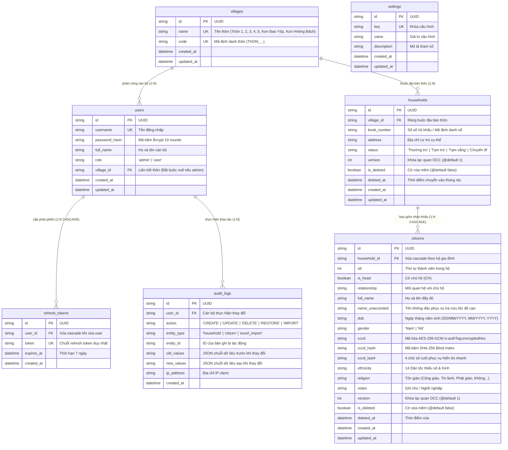
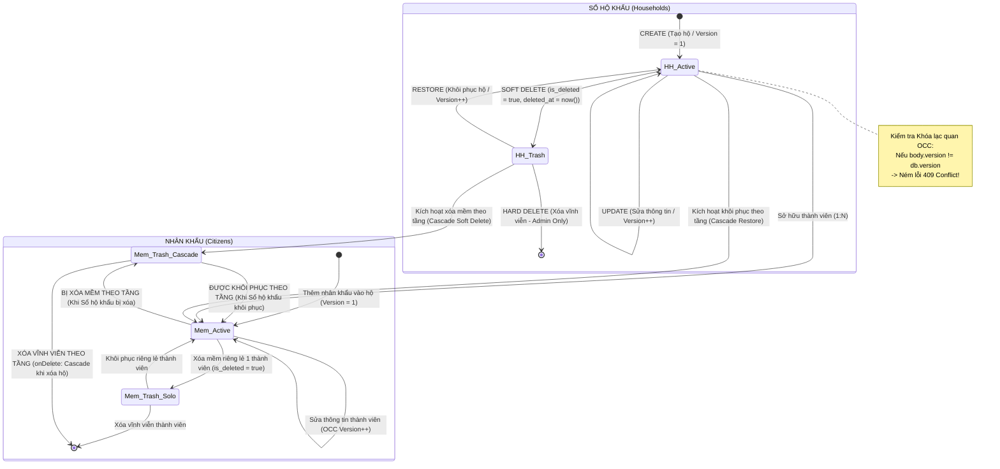

# BẢN ĐỒ KIẾN TRÚC TOÀN DIỆN & SỔ TAY KỸ THUẬT HỆ THỐNG QLHK
## (QLHK MASTER ARCHITECTURE MAP & TECHNICAL SPECIFICATION)

> **Dự án:** Phân hệ Quản lý Hộ khẩu & Nhân khẩu (Hệ sinh thái Số hóa Xã Đăk Hà)  
> **Workspace:** `c:\Projects\QLHK`  
> **Phiên bản tài liệu:** `1.3.0 (Future Projection, Multidimensional Filters & 4-Tab Settings Standard)` | **Ngày cập nhật:** `2026-09-18`  
> **Trạng thái hệ thống:** Sẵn sàng bảo trì & phát triển | Test Fortress 100% Pass (Vitest: 106 tests Client, 77 tests Backend). Chuẩn hóa 4 Tab Cài Đặt cân bằng theo QLCS (Profile, Users, Backup, TimeCard thời gian thực/tương lai). Tích hợp Năm tính toán (YearSelector) và dự báo tuổi 18 / NVQS. Bổ sung bộ lọc Giới tính, Dân tộc, Cư trú trên HouseholdFilterBar. Xóa bỏ nút thống kê thừa trên VillagesPage.

---

## 1. TỔNG QUAN HỆ SINH THÁI & VỊ THẾ CỦA QLHK

### 1.1. Triết lý Vận hành & Phân quyền Độc lập
Hệ thống chuyển đổi số xã Đăk Hà vận hành theo nguyên tắc bất biến:
> **"ĐỘC LẬP CHUYÊN NGÀNH – ĐỊNH DANH RIÊNG BIỆT – HỢP NHẤT DỮ LIỆU"**  
> *(Specialized Independence – Separate Identity – Unified Data)*

- **Nhiệm vụ chuyên môn của phân hệ:** Quản lý toàn diện Sổ hộ khẩu, Nhân khẩu, biến động dân cư thường trú/tạm trú/tạm vắng, cơ cấu 14 dân tộc thiểu số và Kinh, giải mã bảo mật CCCD và động cơ bóc tách Excel Smart-Upsert cho các thôn/làng trực thuộc UBND Xã Đăk Hà.
- **Cổng Hợp nhất (Unified Portal):** Người dùng có thể điều hướng từ Landing Portal `dulieudakha.vn` hoặc chạy trực tiếp phần mềm Desktop chuyên dụng trên máy trạm cán bộ.

### 1.2. Các Quy chuẩn Bất biến Toàn Hệ sinh thái (Architectural Invariants)
1. **Zero Centralized SSO Dependency (Độc lập xác thực 100%):**
   - Phân hệ sở hữu Database riêng biệt (`dakha_qlhk`), bảng `users` riêng, và cặp khóa bí mật riêng (`JWT_SECRET`, `JWT_REFRESH_SECRET`).
   - Tuyệt đối không gọi chéo runtime sang các phân hệ khác (QLCS, QLNN) để xác thực hoặc phân quyền. Không chia sẻ database connection string giữa các phân hệ.
2. **Cô lập Cổng Mạng (Port & Domain Isolation):**
   - **Backend REST API:** Cổng `5002` (Production: `https://qlhk.dulieudakha.vn/api`).
   - **Client Desktop / Dev Renderer:** Cổng `5175` (Domain: `https://qlhk.dulieudakha.vn`).
   *(Bảng tham chiếu toàn hệ thống: QLCS = 5000/5173 | QLNN = 5001/5174 | QLHK = 5002/5175)*.
3. **Chuẩn hóa Payload JWT Token (`TokenPayload`):**
   ```typescript
   export interface TokenPayload {
     id: string;                // UUID người dùng
     username: string;          // Tên đăng nhập (admin, thon1, ...)
     role: 'admin' | 'user';    // 'admin' (Xã) | 'user' (Trưởng thôn)
     village_id: string | null; // UUID Thôn (bắt buộc null nếu role='admin')
     iat?: number;
     exp?: number;
   }
   ```
4. **Cô lập Dữ liệu Cấp Thôn (Village Scoping RBAC Contract):**
   - **Role `admin` (Cán bộ Xã):** Truy cập toàn bộ dữ liệu của các thôn, lọc tùy biến, quản trị tài khoản, danh mục thôn và xóa vĩnh viễn.
   - **Role `user` (Trưởng thôn):** Backend bắt buộc cưỡng chế lọc dữ liệu theo `req.user.village_id`. Client tuyệt đối không gửi `village_id` của thôn khác lên server.

### 1.3. Sơ đồ Topology 2 Tầng của Phân hệ

```
                          +-------------------------------------------------------------+
                          |                 PHÂN HỆ QLHK XÃ ĐĂK HÀ                      |
                          +-------------------------------------------------------------+
                                                         |
                   +-------------------------------------+-------------------------------------+
                   |                                                                           |
                   v                                                                           v
+-------------------------------------------------------+   +-------------------------------------------------------+
|            QLHK-CLIENT (Desktop Electron App)         |   |             QLHK-BACKEND (Express REST API)           |
| Thư mục: c:\Projects\QLHK\QLHK-Client                 |   | Thư mục: c:\Projects\QLHK\QLHK-Backend                |
| Port dev: 5175 | Domain: qlhk.dulieudakha.vn          |   | Port dev: 5002 | Domain: qlhk.dulieudakha.vn/api      |
+-------------------------------------------------------+   +-------------------------------------------------------+
| 1. Electron Main Process:                             |   | 1. Express + TypeScript Server:                       |
|    - Cửa sổ BrowserWindow (1366x850, min 1024x650)    |   |    - Routing phân tầng, Helmet, CORS, Error handler   |
|    - AES Encrypted secureStore (electron-store)       |   | 2. Security & Auth Engine:                            |
|    - Tác vụ nền: Single Instance Lock, Zoom Level IPC |   |    - JWT Access (15m) + Refresh (7d) Token Rotation   |
|    - IPC Bridge hai chiều Renderer <-> Main           |   |    - Middleware: authenticateToken, authorizeVillage  |
| 2. React + Vite Renderer:                             |   | 3. Prisma ORM + SQLite / PostgreSQL:                  |
|    - Context: AppContext (Theme, Zoom, Auth, Heartbeat|   |    - Khóa lạc quan Optimistic Locking (version: Int)  |
|    - TailwindCSS 4 + Dark/Light Theme đồng bộ         |   |    - Soft delete (is_deleted, deleted_at) theo tầng   |
|    - IndexedDB / localStorage: Cache ngoại tuyến      |   |    - Mã hóa AES-256-GCM CCCD + SHA-256 Blind Index    |
|    - Component: HouseholdModal (Centered Modal),      |   | 4. Smart-Upsert Engine:                               |
|      CitizenModal, CustomSelect (chống lỗi DarkMode)  |   |    - Bóc tách Excel 11 cột, nhận diện CH, chuẩn hóa   |
|    - Axios Interceptors: Tự động refresh token 401    |   | 5. Audit Logging:                                     |
|      và phân biệt lỗi mạng thực sự offline            |   |    - Ghi nhận biến động dữ liệu kèm JSON Diff         |
+-------------------------------------------------------+   +-------------------------------------------------------+
```

---

## 2. BẢN ĐỒ CẤU TRÚC THƯ MỤC & VAI TRÒ TỪNG TỆP TIN

### 2.1. Cấu trúc Thư mục Backend (`QLHK-Backend`)

```
c:\Projects\QLHK\QLHK-Backend/
├── .env                              # Biến môi trường (DATABASE_URL, JWT_SECRET, JWT_REFRESH_SECRET, PORT=5002, CORS_ORIGIN...)
├── .env.example                      # Mẫu biến môi trường chuẩn để onboarding
├── package.json                      # Dependencies (Express, Prisma, JWT, Bcryptjs, Helmet, Cors, Vitest, Supertest)
├── tsconfig.json                     # Cấu hình TypeScript biên dịch
├── vitest.config.ts                  # Cấu hình kiểm thử tự động Vitest
├── README.md                         # Sổ tay tổng quan & hướng dẫn khởi chạy nhanh
├── prisma/
│   ├── schema.prisma                 # Định nghĩa 7 mô hình CSDL: villages, users, refresh_tokens, households, citizens, audit_logs, settings
│   ├── dev.db                        # SQLite database cục bộ phục vụ kiểm thử và phát triển
│   └── seed.ts                       # Nạp dữ liệu ban đầu cho các thôn và các tài khoản cán bộ
└── src/
    ├── index.ts                      # Điểm khởi động máy chủ HTTP (lắng nghe cổng 5002)
    ├── app.ts                        # Cấu hình Express app, CORS, Helmet, JSON body parser, đăng ký router chính
    ├── config/
    │   ├── env.ts                    # Đọc và chuẩn hóa biến môi trường
    │   └── prisma.ts                 # Khởi tạo thể hiện Prisma Client duy nhất
    ├── controllers/                  # Tầng điều khiển nghiệp vụ & xử lý HTTP Request/Response
    │   ├── auth.controller.ts        # Đăng nhập, cấp phát AccessToken/RefreshToken, làm mới token, lấy thông tin phiên
    │   ├── users.controller.ts       # Quản lý tài khoản cán bộ: xem danh sách, tạo mới, sửa thông tin, đổi mật khẩu, xóa tài khoản
    │   ├── villages.controller.ts    # Quản lý thôn làng: lấy danh sách kèm số lượng hộ/nhân khẩu, thêm thôn, sửa tên, xóa an toàn
    │   ├── households.controller.ts  # Quản lý sổ hộ khẩu: phân trang, lọc thôn, tìm kiếm, CRUD, OCC version, soft-delete, restore, hard-delete
    │   ├── citizens.controller.ts    # Quản lý nhân khẩu: CRUD, gán chủ hộ, giải mã AES-256-GCM CCCD (/reveal-cccd), OCC version
    │   ├── analytics.controller.ts   # Thống kê phân tích: tổng quan 14 dân tộc, tỷ lệ nam/nữ, tôn giáo, bảng đối soát giữa các thôn
    │   ├── excel.controller.ts       # Động cơ Excel: xem trước bóc tách 11 cột (/preview), nhập dữ liệu Smart-Upsert qua Prisma Transaction
    │   └── audit.controller.ts       # Tra cứu nhật ký biến động dữ liệu bất biến kèm phân quyền thôn
    ├── middlewares/
    │   ├── auth.middleware.ts        # authenticateToken + authorizeVillageScope + requireAdmin
    │   └── error.middleware.ts       # Bộ xử lý lỗi tập trung, chuẩn hóa mã lỗi HTTP và định dạng JSON phản hồi
    ├── routes/                       # Tầng định tuyến API
    │   ├── index.ts                  # Gom cụm và gắn tiền tố /api cho toàn bộ routes
    │   ├── auth.routes.ts            # Routes /api/auth
    │   ├── users.routes.ts           # Routes /api/users
    │   ├── villages.routes.ts        # Routes /api/villages
    │   ├── households.routes.ts      # Routes /api/households
    │   ├── citizens.routes.ts        # Routes /api/citizens
    │   ├── analytics.routes.ts       # Routes /api/analytics
    │   ├── excel.routes.ts           # Routes /api/excel
    │   └── audit.routes.ts           # Routes /api/audit-logs
    └── utils/                        # Thư viện tiện ích dùng chung
        ├── crypto.ts                 # Mã hóa/giải mã AES-256-GCM, tạo SHA-256 Blind Index, cắt 4 số cuối CCCD
        ├── jwt.ts                    # Ký và xác thực Access Token (15m) & Refresh Token (7d)
        ├── audit.ts                  # Hàm tiện ích ghi nhận nhật ký audit log kèm JSON diff cũ/mới
        └── excel-parser.ts           # Trình phân tích cú pháp Excel: nhận diện CH, chuẩn hóa ngày sinh, bóc tách họ tên
└── tests/                            # Pháo đài kiểm thử tự động Backend (59 tests PASS)
    ├── api.test.ts                   # Kiểm thử tích hợp toàn bộ các endpoints API (33 tests)
    ├── crypto.test.ts                # Kiểm thử mã hóa AES-256-GCM và Blind Index (5 tests)
    ├── excel-parser.test.ts          # Kiểm thử thuật toán bóc tách file Excel 11 cột (8 tests)
    ├── occ.test.ts                   # Kiểm thử khóa lạc quan Optimistic Locking và xung đột 409 (4 tests)
    └── rbac.test.ts                  # Kiểm thử phân quyền RBAC cấp Xã vs Thôn (9 tests)
```

### 2.2. Cấu trúc Thư mục Client (`QLHK-Client`)

```
c:\Projects\QLHK\QLHK-Client/
├── package.json                      # Dependencies (React 18, Vite 5, TailwindCSS 4, Electron 42, Lucide, SheetJS, Axios, Vitest)
├── vite.config.ts                    # Cấu hình Vite, Electron plugin, polyfill Node.js
├── vitest.config.ts                  # Cấu hình kiểm thử Vitest Renderer
├── tsconfig.json                     # Cấu hình TypeScript cho React Renderer
├── tsconfig.node.json                # Cấu hình TypeScript cho Vite & Electron build
├── electron-builder.json5            # Cấu hình đóng gói ứng dụng Desktop Windows Installer (.exe)
├── index.html                        # Điểm gắn kết DOM của ứng dụng Desktop
├── electron/                         # Tầng Electron Main Process (Hệ điều hành Windows)
│   ├── main.ts                       # Khởi tạo BrowserWindow, Single Instance Lock, cấu hình AES electron-store, IPC Handlers
│   ├── preload.ts                    # ContextBridge phơi bày an toàn window.electronAPI cho React Renderer
│   └── electron-env.d.ts             # Khai báo kiểu dữ liệu TypeScript cho window.electronAPI
└── src/                              # Tầng React Renderer Process
    ├── App.tsx                       # Bộ điều hướng trung tâm giữa 6 màn hình chính, bao bọc AppLayout và LoginView
    ├── AppContext.tsx                # Context quản lý phiên: User, Theme (Dark/Light), Zoom, Sidebar, Offline Cache, 30m Auto-Logout, Heartbeat
    ├── main.tsx                      # Điểm gắn React Root vào index.html
    ├── index.css                     # Cấu hình TailwindCSS 4, biến màu Slate/Emerald, hiệu ứng cuộn mượt mà
    ├── vite-env.d.ts                 # Định nghĩa biến môi trường VITE_API_URL
    ├── api/                          # Tầng gọi API Backend qua Axios
    │   ├── client.ts                 # Axios instance, Interceptor gắn Bearer token, tự động retry khi 401, nhận diện mất mạng thực sự
    │   ├── authApi.ts                # API đăng nhập, đổi mật khẩu, phân công thôn, quản lý tài khoản offline store
    │   ├── villageApi.ts             # API danh mục thôn: lấy danh sách, thêm, sửa tên, xóa an toàn
    │   ├── householdApi.ts           # API sổ hộ khẩu: phân trang, tìm kiếm, CRUD, khôi phục, xóa lô, thùng rác
    │   ├── analyticsApi.ts           # API thống kê tổng quan và số liệu so sánh theo thôn
    │   └── auditApi.ts               # API tra cứu nhật ký kiểm toán biến động dữ liệu
    ├── components/                   # Thư viện thành phần giao diện người dùng
    │   ├── layout/                   # Khung sườn ứng dụng
    │   │   ├── AppLayout.tsx         # Khung bao bọc Header + Sidebar + Main Content Container
    │   │   ├── Header.tsx            # Thanh tiêu đề: hiển thị thôn đang chọn, trạng thái mạng, nút chuyển Dark/Light mode, Zoom, thông tin tài khoản
    │   │   └── Sidebar.tsx           # Thanh điều hướng bên trái: tự động co giãn, phân quyền hiển thị theo vai trò Admin / Trưởng thôn
    │   ├── households/               # Các thành phần nghiệp vụ Sổ hộ khẩu & Nhân khẩu
    │   │   ├── HouseholdTable.tsx    # Bảng hiển thị danh sách hộ gia đình dạng phẳng, Accordion mở rộng nhân khẩu, che/hiện CCCD, badge trạng thái
    │   │   ├── HouseholdDrawer.tsx   # [ĐẶC TẢ CHI TIẾT]: Modal Nổi Trung Tâm (Centered Floating Dialog) bọc createPortal, quản lý thông tin hộ & nhân khẩu, ESC
    │   │   ├── CitizenModal.tsx      # [ĐẶC TẢ CHI TIẾT]: Modal dạng nổi 2 hàng nhập liệu tinh gọn thông tin nhân khẩu, tự động nhận diện chủ hộ, tính tuổi
    │   │   ├── HouseholdFilterBar.tsx# Thanh công cụ: tìm kiếm tiếng Việt không dấu, lọc theo thôn, nút thêm hộ mới, nhập/xuất Excel
    │   │   └── RecycleBinTable.tsx   # Bảng quản lý danh sách hộ đã xóa mềm trong Thùng rác, nút khôi phục và nút xóa vĩnh viễn (Admin)
    │   ├── common/                   # Thành phần giao diện tái sử dụng
    │   │   ├── CustomSelect.tsx      # [ĐẶC TẢ CHI TIẾT]: Dropdown tùy chỉnh độc lập OS, giải quyết triệt để lỗi màu nền trắng ở Dark Mode, tự đảo hướng mở
    │   │   ├── TablePagination.tsx   # Phân trang bảng: chọn số dòng trên trang (10, 25, 50, 100), chuyển trang trước/sau
    │   │   └── ErrorBoundary.tsx     # Bắt lỗi sập giao diện React toàn cục
    │   ├── analytics/
    │   │   └── AnalyticsDashboard.tsx# Bảng điều khiển phân tích: 4 thẻ KPI, cơ cấu 14 dân tộc, SVG MiniDonut giới tính & tôn giáo, bảng đối soát thôn
    │   ├── audit/
    │   │   └── AuditLogView.tsx      # Trình duyệt nhật ký kiểm toán: bộ lọc hành động, thôn, cán bộ, tìm kiếm, visual diff cũ/mới tiếng Việt
    │   ├── settings/
    │   │   └── BackupRestoreTab.tsx  # Quản lý sao lưu snapshot CSDL và phục hồi dữ liệu cho Quản trị viên
    │   ├── excel/
    │   │   ├── ImportPreviewModal.tsx# Modal xem trước kết quả bóc tách file Excel 11 cột kèm cảnh báo lỗi ngày sinh
    │   │   └── ExportSettingsModal.tsx# Modal tùy chọn xuất dữ liệu ra file Excel
    │   ├── network/
    │   │   ├── ConnectionBanner.tsx  # Banner màu cam hiển thị thông báo khi hệ thống mất kết nối và chạy trên Offline Cache
    │   │   └── ServerStatusModal.tsx # Hộp thoại kiểm tra chi tiết trạng thái kết nối máy chủ
    │   └── auth/
    │       └── LoginView.tsx         # Màn hình đăng nhập cán bộ chuyên dụng với giao diện hiện đại
    ├── db/
    │   └── indexedDB.ts              # Lớp lưu trữ bộ nhớ đệm ngoại tuyến (Offline Cache): setCache, getCache, removeCache, clearCache
    ├── hooks/
    │   ├── useModal.tsx              # Hook điều khiển hiển thị Modal thông báo (success, danger, warning, confirm)
    │   └── useInactivityTimeout.ts   # Hook tự động đăng xuất sau 30 phút không tương tác
    ├── utils/
    │   ├── secureStorage.ts          # Giao tiếp với electron-store (mã hóa AES trên Desktop) hoặc fallback sang localStorage trên Web
    │   ├── vietnamese.ts             # Chuẩn hóa tiếng Việt không dấu, tách họ lót và tên
    │   ├── date.ts                   # Phân tích ngày sinh linh hoạt (DD/MM/YYYY, MM/YYYY, YYYY), tính tuổi tự động
    │   └── cccd.ts                   # Che số CCCD hiển thị (masking) và kiểm tra tính hợp lệ của 12 số CCCD
    ├── data/
    │   ├── constants.ts              # Danh mục 14 Dân tộc thiểu số, Tôn giáo, Quan hệ gia đình, Danh mục Thôn xã Đăk Hà
    │   └── seedData.ts               # Dữ liệu mẫu dự phòng khi chạy hoàn toàn ngoại tuyến
    ├── types/
    │   └── index.ts                  # Toàn bộ định nghĩa TypeScript interfaces: User, Village, Household, Person, Analytics, AuditLog
    └── pages/                        # 6 Trang màn hình chính
        ├── VillagesPage.tsx          # Trang Quản lý Thôn (Admin)
        ├── HouseholdsPage.tsx        # Trang Sổ Hộ Khẩu (Trang làm việc chính)
        ├── AnalyticsPage.tsx         # Trang Báo cáo Thống kê
        ├── RecycleBinPage.tsx        # Trang Thùng Rác
        ├── AuditLogView.tsx          # Trang Nhật Ký Hoạt Động
        └── SettingsPage.tsx          # Trang Cài Đặt Hệ Thống & Tài Khoản
```

---

## 3. KIẾN TRÚC DỮ LIỆU & BẢO MẬT (DATABASE, PRISMA ORM & SECURITY)

### 3.1. Sơ đồ Thực thể - Quan hệ (Mermaid ER Diagram)



### 3.2. 5 Quy chuẩn CSDL Cốt lõi (Mandatory DB Standards)
1. **Khóa Lạc Quan (Optimistic Concurrency Control - OCC):**
   - Cả hai bảng `households` và `citizens` đều sở hữu cột `version: Int @default(1)`.
   - Mọi request cập nhật (`PUT`) bắt buộc gửi `version`. Nếu `req.body.version !== db.version` -> Server lập tức trả về `409 Conflict`. Cập nhật thành công -> `version` tự tăng `+1`.
2. **Vòng Đời Xóa Mềm Theo Tầng (Cascading Soft Delete & Recycle Bin):**
   - Khi xóa Sổ hộ khẩu (`DELETE /api/households/:id`), toàn bộ các Nhân khẩu (`citizens`) thuộc hộ đó được tự động cập nhật đồng thời sang trạng thái `is_deleted = true, deleted_at = now()`.
   - Dữ liệu chuyển vào Thùng rác (`Recycle Bin`) để cán bộ có thể khôi phục nguyên trạng cả hộ và toàn bộ thành viên.
   - Xóa vĩnh viễn (`HARD_DELETE`) chỉ được cấp phép cho vai trò `admin` và chỉ áp dụng cho các bản ghi đang nằm trong Thùng rác.
3. **Cascade Delete trên Quan hệ Cha - Con (Parent-Child Integrity):**
   - Khi thực hiện xóa vật lý một Sổ hộ khẩu, Prisma và Database tự động xóa sạch toàn bộ các Nhân khẩu con thuộc hộ đó nhờ cấu hình `onDelete: Cascade`.
4. **Tìm Kiếm Tiếng Việt Không Dấu (High-Performance Search):**
   - Duy trì cột `name_unaccented` cho cả chủ hộ và nhân khẩu, được tự động chuẩn hóa qua hàm `normalizeUnaccented()` khi lưu.
   - Hỗ trợ tìm kiếm siêu tốc bất kể người dùng nhập tiếng Việt có dấu hay không dấu.
5. **Bảo Mật Tuyệt Đối Căn Cước Công Dân (AES-256-GCM + Blind Index):**
   - Mã hóa đối xứng **AES-256-GCM** với IV ngẫu nhiên 16 bytes: Lưu dạng `iv:authTag:encryptedHex`.
   - Tạo mã băm **SHA-256 Blind Index** lưu tại cột `cccd_hash` để phục vụ tra cứu chính xác mà không cần giải mã CSDL.
   - Lưu `cccd_last4` để hiển thị che giấu dạng `•••• •••• 1234`. Giải mã CCCD gốc chỉ thực hiện khi Admin bấm nút xem thông qua endpoint chuyên biệt `GET /api/citizens/:id/reveal-cccd`.

---

## 4. KIẾN TRÚC BACKEND & HỢP ĐỒNG API (BACKEND SERVICES & RBAC CONTRACTS)

### 4.1. Ma trận API Chuẩn (Port 5002)

| Phân nhóm | Method | Đường dẫn Route | Yêu cầu Quyền | Mục đích Nghiệp vụ |
|---|---|---|---|---|
| **Hệ thống** | `GET` | `/api/health` | Public | Kiểm tra kết nối Backend, Uptime, CSDL (Chuẩn chung hệ sinh thái) |
| **Xác thực** | `POST` | `/api/auth/login` | Public (Rate Limited) | Đăng nhập cán bộ, cấp cặp JWT Access (15m) + Refresh (7d) |
| | `POST` | `/api/auth/refresh` | Public | Luân chuyển Token (Token Rotation, thu hồi token cũ) |
| | `GET` | `/api/auth/me` | Authenticated | Lấy thông tin tài khoản phiên hiện tại |
| | `PUT` | `/api/auth/password` | Authenticated | Đổi mật khẩu người dùng |
| | `POST` | `/api/auth/logout` | Authenticated | Đăng xuất và thu hồi Refresh Token |
| **Quản trị User**| `GET` | `/api/users` | Admin Only | Danh sách tài khoản cán bộ kèm phân công thôn |
| | `POST` | `/api/users` | Admin Only | Tạo tài khoản cán bộ mới |
| | `PUT` | `/api/users/:id` | Admin Only | Cập nhật họ tên, vai trò, phân công thôn, đổi mật khẩu |
| | `PUT` | `/api/users/:id/password`| Admin Only | Đổi mật khẩu tài khoản cán bộ |
| | `DELETE`| `/api/users/:id` | Admin Only | Xóa tài khoản cán bộ (chặn xóa admin mặc định) |
| **Thôn / Làng** | `GET` | `/api/villages` | Authenticated | Danh mục các thôn kèm số lượng hộ khẩu và nhân khẩu |
| | `POST` | `/api/villages` | Admin Only | Thêm thôn mới |
| | `PUT` | `/api/villages/:id` | Admin Only | Đổi tên thôn / mã thôn |
| | `DELETE`| `/api/villages/:id` | Admin Only | Xóa thôn an toàn (kiểm tra ràng buộc dữ liệu hộ dân) |
| **Sổ Hộ Khẩu** | `GET` | `/api/households` | Village Scoped | Danh sách sổ hộ khẩu (Phân trang, Lọc thôn, Tìm kiếm không dấu) |
| | `GET` | `/api/households/:id` | Village Scoped | Chi tiết sổ hộ khẩu và danh sách toàn bộ nhân khẩu |
| | `POST` | `/api/households` | Village Scoped | Thêm mới sổ hộ khẩu (tạo chủ hộ ban đầu) |
| | `PUT` | `/api/households/:id` | Village Scoped | Cập nhật sổ hộ khẩu (Bắt buộc kiểm tra OCC `version`) |
| | `DELETE`| `/api/households/:id` | Village Scoped | Xóa mềm sổ hộ khẩu và tự động cascade xóa mềm nhân khẩu |
| | `POST` | `/api/households/:id/restore`| Village Scoped| Khôi phục sổ hộ khẩu và các nhân khẩu từ Thùng rác |
| | `POST` | `/api/households/batch-delete`| Village Scoped| Xóa mềm hàng loạt sổ hộ khẩu đã chọn |
| | `DELETE`| `/api/households/:id/hard`| Admin Only | Xóa vĩnh viễn sổ hộ khẩu và nhân khẩu |
| **Nhân Khẩu** | `GET` | `/api/citizens` | Village Scoped | Danh sách nhân khẩu (tìm kiếm theo tên không dấu, CCCD hash) |
| | `GET` | `/api/citizens/:id` | Village Scoped | Chi tiết 1 nhân khẩu (CCCD đã che 4 số cuối) |
| | `GET` | `/api/citizens/:id/reveal-cccd`| Village Scoped| Giải mã hiển thị đầy đủ 12 số CCCD gốc |
| | `POST` | `/api/citizens` | Village Scoped | Thêm nhân khẩu mới vào sổ hộ khẩu (Mã hóa AES-256-GCM) |
| | `PUT` | `/api/citizens/:id` | Village Scoped | Cập nhật nhân khẩu (Bắt buộc kiểm tra OCC `version`) |
| | `DELETE`| `/api/citizens/:id` | Village Scoped | Xóa mềm 1 nhân khẩu |
| **Excel ETL** | `POST` | `/api/excel/preview` | Village Scoped | Xem trước kết quả bóc tách file Excel 11 cột, cảnh báo lỗi dòng |
| | `POST` | `/api/excel/import` | Village Scoped | Nhập dữ liệu Smart-Upsert vào CSDL qua ACID Transaction |
| **Thống Kê** | `GET` | `/api/analytics/overview`| Village Scoped | Thống kê cơ cấu 14 dân tộc, giới tính, tôn giáo toàn xã/thôn |
| | `GET` | `/api/analytics/by-village`| Village Scoped | Bảng thống kê so sánh số liệu giữa các thôn |
| **Audit Logs** | `GET` | `/api/audit-logs` | Village Scoped | Tra cứu nhật ký biến động dữ liệu kèm Visual Diff trực quan |

### 4.2. Middlewares Bảo vệ Cốt lõi
1. `authenticateToken`: Bóc tách Header `Authorization: Bearer <token>`, giải mã JWT với `JWT_SECRET`, gắn `req.user = TokenPayload`. Báo `401` nếu hết hạn hoặc thiếu token.
2. `authorizeVillageScope`:
   - Nếu `req.user.role === 'admin'`: Bỏ qua kiểm tra, cho phép truy cập toàn bộ dữ liệu hoặc lọc thôn tùy ý qua query param `villageId`.
   - Nếu `req.user.role === 'user'`: Bắt buộc kiểm tra `village_id`. Nếu gửi `village_id` khác thôn của mình -> Báo `403 Forbidden`. Tự động cưỡng chế `req.query.villageId = req.user.village_id` cho lệnh đọc và `req.body.village_id = req.user.village_id` cho lệnh ghi.
3. `requireAdmin`: Chặn đứng các hành động nhạy cảm cấp xã (xóa vĩnh viễn, thêm/sửa thôn, tạo tài khoản cán bộ) nếu `req.user.role !== 'admin'`.

---

## 5. KIẾN TRÚC CLIENT & TRẢI NGHIỆM NGƯỜI DÙNG (DESKTOP/WEB CLIENT & OFFLINE-FIRST)

### 5.1. Quản lý Phiên & Bảo mật Client (`AppContext.tsx` & `secureStorage.ts`)
- **Lưu trữ Token an toàn (`secureStorage`):**
   - Token (`accessToken`, `refreshToken`) và dữ liệu phiên BẮT BUỘC lưu trữ qua `electron-store` (được mã hóa AES cấp hệ điều hành với khóa `QLHK_ENCRYPTED_STORE_KEY_SECURE_2026`).
   - `localStorage` chỉ dùng làm fallback trong môi trường trình duyệt Web và Vitest.
- **Phiên Tự Động Đăng Xuất (30-Minute Inactivity Timeout):**
   - Hook `useInactivityTimeout` theo dõi hoạt động bàn phím, chuột, click.
   - Quá 30 phút không tương tác -> Tự động gọi API logout, xóa session an toàn và đưa về màn hình đăng nhập.
- **Heartbeat & Nhận diện Ngoại tuyến:**
   - Định kỳ gọi `GET /api/health` mỗi 6 giây để theo dõi kết nối tới máy chủ `https://qlhk.dulieudakha.vn`.
   - Phân biệt chính xác giữa lỗi mạng thực sự (`ERR_NETWORK`, `ECONNABORTED`) và lỗi HTTP nghiệp vụ. Khi mất kết nối -> Tự động kích hoạt Offline Mode và hiển thị Banner màu cam.
   - Lắng nghe sự kiện `server:reconnected` khi kết nối phục hồi để tự động tải lại dữ liệu mới nhất.

### 5.2. Luồng Tự Động Luân Chuyển Token Khi Hết Hạn (Axios Interceptors)
```
[Client Request] ---> [Backend] (401 Token Expired)
      |
      v
[Axios Response Interceptor (client.ts)]:
      ├─ Đánh dấu originalRequest._retry = true
      ├─ Kiểm tra khóa isRefreshing tránh gọi chồng chéo
      ├─ Đọc refreshToken từ secureStorage
      ├─ POST /api/auth/refresh (refreshToken)
      │     └─ Backend cấp cặp { accessToken mới, refreshToken mới }
      ├─ Lưu token mới vào secureStorage
      ├─ Gắn Authorization: Bearer <accessToken_mới> vào header request gốc
      └─ Thực thi lại request ban đầu thành công (Trong suốt 100% với người dùng)
```

### 5.3. Chiến lược Lưu trữ Ngoại tuyến (Offline-First Strategy via IndexedDB)
- Lớp lưu trữ [`indexedDB.ts`](file:///c:/Projects/QLHK/QLHK-Client/src/db/indexedDB.ts) tổ chức lưu trữ an toàn với tiền tố `qlhk_cache_*`:
  1. `households_page_*`: Lưu trữ từng trang danh sách hộ để hiển thị tức thì (First Paint < 50ms).
  2. `villages_overview` & `villages_breakdown`: Lưu trữ số liệu thống kê thời gian thực phục vụ Dashboard khi offline.
  3. `villages`: Lưu trữ danh mục thôn để bộ lọc luôn hoạt động mượt mà.
  4. Cơ chế fallback an toàn nạp dữ liệu từ `seedData.ts` nếu máy trạm chưa từng đồng bộ cache lần nào.

### 5.4. Các Thành Phần Giao Diện Đặc Thù Đã Chuẩn Hóa
1. **[`HouseholdDrawer.tsx`](file:///c:/Projects/QLHK/QLHK-Client/src/components/households/HouseholdDrawer.tsx) / `HouseholdModal.tsx` (Modal Nổi Trung Tâm):**
   - Nâng cấp từ bảng trượt cạnh phải cũ thành **Modal Nổi Trung Tâm (Centered Floating Dialog Modal)** bọc qua `createPortal(..., document.body)`.
   - Lớp phủ mờ toàn màn hình kết hợp lớp chống lỗi layout Tailwind v4: `fixed inset-0 !m-0 z-50 flex items-center justify-center p-4 sm:p-6 bg-slate-950/60 backdrop-blur-xs animate-in fade-in duration-150` (sử dụng `!m-0` triệt tiêu lỗi co 24px do selector `:not(:last-child)`).
   - Khung thẻ nổi 3 tầng: `w-full max-w-4xl h-[90vh] max-h-[90vh] bg-white dark:bg-slate-900 border border-slate-200 dark:border-slate-800 rounded-3xl shadow-2xl flex flex-col overflow-hidden text-slate-900 dark:text-slate-100 animate-in zoom-in-95 duration-150 relative`.
   - Top Bar cố định (Icon sổ hộ, tiêu đề động theo tên chủ hộ, badge thôn, nút đóng X), Body cuộn độc lập (thông tin hộ, danh sách nhân khẩu trực quan, thêm/sửa nhân khẩu con), Bottom Bar cố định (Hủy và Lưu thông tin có OCC version).
   - Hỗ trợ phím `Escape` và click ra ngoài overlay để đóng an toàn.
2. **[`CitizenModal.tsx`](file:///c:/Projects/QLHK/QLHK-Client/src/components/households/CitizenModal.tsx) (Modal Nổi 2 Hàng Tinh Gọn):**
   - Bố cục 2 hàng: Hàng 1 (Họ tên, Quan hệ, Giới tính, Ngày sinh), Hàng 2 (Số CCCD, Dân tộc, Tôn giáo, Cụm nút Lưu/Hủy).
   - Tự động nhận diện Chủ hộ khi chọn quan hệ là "Chủ hộ".
   - Tự động phân tách họ lót và tên, tự động tính tuổi ngay khi nhập ngày sinh.
3. **[`CustomSelect.tsx`](file:///c:/Projects/QLHK/QLHK-Client/src/components/common/CustomSelect.tsx) (Dropdown Độc Lập OS):**
   - Thay thế toàn bộ thẻ `<select>` mặc định của Windows/Browser.
   - Khắc phục triệt để lỗi màu nền trắng che chữ trong Dark Mode.
   - Hỗ trợ tìm kiếm theo từ khóa, điều hướng bàn phím (`ArrowUp`, `ArrowDown`, `Enter`, `Escape`).
   - Tự động đảo hướng mở lên trên nếu khoảng trống đáy màn hình dưới 240px.
4. **[`VillagesPage.tsx`](file:///c:/Projects/QLHK/QLHK-Client/src/pages/VillagesPage.tsx) (Dải Thống Kê Tóm Tắt & 4 Thẻ KPI Quản Lý Dân Cư Chuẩn Hóa):**
   - **Banner Gradient Emerald Đậm (`from-emerald-800 via-emerald-700 to-emerald-900`):** Đặt ở đỉnh trang Quản lý Thôn, bo góc `rounded-3xl`, tích hợp icon `BarChart3` kính mờ, Huy hiệu `UBND XÃ ĐĂK HÀ - Địa Bàn {villages.length} Thôn & Làng Bản`, Tiêu đề *"Tổng Quan Dân Cư & Hộ Gia Đình Toàn Xã"*, Phụ đề tổng hợp số hộ, nhân khẩu, số người bình quân/hộ, và nút bấm hành động *"Xem Báo Cáo Thống Kê →"* chuyển tức thì sang tab Analytics toàn xã.
   - **Lưới 4 Thẻ KPI Phụ (`grid-cols-1 sm:grid-cols-2 lg:grid-cols-4`):**
     1. *Địa Bàn Quản Lý:* Số lượng thôn trực thuộc (`{villages.length} Thôn`) + icon `MapPin`.
     2. *Tổng Hộ Gia Đình:* Số hộ dân toàn xã và số người bình quân/hộ + icon `Home`.
     3. *Tổng Nhân Khẩu:* Tổng số công dân kèm cơ cấu giới tính Nam / Nữ (số lượng & %) + icon `Users`.
     4. *Dân Tộc Thiểu Số:* Tỷ lệ % và số lượng công dân thuộc các dân tộc thiểu số ngoài Kinh ({dttsCount} / {totalCitizens} nhân khẩu) + icon `Globe`.
   - **Đồng bộ Offline-First:** Dữ liệu được nạp tự động từ `analyticsApi.getOverview()` và lưu cache vào IndexedDB (`villages_overview`), bảo đảm hiển thị đầy đủ ngay cả khi máy trạm ngắt kết nối mạng.
5. **[`YearSelector.tsx`](file:///c:/Projects/QLHK/QLHK-Client/src/components/households/YearSelector.tsx) & Hệ Thống Tính Tuổi Tương Lai (`calculationYear`):**
   - Bộ chọn năm trực quan dạng Popover chuẩn QLCS: Hỗ trợ chọn nhanh các năm và nhập năm tùy biến (1900 - 2100).
   - Đồng bộ biến toàn cục `calculationYear` trong `AppContext`: Khi chuyển năm (ví dụ sang 2027), toàn bộ danh sách nhân khẩu trên bảng `HouseholdTable` tự động tính lại tuổi qua `calculateAge(m.dob, calculationYear)`. Công dân sinh năm 2009 sẽ tự động hiển thị là 18 tuổi.
   - Hỗ trợ mốc tuổi hành chính đặc thù trong `AgeFilterPopover`: *Tròn 14 tuổi* (Cấp CCCD), *Tròn 18 tuổi* (Bầu cử / Căn cước), *18 - 27 tuổi* (Độ tuổi gọi Nghĩa vụ quân sự theo Luật NVQS).
6. **[`HouseholdFilterBar.tsx`](file:///c:/Projects/QLHK/QLHK-Client/src/components/households/HouseholdFilterBar.tsx) (Thanh Công Cụ Lọc Đa Chiều Toàn Diện):**
   - Tích hợp đồng thời 6 tiêu chuẩn lọc dữ liệu dân cư:
     1. *Ô Tìm Kiếm:* Tìm họ tên, tên không dấu, CCCD, địa chỉ, số sổ.
     2. *Bộ Lọc Năm:* Đổi năm tính toán tương lai tức thì.
     3. *Bộ Lọc Độ Tuổi:* 9 presets mốc tuổi + nhập khoảng tuổi min-max tùy biến.
     4. *Bộ Lọc Giới Tính:* Nam / Nữ (kết hợp với 18-27 tuổi để trích xuất danh sách thanh niên gọi NVQS).
     5. *Bộ Lọc Dân Tộc:* Kinh / Dân tộc thiểu số (DTTS) / Từng dân tộc cụ thể trong 14 dân tộc Đăk Hà.
     6. *Bộ Lọc Trạng Thái Cư Trú:* Thường trú / Tạm trú / Tạm vắng / Đã chuyển đi.
   - Nút *Xóa Bộ Lọc* tự động kích hoạt khi có bất kỳ tiêu chí nào được chọn; Nút *Làm Mới* xoay mượt mà.
7. **[`SettingsPage.tsx`](file:///c:/Projects/QLHK/QLHK-Client/src/pages/SettingsPage.tsx) (Chuẩn Hóa 4 Tab Cân Bằng Theo Kiến Trúc QLCS):**
   - **Tab 1 - `profile` (Tài Khoản Của Tôi):** Sử dụng [`ProfileCard.tsx`](file:///c:/Projects/QLHK/QLHK-Client/src/pages/Settings/ProfileCard.tsx) hiển thị thông tin tài khoản, đổi mật khẩu cá nhân tức thì, và `DangerZoneCard` (Xóa bộ nhớ đệm Offline Cache, Đăng xuất).
   - **Tab 2 - `users` (Quản Lý Cán Bộ Thôn):** Bảng danh sách cán bộ, form thêm cán bộ kèm phân công thôn qua `CustomSelect`, đổi mật khẩu cán bộ, xóa tài khoản (Admin).
   - **Tab 3 - `backup` (Sao Lưu & Khôi Phục CSDL):** Tích hợp `BackupRestoreTab.tsx` xuất snapshot JSON và nạp phục hồi CSDL (Admin).
   - **Tab 4 - `system` (Thời Gian & Hệ Thống):** Tích hợp [`TimeCard.tsx`](file:///c:/Projects/QLHK/QLHK-Client/src/pages/Settings/TimeCard.tsx) hỗ trợ 3 chế độ đồng hồ: Giờ máy tính (Machine), Giờ Internet (Internet Sync), và Giờ tùy chỉnh tương lai (Manual Offset) có đồng bộ trực tiếp với `setCalculationYear` trong `AppContext`.

---

## 6. LOGIC NGHIỆP VỤ CỐT LÕI & VÒNG ĐỜI DỮ LIỆU (CORE DOMAIN LOGIC & CONCURRENCY)

### 6.1. Quy tắc Nghiệp vụ Đặc thù của Phân hệ QLHK
- **Nhận diện Chủ hộ (`CH`):** Mỗi hộ gia đình có duy nhất một người đại diện mang cờ `is_head = true` và quan hệ là "Chủ hộ". Khi một thành viên mới được chỉ định làm Chủ hộ, hệ thống tự động hủy cờ chủ hộ của thành viên cũ.
- **Chuẩn hóa Ngày tháng năm sinh linh hoạt:** Hỗ trợ 3 định dạng thực tế của hồ sơ hộ tịch cấp xã:
  1. Đầy đủ ngày tháng năm: `DD/MM/YYYY` (ví dụ `18/08/1990`).
  2. Tháng và năm: `MM/YYYY` (ví dụ `05/1985`).
  3. Chỉ có năm sinh: `YYYY` (ví dụ `1962`).
  - Tự động phát hiện và sửa năm 3 chữ số do lỗi đánh máy của cán bộ (ví dụ `11/01/976` -> `11/01/1976`).
  - Cảnh báo các trường hợp ngày/tháng không hợp lệ (ví dụ tháng 17 trong `15/17/1989`).
- **Danh mục 14 Dân tộc thiểu số & Kinh:** Chuẩn hóa theo danh mục phân bổ thực tế tại Kon Tum: Cor, Cơ Ho, Dao, Dìu, Ê Đê, Gia Rai, Xơ Đăng, Giẻ Triêng, Giơ Lâng, Ha Lăng, Hoa, Hrê, Khách Gia, Kinh.

### 6.2. Động cơ Bóc Tách Excel Thông Minh (Smart-Upsert Engine)
File Excel chuẩn `Nhân hộ khẩu.xls` gồm 11 cột:
1. `Cột 1`: Ký hiệu Quan hệ với Chủ hộ (Chủ hộ mang ký hiệu `CH`, thành viên tiếp theo là `Vợ`, `Con`...).
2. `Cột 2 & 3`: Họ và Tên đệm, Tên riêng -> Tự động ghép thành Họ và tên đầy đủ.
3. `Cột 4 & 5`: Ngày tháng năm sinh, Giới tính.
4. `Cột 6`: Số CCCD/CMND (Mã hóa bảo mật khi nhập).
5. `Cột 7 & 8`: Dân tộc, Tôn giáo.
6. `Cột 9, 10, 11`: Nghề nghiệp, Nơi cư trú, Ghi chú.

**Quy tắc Smart-Upsert:**
- Quét từ trên xuống dưới, gặp dòng `CH` đầu tiên -> Khởi tạo một Sổ hộ khẩu mới. Toàn bộ các dòng tiếp theo cho đến trước dòng `CH` kế tiếp được tự động gom nhóm vào làm thành viên của hộ đó.
- Bỏ qua các dòng trống không có tên chủ hộ để ngăn chặn việc tạo "hộ ma".
- Toàn bộ quá trình nạp hàng loạt được thực thi trong một `prisma.$transaction` duy nhất để bảo toàn tính toàn vẹn dữ liệu.

### 6.3. Vòng Đời Bản Ghi & Quan Hệ Xóa Mềm Theo Tầng (State Diagram)

Sơ đồ trạng thái thể hiện rõ nét mối quan hệ phụ thuộc giữa **Sổ hộ khẩu (`households`)** và **Nhân khẩu (`citizens`)** khi xảy ra thao tác xóa mềm, khôi phục theo tầng và khóa lạc quan OCC:



---

## 7. PHÁO ĐÀI KIỂM THỬ (TEST FORTRESS & QUALITY GATES)

Toàn bộ hệ thống QLHK đã thiết lập hệ thống kiểm thử tự động toàn diện đạt tỷ lệ **100% PASS (13/13 test suites, 130/130 tests)**:

### 7.1. Backend Integration Tests (Vitest) — 59/59 Tests PASS
- `tests/crypto.test.ts` (5 tests):
  - Mã hóa đối xứng AES-256-GCM và giải mã chính xác 100%.
  - Tạo mã băm SHA-256 Blind Index nhất quán cho cùng một số CCCD.
  - Cắt và định dạng 4 số cuối `cccd_last4` an toàn.
- `tests/excel-parser.test.ts` (8 tests):
  - Nhận diện ký hiệu chủ hộ `CH` và gom nhóm thành viên chính xác.
  - Chuẩn hóa ngày sinh năm 3 chữ số (`11/01/976` -> `11/01/1976`).
  - Gắn cờ cảnh báo đối với các dòng có ngày/tháng không hợp lệ.
- `tests/rbac.test.ts` (9 tests):
  - Chặn người dùng chưa xác thực truy cập API (`401 Unauthorized`).
  - Chặn Trưởng thôn truy cập dữ liệu của thôn khác (`403 Forbidden`).
  - Cho phép Quản trị viên cấp Xã truy cập và lọc tùy ý trên tất cả các thôn.
- `tests/occ.test.ts` (4 tests):
  - Kiểm tra xung đột phiên bản `version` và trả về mã lỗi `409 Conflict`.
  - Tự động tăng `version + 1` sau mỗi lần cập nhật thành công.
- `tests/api.test.ts` (33 tests):
  - Toàn bộ chu trình nghiệp vụ CRUD Sổ hộ khẩu, Nhân khẩu, Thôn làng, Người dùng, Thống kê báo cáo và Nhật ký kiểm toán.

### 7.2. Client Unit & Component Tests (Vitest) — 71/71 Tests PASS
- `src/__tests__/workflow.test.ts` (7 tests): Chuẩn hóa tiếng Việt không dấu, tách họ tên, tính tuổi, kiểm tra logic quy trình làm việc.
- `src/api/__tests__/authApi.test.ts` (8 tests): Đăng nhập, đổi mật khẩu, phân công thôn cho cán bộ, xóa tài khoản, đồng bộ kho tài khoản cục bộ.
- `src/api/__tests__/householdApi.test.ts` (8 tests): Gọi API phân trang, tìm kiếm, lưu và đọc từ bộ nhớ đệm Offline Cache.
- `src/api/__tests__/villageApi.test.ts` (8 tests): CRUD danh mục thôn, xử lý ngoại tuyến an toàn.
- `src/components/common/__tests__/CustomSelect.test.tsx` (6 tests): Render danh sách, tìm kiếm, chọn giá trị, hỗ trợ Dark/Light mode và bàn phím.
- `src/db/__tests__/indexedDB.test.ts` (7 tests): Lưu trữ, đọc dữ liệu, xóa mục lẻ và làm sạch toàn bộ cache ngoại tuyến.
- `src/utils/__tests__/secureStorage.test.ts` (8 tests): Lưu trữ bảo mật qua Electron Store IPC và fallback localStorage.
- `src/utils/__tests__/utilities.test.ts` (19 tests): Các hàm tiện ích ngày tháng, định dạng chuỗi, che CCCD.

### 7.3. Lệnh Chạy Kiểm Thử Tiêu Chuẩn
```powershell
# 1. Chạy toàn bộ kiểm thử Backend:
cd c:\Projects\QLHK\QLHK-Backend
npm test

# 2. Chạy toàn bộ kiểm thử Client:
cd c:\Projects\QLHK\QLHK-Client
npm test
```

---

## 8. SỔ TAY KỸ SƯ PHÁT TRIỂN & CẠM BẪY BẤT KHẢ XÂM PHẠM (RUNBOOK & GOTCHAS)

### 8.1. Lệnh Vận Hành Môi Trường Phát Triển
```powershell
# 1. Khởi động Backend (Cổng 5002):
cd c:\Projects\QLHK\QLHK-Backend
npm install
npx prisma generate
npx prisma db push
npm run dev

# 2. Khởi động Client Desktop (Cổng 5175):
cd c:\Projects\QLHK\QLHK-Client
npm install
npm run dev

# 3. Biên dịch và kiểm tra tính toàn vẹn mã nguồn:
cd c:\Projects\QLHK\QLHK-Backend
npm run build

cd c:\Projects\QLHK\QLHK-Client
npm run build:vite
```

### 8.2. Quy Trình 7 Tầng Chuẩn Khi Triển Khai Tính Năng Mới
Mọi tính năng mới phát triển trong phân hệ QLHK bắt buộc tuân thủ quy chuẩn 7 tầng kiến trúc đồng nhất với QLCS và QLNN:
1. **Tầng 1 (CSDL & Prisma Schema):**
   - Định nghĩa/sửa đổi mô hình trong `prisma/schema.prisma`.
   - Bắt buộc phải có các trường chuẩn: `id` (UUID), `version` (Int @default(1) OCC), `is_deleted` (Boolean @default(false)), `deleted_at` (DateTime?), `created_at`, `updated_at`.
   - Thực thi cập nhật: `npx prisma db push` và `npx prisma generate`.
2. **Tầng 2 (Data Transfer Objects & Types):**
   - Khai báo kiểu dữ liệu TypeScript tại `src/types/index.ts` ở cả Client và Backend để đảm bảo tính nhất quán (Type Safety).
3. **Tầng 3 (Data Validation & Bảo mật):**
   - Xác thực tính hợp lệ của dữ liệu đầu vào tại Controller và Form nhập liệu (ngày sinh, giới tính, 14 dân tộc).
   - Với các trường dữ liệu nhạy cảm (như CCCD): Bắt buộc mã hóa qua `encryptAES256()` và tạo `hashSHA256()` trước khi lưu vào CSDL.
4. **Tầng 4 (Controller & ACID Transactions):**
   - Viết logic xử lý nghiệp vụ tại Controller Backend.
   - Các thao tác ghi đồng thời nhiều bảng (như xóa hộ + nhân khẩu, nhập Excel) BẮT BUỘC bọc trong `prisma.$transaction`.
   - Kiểm tra `version` OCC để chặn ghi đè đồng thời.
   - Ghi nhận lịch sử vào `audit_logs` kèm diff JSON cũ/mới.
5. **Tầng 5 (Routing & Village Scoping RBAC):**
   - Đăng ký route Express trong `src/routes/`.
   - Bắt buộc gắn middleware `authenticateToken` và `authorizeVillageScope` (chặn 403 nếu Trưởng thôn thao tác ngoài thôn được cấp).
6. **Tầng 6 (Client API Service & React UI):**
   - Viết hàm gọi API tương ứng trong `src/api/`.
   - Xây dựng giao diện React với TailwindCSS 4, hỗ trợ đầy đủ Dark/Light mode, tích hợp `CustomSelect`, `HouseholdDrawer`, `CitizenModal`.
   - Xử lý lưu cache ngoại tuyến vào `indexedDB.ts` khi gọi API thành công.
7. **Tầng 7 (Kiểm thử & Thẩm tra Chất lượng):**
   - Viết test case bổ sung cho tính năng mới trong `tests/` (Backend) và `src/__tests__/` (Client).
   - Chạy `npm test` tại cả hai phân hệ xác nhận 100% tests PASS.
   - Chạy `npm run build:vite` xác nhận 0 lỗi biên dịch TypeScript.

### 8.3. Danh Mục Các Cạm Bẫy Bắt Buộc Tránh (CRITICAL GOTCHAS)
- ❌ **CẠM BẪY 1: TẠO FILE VÁ TẠM (PATCH/TEMP SCRIPTS)**
  - *Quy tắc:* Tuyệt đối không tạo `fix*.js`, `patch*.py`, `temp*`, `debug*`. Mọi chỉnh sửa mã nguồn phải thực hiện trực tiếp vào file gốc thông qua công cụ sửa file chuẩn mực.
- ❌ **CẠM BẪY 2: TIN TƯỞNG `village_id` TỪ CLIENT GỬI LÊN**
  - *Quy tắc:* Với tài khoản Trưởng thôn (`role === 'user'`), Backend luôn trích xuất `village_id` từ JWT token đã giải mã. Tuyệt đối không lấy trực tiếp từ `req.body.village_id` hoặc `req.query.villageId` của Client gửi lên để phòng chống lỗ hổng leo quyền ghi dữ liệu sang thôn khác.
- ❌ **CẠM BẪY 3: LƯU CCCD PLAIN-TEXT VÀO CƠ SỞ DỮ LIỆU**
  - *Quy tắc:* Tuyệt đối không lưu chuỗi CCCD gốc dạng văn bản thô vào database. Luôn mã hóa AES-256-GCM và sinh Blind Index SHA-256.
- ❌ **CẠM BẪY 4: QUÊN KIỂM TRA KHÓA LẠC QUAN `version` (OCC)**
  - *Quy tắc:* Mọi API cập nhật (`PUT /api/households/:id` và `PUT /api/citizens/:id`) nếu bỏ qua bước kiểm tra `body.version === db.version` sẽ phá vỡ cơ chế bảo vệ chống ghi đè dữ liệu đồng thời giữa các cán bộ.
- ❌ **CẠM BẪY 5: SỬ DỤNG THẺ `<select>` HTML MẶC ĐỊNH TRÊN CLIENT**
  - *Quy tắc:* Luôn sử dụng component `CustomSelect` đã được thiết kế riêng. Thẻ `<select>` mặc định của Windows/trình duyệt sẽ bị lỗi màu nền trắng che mất chữ khi người dùng kích hoạt Dark Mode.
- ❌ **CẠM BẪY 6: XÓA VẬT LÝ DỮ LIỆU SỔ HỘ KHẨU & CÔNG DÂN**
  - *Quy tắc:* Mọi thao tác xóa từ người dùng đều là xóa mềm (`is_deleted = true`). Xóa vĩnh viễn (`HARD_DELETE`) là đặc quyền tối cao chỉ dành riêng cho tài khoản Admin cấp Xã khi thao tác bên trong màn hình Thùng rác.
